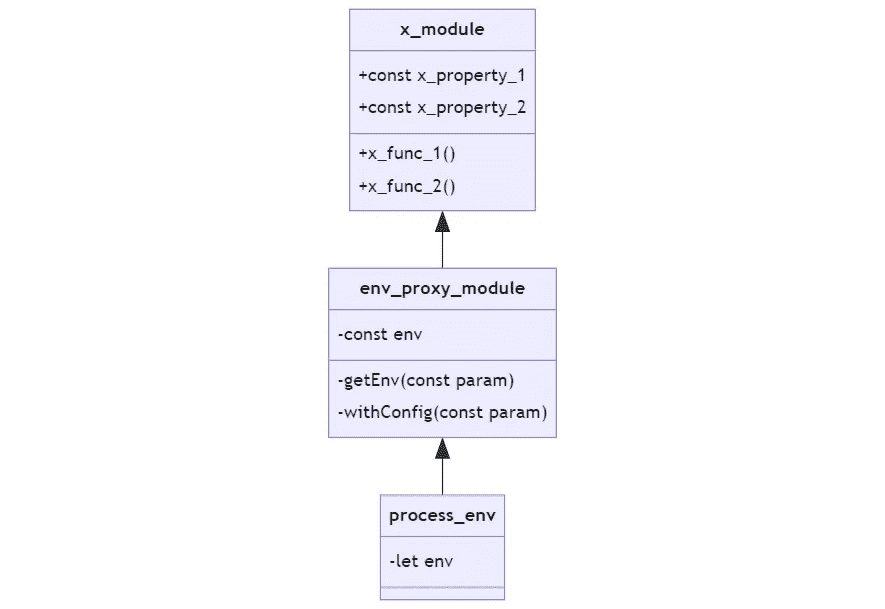

# 如何在 Nest.js v9 中使用可配置的模块生成器

> 原文：<https://medium.com/geekculture/how-to-use-configurable-module-builders-in-nest-js-v9-ae1f458fd6ca?source=collection_archive---------5----------------------->

## 用于定制后端服务的动态 Nest.js 模块


Photo by [Hannah Troupe](https://unsplash.com/@htroupe?utm_source=medium&utm_medium=referral) on [Unsplash](https://unsplash.com?utm_source=medium&utm_medium=referral)

Nest.js 是专门用 TypeScript 制作的 web 框架。大多数接触过 Nest.js 的开发人员通常会认识到一些非常熟悉的东西，这是一个强大的面向对象编程模型，其语法与另一个框架 Angular 非常相似。

Nest.js 代码通常会迫使你创建一个最优的设计模式。然而，从 Java 或 ASP.NET 背景迁移到 Node.js 和 TypeScript 的开发人员将很快理解 Nest.js 的结构。像依赖注入、封装、类和类注释(装饰器)这样的概念在 Nest.js 中都有。

在 Nest.js 中，创建一个可重用的定制模块非常简单，而且最重要的是，我们鼓励这样做。将一个模块封装成小的可重用块将有助于提高 Nest.js 应用程序的开发速度，如果您决定将这些模块作为开源包发布，还会给您加分。

# Nest.js 模块是什么？

但是在继续之前，Nest.js 模块是什么？

模块是要注入 Nest.js 应用程序的封装代码集。您可以使用模块来创建旨在完成特定任务的定制服务。例如，TypeORM 是基于 TypeScript 的 ORM。Nest.js 团队创建了一个模块，它将注入一个开放的数据库连接，允许来自注入模块的数据库命令和查询。

Nest.js 模块是框架健壮的依赖注入机制的主干。依赖注入是一种应用程序开发模式，旨在分离两个类(或模块)之间的依赖关系。不需要为每个类严格定义依赖关系，您可以使用一个接口来对依赖关系的行为方式进行某种程度的“约定”,而不需要对依赖关系的运行方式进行字面定义。

解耦架构支持多种应用，并为应用中的每个模块创建即插即用行为。

# Nest.js 模块状态管理

默认情况下，Nest.js 模块是单例的。您只需要启动一个模块一次。虽然从工程的角度来看，为每个模块创建单例似乎有些过分，但是 Nest.js 将会在组件级别上[初始化单例。](https://github.com/nestjs/nest/issues/47#issuecomment-300283919)

## Nest.js 中的模块范围

Nest.js 中有三个模块注入范围:

1.  请求级模块
2.  组件级模块(瞬态)
3.  共享应用程序级模块

默认情况下，大多数 Nest.js 模块都是应用程序级模块，或者您也可以将它们称为全局共享模块。但不是每个模块都可以是全局模块。例如，它们中的一些需要保持瞬态/请求级别。

例如，如果您需要一个应用程序级的只读模块，您最好的选择是使用全局共享模块。存储在模块中的数据不会经常改变，所以它可以作为应用程序级的单例对象被延迟，以节省内存并创建一个全局可访问的类。有`@Global`装饰器的模块消除了代码和组件级的冗余，因为你不需要重新初始化模块。

为了更好地理解模块级的状态保持，如果您在具有瞬态或请求范围的模块中有一个常量，它将是一个不可变的变量，直到模块在垃圾收集时销毁它。但是，当使用跨整个应用程序的全局模块时，它只会在应用程序的生命周期结束时被销毁。

## 使用单例时防止数据竞争

使用单例时需要小心的另一件事是数据竞争问题。 [Node.js 对](https://stackoverflow.com/questions/21438207/can-node-js-code-result-in-race-conditions)数据争用情况并不免疫，Nest.js 也是如此。数据争用情况是当两个独立的进程试图同时更新同一块数据时。因为对象是全局可访问的，同时执行数据可能会导致执行时丢失数据点。避免数据竞争情况的最佳实践是创建一个全局只读模块，并对每个模块的注入范围更加谨慎。

全局模块最容易受到数据竞争条件的影响，使用全局模块在组件之间通信或管理状态将导致反模式。

但是为什么瞬态组件级模块不能这样说呢？

在组件级别，封装障碍只扩展到组件的需求。每个瞬态模块提供程序都有一个专用的实例。组件级的关注点分离通常更细粒度，这使得它比大规模应用程序更可预测。

请求级的单例也是如此，尽管规模较小。

# 简短的摘要

总而言之，Nest.js 中的模块有三个注入范围:

1.  请求级模块
2.  组件级模块(瞬态)
3.  共享应用程序级模块(全局)

每一种都有其优点和缺点，数据竞争是全局模块最常见的问题。大部分全局模块应该是只读的，Nest.js 在初始化时只会设置一次原始状态。

组件级模块有更多的细微差别；更具体地说，由于它们的可预测性，您可以将它们用于较小规模的状态管理。组件级的细粒度封装单件使其成为组件级状态管理的完美选择。

> **注**:数据竞争条件只限于每个独立模块的状态。修改数据库等外部应用程序中的数据应该不成问题，因为数据库有自己的数据竞争解决方案。

# Nest.js 中的可配置模块生成器

默认的 Nest.js 模块是静态的，不可配置的。另一方面，可配置模型构建器是动态模块工厂，可以根据初始化时传递的变量生成不同的模块。

## Nest.js 中的动态模块

但是在开始做可配置模块之前，您需要理解动态模块的基础。它们的用例通常围绕创建一个非静态模块，该模块可以从外部 API 接收参数，以改变模块的行为方式，特别是每个模块处理数据的方式。

例如，您创建了一个用于从数据库中查询数据的模块，但是您不想为特定的数据库提供者进行硬编码。那么如何解决问题呢？

首先，您需要创建一个具有配置功能的模块。配置函数将有一个数据库提供者接口作为参数。提供者接口具有应用程序连接和查询数据库所需的所有基本功能。因为使用接口作为参数，所以只要提供者扩展了接口，就可以注入不同的数据库提供者。

底层的业务逻辑仍然是相同的，但是数据库提供者将根据您在初始化时提供的而改变。因此，你的模块将不再是静态的，而是动态的。

这就是所有可配置模块都是动态模块的本质原因。

## 构建一个基本的可配置 Nest.js 模块

例如，您将创建一个定制的 Nest.js 模块，该模块使用`dotenv`包中的`process.env` API 从`.env`文件中读取数据。该模块将作为一个可配置的代理，您可以在您的项目中使用。



[Module architecture](https://mermaid.live/edit#pako:eNqNkUFuwyAQRa-CZpWo8SJZWt21OUG3SAjB2EGywYIhtZX67h2FOHXTVior-P_BH2YuYIJFqMF0OqVXp9uoe-kFr1H1weYOxfNHVQn0ZzXEME43tTCPamFZMZiSYvfhqVo8meATscLQgJEmtf8Hc_jOMDKqJnuj9pvtX9Zhsa5f-1HqpZhCVCXtXiwrLdLRnzfFGDS3ZHv33h2dXoJvXPuLP68TV234CutwFTUvclmwgx5jr53lgVyvSKAT9iih5q3FRueOJEg_M5oHqwmP1lGIUFPMuAOdKbxN3iznwtzGWsT5E4s7pd8), image by author

代理模块的架构似乎是多余的，因为您可以直接访问`process.env`变量，而无需依赖注入。但是为了简单起见，您将使用这个架构来全面掌握 Nest.js 模块是如何工作的。

您的代理模块将在初始化时检索`process.env`，并将它存储在它的`env`属性中。Nest.js 模块在默认情况下是单例的，所以只需要初始化一次。您可以执行`getEnv`函数来检索您的`env`变量，它将作为动态`env`属性的获取器。

您可以在初始化时添加一个函数来接受参数并创建一个动态模块，使其可配置。在这种情况下，`withConfig`函数将是可配置的 init 函数。

## 如何创建一个基本的可配置 Nest.js 模块

全局安装`@nest/cli`。

```
npm i -g @nest/cli
```

然后，生成一个新的 Nest.js app。

```
nest new configurable-module-builder-examples
```

选择你喜欢的任何包管理器，但是本教程主要使用 Yarn。你可以到`step-1`分支[这里](https://github.com/agustinustheo/configurable-module-builder-example/tree/step-1)看到你目前生成的代码。

一个新的 Nest.js 项目将所有模块放在一个级别上；您需要重构它，然后才能继续。将模块、控制器和服务复制到一个名为`api-modules`的文件夹中，[将所有文件和变量名](https://github.com/agustinustheo/configurable-module-builder-example/tree/step-2/src/api-module)从`App`重命名为`Api`。

创建一个新的`AppModule`文件，并在导入中注入`ApiModule`。

```
import { Module } from '@nestjs/common';
import { ApiModule } from './api-module/api.module';@Module({
  imports: [ApiModule],
})
export class AppModule {}
```

如果你没有跟上，检查[中的`step-2`分支。](https://github.com/agustinustheo/configurable-module-builder-example/tree/step-2)

接下来，您可以开始创建`process.env`代理模块。您需要`dotenv`包来访问`.env`文件，因此通过运行以下命令来安装依赖项:

```
yarn add dotenv
```

创建一个新文件夹`src/env-proxy-module`并创建两个文件`env-proxy.module.ts`:

```
import { Global, Module } from '@nestjs/common';
import { EnvProxyService } from './env-proxy.service';@Global()
@Module({
  providers: [EnvProxyService],
  exports: [EnvProxyService],
})
export class EnvProxyModule {}
```

注意`@Global`装饰器用于自动将模块的输出注入到注入组件的任何子组件中。您不必在每个模块上重复导入`EnvProxyModule`。您只需要在主`AppModule`中将它添加为导入。

```
import { EnvProxyModule } from './env-proxy-module/env-proxy.module';@Module({
  imports: [ApiModule, EnvProxyModule],
})
export class AppModule {}
```

然后，创建服务文件`env-proxy.service.ts`:

```
import { Injectable } from '@nestjs/common';require('dotenv').config(); // eslint-disable-line@Injectable()
export class EnvProxyService {
  public readonly env: NodeJS.ProcessEnv;
  constructor() {
    this.env = process.env;
  }
}
```

为了测试`EnvProxyModule`，您可以创建一个`.env`文件，其中包含一个`DATA`参数:

```
DATA=Hello World
```

通过在一个`GET`请求中返回环境变量来试用这个模块:

```
import { EnvProxyService } from '../env-proxy-module/env-proxy.service';@Injectable()
export class ApiService {
  constructor(private readonly envProxy: EnvProxyService) {}getHello(): string {
    return this.envProxy.env.DATA;
  }
}
```

运行开发服务器:

```
yarn start:dev
```

打开浏览器并转到`localhost:3000`。您应该得到一条`Hello World`文本作为回报。这一步的完整代码可以在`step-3`分支[这里](https://github.com/agustinustheo/configurable-module-builder-example/tree/step-3)看到。

您已经创建了一个简单的模块，但是它还不可配置。可以用`ConfigurationModuleBuilder`来做。`ConfigurableModuleBuilder`是 Nest.js v9 中提供的新特性，其目的是减少创建可配置动态模块所需编写的样板代码的数量。

在`src/env-proxy-module`内创建一个新文件`env-proxy.definition.ts`:

```
import { ConfigurableModuleBuilder } from '@nestjs/common';export interface EnvProxyModuleOptions {
  exclude: string[];
}export const { ConfigurableModuleClass, MODULE_OPTIONS_TOKEN } =
  new ConfigurableModuleBuilder<EnvProxyModuleOptions>({
    moduleName: 'EnvProxy',
  })
    .build();
```

`EnvProxyModuleOptions`接口表示您在初始化时通过配置文件传递的对象。在这种情况下，您将给出一个要从模块中排除的环境变量数组。

使`EnvProxyModule`伸出`ConfigurableModuleBuilder`:

```
@Global()
@Module({
  providers: [EnvProxyService],
  exports: [EnvProxyService],
})
export class EnvProxyModule extends ConfigurableModuleClass {}
```

继续执行`EnvProxyService`类并实现以下内容:

```
@Injectable()
export class EnvProxyService {
  public readonly env: NodeJS.ProcessEnv;
  constructor(@Inject(MODULE_OPTIONS_TOKEN) private options: EnvProxyModuleOptions) {
    this.env = process.env;
    options.exclude.forEach(val => {
      delete this.env[val];
    });
  }
}
```

您可以从构造函数和`@Inject`装饰器中检索`EnvProxyModuleOptions`对象。您将把排除环境变量的主要业务逻辑添加到`EnvProxyService`构造函数中。为了测试它，您可以创建第二个环境变量`DATA2`。

```
DATA=Hello World
DATA2=Hello World2
```

在`AppModule`导入上，添加一个`register`函数并插入一个`EnvProxyModuleOptions`。

```
imports: [ApiModule, EnvProxyModule.register({
  exclude: [
    "DATA"
  ]
})],
```

模块将排除`DATA`变量，检查排除是否有效，编辑`ApiService`:

```
getHello(): string {
  return this.envProxy.env.DATA ?? this.envProxy.env.DATA2;
}
```

当你访问`localhost:3000`时，你会得到`Hello World2`。

祝贺您，您已经使用可配置模块生成器创建了您的第一个可配置模块！你可以在这里查看[最终的代码库](https://github.com/agustinustheo/configurable-module-builder-example/tree/step-4)。

如果您的配置比前一个示例更复杂，您可以依赖工厂模式:

使用`useFactory`允许你调用异步代码来帮助你配置你的构建器。对于最后一个异步例子，你可以在找到它。

# 摘要

NestJS 是一个内置于 TypeScript 中的面向对象的 web 框架。NestJS 使用了强大的面向对象原则，并提供了许多功能，包括依赖注入、类、通过 decorators 的类注释和强大的封装。

NestJS 中的状态管理在模块级别上有所不同。大多数模块的封装仅限于组件级，而很少有模块在应用程序级具有全局共享状态。所有的 NestJS 模块都使用单件。如果处理不当，拥有可以全局使用的共享模块会导致数据竞争。

大多数共享模块应该是只读的，但是也有一些情况下共享模块是实用的，记录和连接到消息队列。否则，您将只需要组件级的模块。

动态模块是非静态的可配置模块。本质上，所有可配置的模块都是动态的。可配置模块使用工厂模式根据初始化期间给定的参数创建不同的模块。

编写定制的 NestJS 模块非常简单。您可以访问 GitHub 上的代码示例，并使用不同的分支来[导航项目](https://github.com/agustinustheo/configurable-module-builder-example)的每个阶段。

我希望你喜欢这篇文章。如果你有任何问题，请留言。

编码快乐！

*原载于 2022 年 9 月 22 日*[](https://blog.logrocket.com/use-configurable-module-builders-nest-js-v9/)**。**