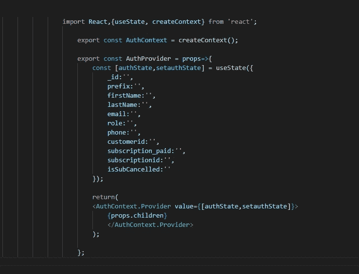
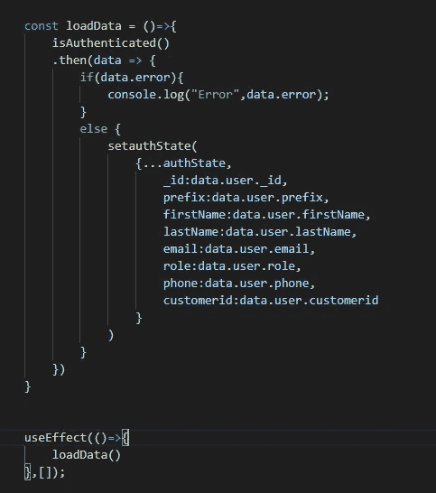
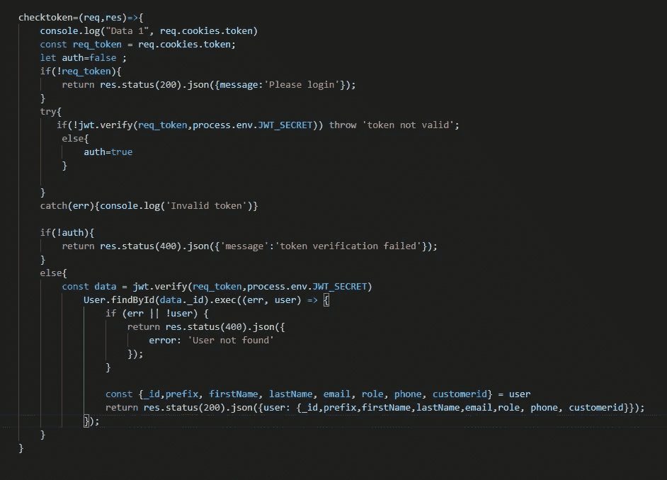

# 如何使用上下文 API 和 JWT 来维护用户会话？

> 原文：<https://medium.com/geekculture/how-to-use-context-api-and-jwt-to-maintain-user-sessions-eb5602e83a03?source=collection_archive---------2----------------------->

当开发一个需要用户认证和用户授权的网站时，最简单的方法是将用户数据存储在 web 存储器中。但是在我的例子中，将用户数据存储在本地存储或会话存储中可能会暴露一些重要的信息，坏人可能会利用这些信息来操纵请求。因此，我必须解决的问题是使用户数据对许多 react 组件可用，并对最终用户隐藏它们。

对于这种情况有一些先进的方法，我想尽可能容易地解决这个问题。我使用 JWT 进行用户认证，我的想法很简单，我将在客户端存储 JWT，并利用上下文 API 来避免 *prop drilling* 。

我将使用上下文 API 将用户数据传递给所有组件。但是等一下，当页面重新加载时会发生什么呢？你猜对了，存储在状态变量中的所有数据都丢失了。没问题，我们将向服务器发送一个请求，再次请求数据，并将数据赋回状态变量 simple right。因此，每次页面重新加载时，这个过程都会重复，并且由于会话数据现在由服务器处理，这比将数据直接存储在会话存储中要安全得多。

此外，我想提一下，这篇文章不是用来像教程一样学习的，而是把它当作一种经过测试的方法，你可以用自己的方式实现它，或者如果你有更好的解决方案，也请提出来。这篇文章的唯一目的是找到不同的观点，成为一名更好的程序员。

我不会深入讨论初始设置的更多细节，我假设你已经实现了 JWT 认证，并且在*package . JSON*文件中有一个指向后端的代理的 react 前端，这对于该方法的工作至关重要。

在 react 工作目录下创建一个新文件 *GlobalStates.js*

我们将使用 useState 钩子来创建我们的状态变量，正如你所看到的，它携带了关于用户的信息，然后我们将通过 AuthProvider 把状态传递给子节点。

然后打开定义路由的文件并导入 AuthProvider 组件

**从'<your path>/global States . js '导入{ auth provider }；**

然后用 <authprovider></authprovider> 把你的路线包起来

现在，您的子组件可以使用“authState ”,继续打开您的组件文件。

**从‘React’导入 React，{useContext，use effect }；**

**从“<your path>/global States . js**”导入{ auth context }；

然后，您可以在组件中使用状态变量，如下所示

**const [authState，setauthState]= use context(auth context)；**

因为我们用空字符串初始化我们的状态，所以你看不到任何数据。现在我将使用 **useEffect** 钩子从服务器获取数据并填充状态变量。

“isAuthenticated()”函数看起来会像这样:

**is authenticated = async()=>{**

**return await fetch(`<your domain>/is auth `)，{**

**方法:“获取”**

**})**

**。然后(response =>response . JSON())**

**。catch(err =>console . log(err))**

**}；**

因为我们使用 httponly cookies 来存储由服务器直接设置的令牌，所以我们不需要将它们添加到标头中，标头会随着每个请求自动添加。

注意:为了设置 cookie，必须在指向服务器域的 package.json 文件中添加一个代理字段。

您可以在服务器端登录函数中添加以下代码来设置 cookie:

*//使用数据库中的用户 id 成功登录后创建令牌*

**const token = jwt . sign({ _ id:user。_id}，process.env.JWT_SECRET)**

**const cookie = req . cookies . token；**

**if (cookie == undefined){**

**res.cookie('token '，token，{ http only:true })；**

**}**

**返回结果状态(200)。json({message:“登录成功”})；**

基本上，我们分配了一个没有截止日期的 cookie，它将作为一个会话 cookie。

现在，我们将为" <your domain="">/isAuth "端点分配一个名为" checktoken "的函数来验证令牌，如果令牌通过验证，我们将发送回一个包含用户数据的肯定响应，该用户数据将用于填充上述的 **authstate** 。</your>

现在，状态变量有了可用于访问控制或更新 UI 的 auth 数据。每次页面重新加载时，状态数据都会丢失，但会被 useEffect 挂钩更新。

请随意分享你的想法，祝你愉快。