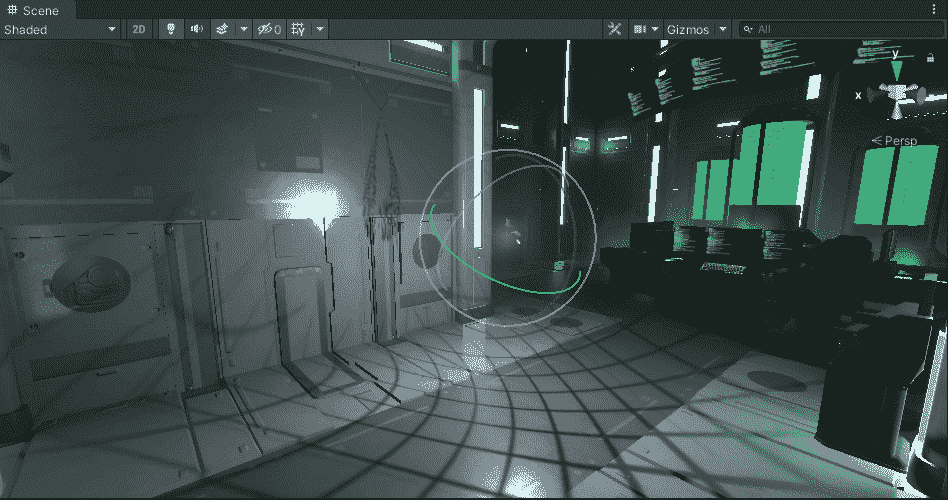
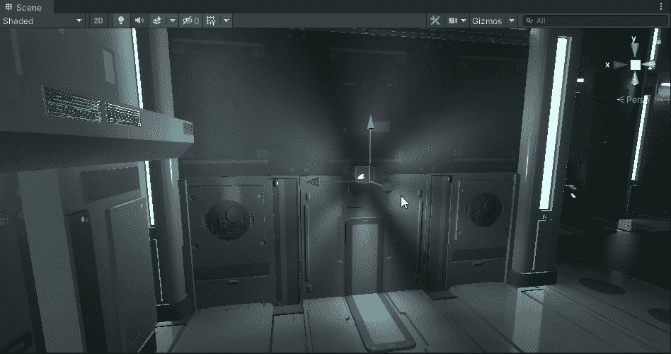
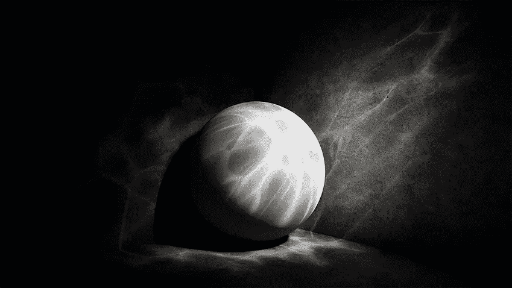
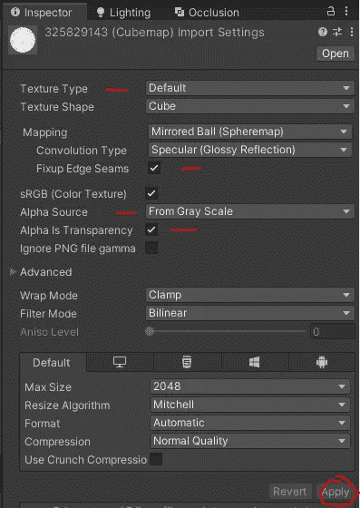
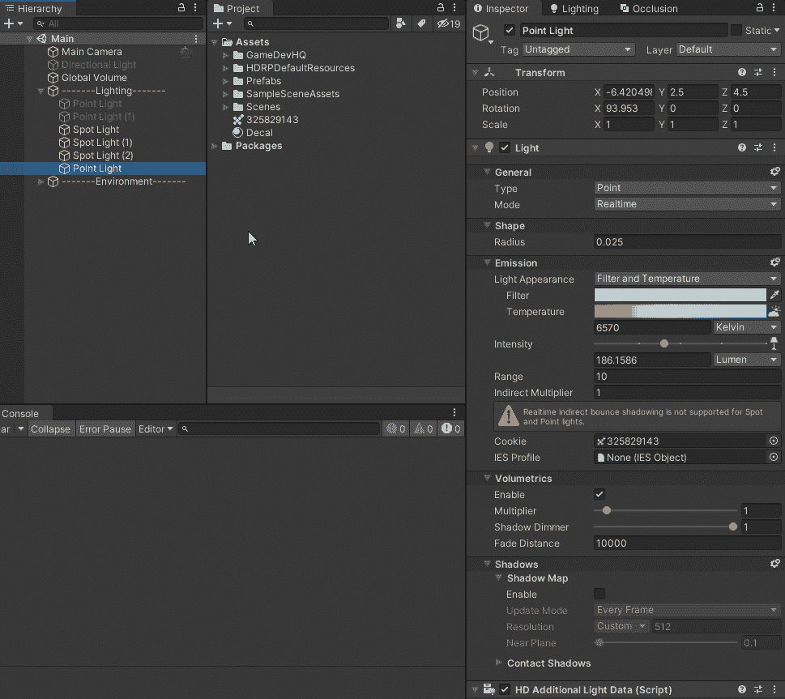
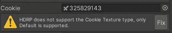

# 如何使用 Cookies 在 Unity 中创建逼真的灯光

> 原文：<https://medium.com/geekculture/how-to-use-cookies-to-create-realistic-lighting-in-unity-87ef95a94222?source=collection_archive---------10----------------------->

**目标**:在**光源**上实现一个**饼干遮罩**来创造更多的**真实光照**。

Adding a greyscale mask layer to point light source

我们不是生活在一个**世界**中，我们的**灯光**总是完美的，那么为什么我们的**光源**在 **Unity** to 中总是看起来完美呢？让我们稍微理性一点**或者现实一点**并且理解我们的**光源**可能有一个**图案、形状**或者甚至是一个**颜色**，它目前正以**碎片阴影**的形式被**照射**。*例如，你家里可能有一盏灯，灯泡上有一些划痕或瑕疵，这会在你的桌子上留下一些斑驳的阴影。*

让我们看看如何**重现**这种**复杂的灯光效果**，同时在**运行时**对的性能影响非常小！

## 什么是饼干

除了是一种**非常美味的小吃**外，它还是一种**面具**，即将**放置在**光源**上，为**特定图案**、**形状**或**颜色**创造出**阴影**。**

unity.com

除了普通的**光源**，我们可以期待**添加**这个**遮罩**来可能给**照明**带来一些**不规则性**来帮助让它看起来**更真实**或者**应用一个图案** ( *如上图*)。

一个 **cookie** 最好的特点之一是，它是一个**非常有效的方法**来执行复杂的灯光效果，同时**对**几乎没有**或**在**运行时**没有性能影响**。**

## 如何获得 Cookie 设置

首先，让我们继续进行，并带来了一个**灰度纹理**，让我们改变一些它的**属性**在**检查器。**

**纹理类型**:保留为‘默认’
**修边接缝**:勾
**光线类型**:点
**阿尔法源**:从灰度
**阿尔法是透明的**:勾
“**应用”按钮**

接下来我们将**拖动**这个**纹理**到“**曲奇**”**域**上的**点光源**:

如果您已经将您的**纹理类型**更改为“ **Cookie** ”，您可能会在此阶段弹出一个**错误**，让您知道“ *HDRP 不支持 Cookie 纹理类型，仅默认支持*”。

您可以点击旁边的“**修复**”按钮来解决问题(通过将*转换回‘默认’*)。

*有关此错误的更多信息，请参考本论坛文章:*
[*Unity—【2020.1】新功能—烤光饼干— Unity 论坛*](https://forum.unity.com/threads/2020-1-new-feature-baked-light-cookies.848269/)

你的**纹理**现在应该出现在**场景**上了！

