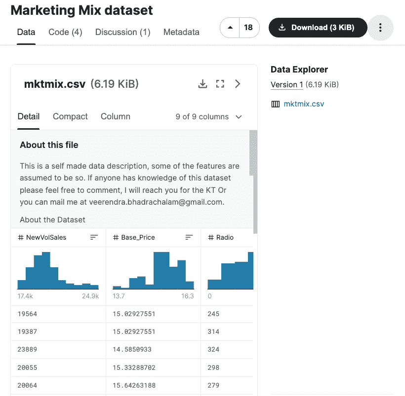
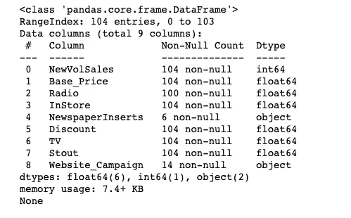
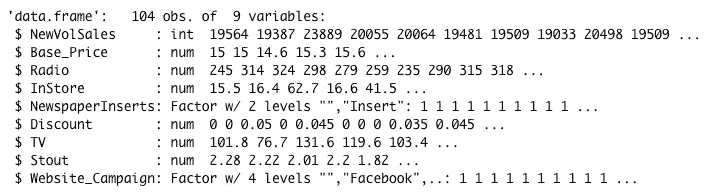
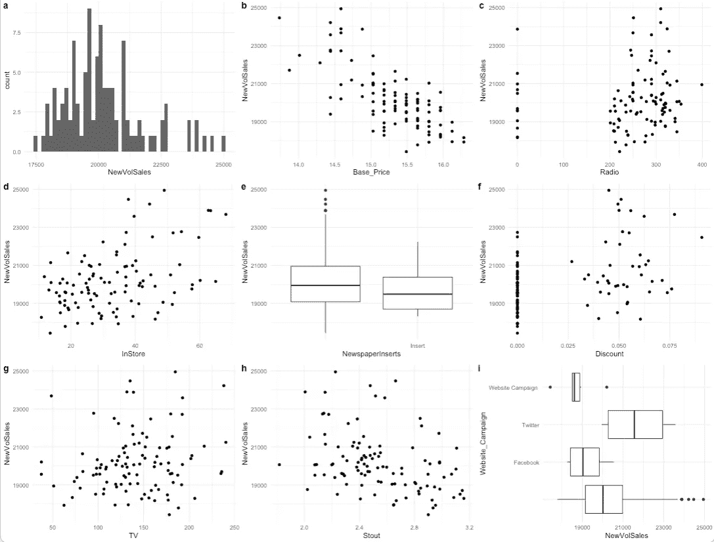
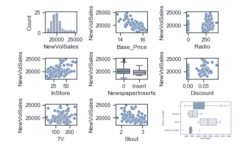
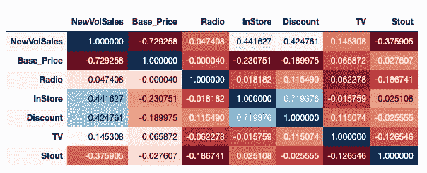
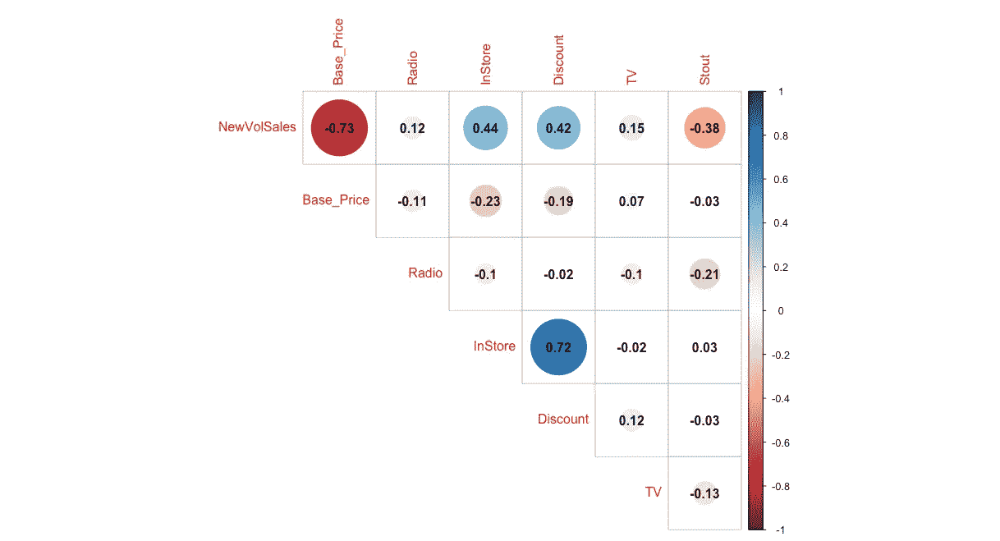
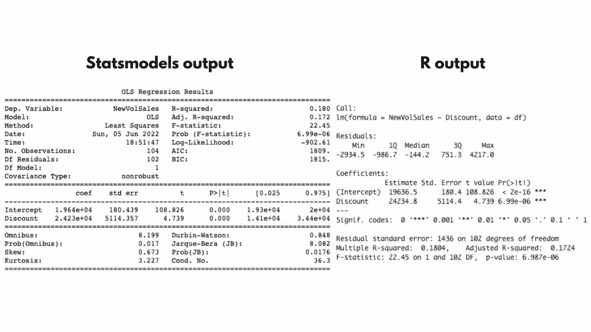
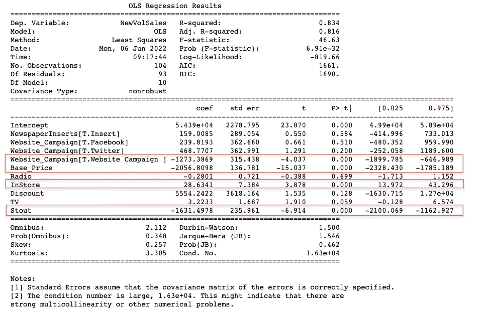
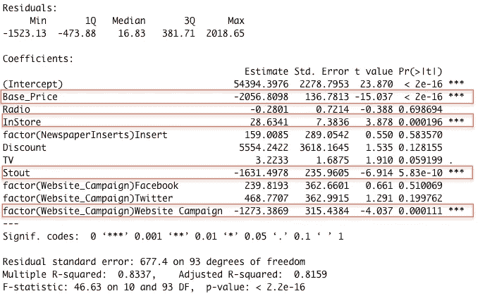

# 如何在 Python & R 中使用相关性分析提高营销绩效

> 原文：<https://medium.com/geekculture/how-to-use-correlation-analysis-to-improve-marketing-performance-in-python-r-156e80187d74?source=collection_archive---------0----------------------->

销售的关键驱动因素是什么？


Photo by [Nguyen Dang Hoang Nhu](https://unsplash.com/@nguyendhn?utm_source=medium&utm_medium=referral) on [Unsplash](https://unsplash.com?utm_source=medium&utm_medium=referral)

# 为什么要关联？

理解是什么驱动了关系是很重要的。例如，如果你想确定营销业绩如何影响你的销售数字，你必须考虑所有能解释你的销售数字的因素。这可能包括以下因素:

1.  营销渠道
2.  季节
3.  地理位置
4.  等等。

相关性是一个很好的探索工具，有时可以揭示数据中有趣的模式。最重要的是，一旦你掌握了窍门，就很容易添加到你的分析工具包中。

# 什么是相关性？

相关性是量化两个变量之间强度的统计数据。该统计被称为相关系数，表示为 *r* 。

相关系数或 *r* 是一个介于+1 和-1 之间的数，并且被计算以表示两个变量之间的线性关系。接近 1 的 *r* 表示变量之间的强关系，而接近 0 的 *r* 表示弱关系。


Correlation examples. Image by author.

一个积极或消极的迹象表明关系的方向。正的 *r* 表示正的关系，负的 *r* 表示负的关系。此外，我们可以在相关图或矩阵中绘制统计数据*(我们将很快完成)*。

让我们介绍三(3)种常见的关联方法:

1.  皮尔逊方法-相关性是线性关系的默认方法，并假设您的数据呈正态分布。它对异常值和扭曲的数据很敏感。
2.  Spearman 方法——用于非正态人群。检查等级或有序关系。
3.  肯德尔方法—适用于当您有一个小数据集和许多关联或等级关系时。

您对关联方法的选择应该由数据的基本分布决定。

# 如何解读相关性

使用 [Jacob Cohen 的经验法则](https://en.wikipedia.org/wiki/Effect_size#Types)的相关阈值，该法则通常在行为科学中用于解释影响大小:

r >= 0.5 大型或强关联
r = 0.3 中型关联
r = 0.1 小型或弱关联

如果基础数据分布不正常，那么您可以转换(例如，对数、Box-Cox 等。)您的变量，然后再尝试应用这些阈值。

# 什么是可接受的相关性？

即使相关系数在处为**或在**附近为**，也不意味着没有关系。只是这种关系不是线性的，但可能有其他的关系，这就是为什么事先可视化你的变量很重要。**

# 探索性可视化和相关性分析

我们将使用在 [Kaggle](https://www.kaggle.com/datasets/veer06b/marrket-mix-dataset) 上提供的营销数据集。



Marketing Mix dataset from Kaggle. Image by author.

该数据包含非指定品牌的产品连续两年的销售数据。每一行都包含一周的销售量，并包含该产品每周的附加信息或各种促销方法。让我们检查数据集。



Inspect DataFrame in Python. Image by author.



Inspect dataframe in R. Image by author.

请注意，我们在广播、报纸插页和 Website_Campaign 列中有一些空值。

让我们对数据集进行一些探索性的数据可视化。



EDA in R. Image by author.



EDA in Python. Image by author.

**我们能从探索性数据可视化中得到什么？**

> 销售似乎相对正常，可能有一点右倾，但不足以特别令人担忧。
> 
> 底价低时销售额更高。当底价高时，销售额减少。
> 
> 黑啤似乎对销售有负面影响。不确定 stout 指的是什么，因为它没有包含在数据字典中，并且数据源是匿名的。
> 
> 店内似乎对销售有积极影响。
> 
> 广播和电视的影响不确定。当广播电视支出增加时，销售额会增加，但不一定总是如此。
> 
> 报纸插页似乎对销售没有任何重大影响。
> 
> 当有 Twitter 参与时，网站活动似乎有更多的销售，但当没有网站活动时，似乎没有明显的不同。

接下来，让我们创建我们的相关图。

```
#Python
corr = df.corr()
corr.style.background_gradient(cmap='RdYlGn')#R
df %>% 
 select_if(is.numeric) %>% 
  cor() %>% 
    corrplot(type = "upper", addCoef.col = "black", diag=FALSE)
```



Correlation matrix with heatmap in Python. Image by author.



Correlation matrix with heatmap in R with corrplot package. Image by author.

每个盒子里都有相关系数。蓝色表示正相关。负相关用红色表示。

**关联汇总:**

Instore 和 discount 都与新销量呈中等正相关。

广播和电视与新销量呈微弱正相关。

价格与新销量有很强的负相关性。

最后，但同样重要的是，黑啤与新销量呈中度负相关

> **注**:决定系数是我们相关系数的平方。它是 y(因变量)变量中方差的比例，可以从我们的 x(自变量)变量中预测出来。

# 相关性及其与回归的关系

让我们通过回顾两个变量(NewVolSales 和 Discount)来回顾相关性和回归是如何相关的。

NewVolSales 与折扣广告的相关系数为 0.42(四舍五入到小数点后 2 位)。

```
#Python
round(df['NewVolSales'].corr(df['Discount']),2)
0.42#R
round(cor(df$NewVolSales, df$Discount),2)
0.42
```

如果我们在线性回归模型中对此建模，并提取 r 平方，结果是 0.18。(四舍五入到小数点后两位)。

```
# Python

sales_vs_discount = ols("NewVolSales ~ Discount", data=df)sales_vs_discount = sales_vs_discount.fit()print(sales_vs_discount.summary()) # Rlinear_model <- lm(NewVolSales ~ Discount, data = df)summary(linear_model)
```



Output of linear model for NewVolSales as explained by Discount. Python and R output. Image by author.

如果我们平方相关系数为 0.42，我们将得到我们的 r 平方 0.180。实际上，相关系数的平方就是 r 平方。

# 显著性测试

让我们通过对整个数据集使用线性回归模型来测试数据集中所有变量的显著性。

```
# Python (Full Model)
mkmix_model = ols("NewVolSales ~ Base_Price + Radio + InStore + NewspaperInserts + Discount + TV + Stout + Website_Campaign", data=df)Fit the model
mkmix_model = mkmix_model.fit()Print the summary of the fitted model
print(mkmix_model.summary())# R (Full Model)
model_spec_lm <- linear_reg() %>%
    set_engine('lm') %>% 
    set_mode('regression')mkmix_model <- model_spec_lm %>%
    fit(NewVolSales ~ Base_Price + Radio + InStore + factor(NewspaperInserts) + Discount + TV + Stout + factor(Website_Campaign), data = df)summary(mkmix_model$fit)
```



Python full model output. Significant variables outlined in red. Python is giving us warnings in reference to our model. The first one, has no impact so we will ignore. For the second error, I would dig further and perhaps transform, scale or drop the variable(s) causing the collinearity error message. Image by author.



R full model output. Significant variables outlined in red. Image by author.

我们的基准收入是 54，394 英镑。唯一具有正意义的 *(p 值小于 0.05)* 变量是 InStore。负显著变量是基价、坚挺度&网站活动*(无活动)*。

对我们每个系数的一般解释是，x 变量每增加一个单位，y 变量 *(NewVolSales)* 就增加β个单位。

例如，InStore 每增加 1 个单位，销售额就会增加 28。如果我们的销售额以美元计算，那么这将增加 28 美元。

# 我们可以从相关性分析中得到什么，我们如何利用它来为营销提供信息？

我们将只关注 NewVolSales 和每个独立(x)变量之间的关系。

营销中有哪些**不起作用的**？

1.  价格— *重大*。当我们提高底价时，我们会赔钱。
2.  结实— *显著的*
3.  网站活动— *意义重大。*这意味着没有网站活动在进行。这对销售有负面影响。

什么是**与营销**的合作？

1.  商店— *重要的*

什么是**没有**有影响力？

1.  无线电— *不重要*
2.  电视— *不重要*
3.  折扣— *不显著*

在这一点上，你应该与你的营销利益相关者进行对话，以了解他们的营销目标和每个营销计划的策略。不同的计划可能有不同的目标。例如，如果市场营销使用广播和电视进行顶级漏斗活动，那么我们在数据中看到的是有意义的。广播和电视有助于品牌推广(如知名度)，但对销售等底层漏斗指标的影响可能较小。因此，那些从统计角度来看不一定重要的营销努力，从现实世界的角度来看可能会产生影响。

# 摘要

通过相关性分析，我们得出了一些关键的见解，了解了在增加销售额方面，哪些措施有效，哪些措施无效。现在，由您来进一步分析，其中可能包括:

1.增加了最初没有包括的额外因素
2。量化每项营销工作的影响(如投资回报率)。换句话说，计算营销对销售的贡献。
3。基于当前的营销支出和促销水平建立未来预测。


Photo by [Kelly Sikkema](https://unsplash.com/@kellysikkema?utm_source=medium&utm_medium=referral) on [Unsplash](https://unsplash.com?utm_source=medium&utm_medium=referral)

# 相关性的一些陷阱和缺点是什么？

**相关性陷阱:**

1.相关性不等于因果关系——相关性为我们提供了一种方法来
检查两个变量之间是否存在关联，但是
可能有其他解释。

2.潜在的或隐藏的变量可以影响两个
变量之间的关系。

**建议:**

1.总是检查高度相关的变量。相关系数 r > 0.9。您可以通过检查相关矩阵或方差膨胀因子(VIF)来实现这一点。

2.如果存在共线性，请在建模前移除或转换。转换的一个例子是取一个变量的自然对数。

3.使用对共线性稳健的方法对数据建模，例如随机森林
模型。

R 代码可以在 [Github](https://github.com/bonheurgirl/Marketing-Analytics-R/blob/main/How%20to%20use%20correlation%20analysis%20to%20improve%20marketing%20performance.Rmd) 和[rpub](https://rpubs.com/anitaowens/correlation-in-marketing)上找到。Python 代码可以在 [Github](https://github.com/bonheurgirl/Marketing-Analytics-Python/blob/main/How%20to%20use%20correlation%20analysis%20to%20improve%20marketing%20performance.ipynb) 上找到。

# 参考资料:

[1].温斯顿 W. L. (2014 年)。营销分析:微软 Excel 的数据驱动技术。威利。第 170-174 页。

[2].Chapman 和 e . MC donnell Feit(2015 年)。市场研究和分析。湛:施普林格，第 95-109 页，第 162-191 页。