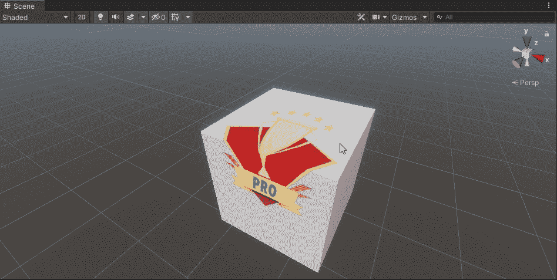
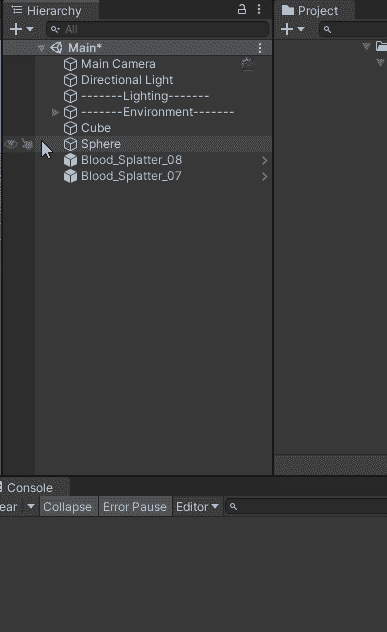
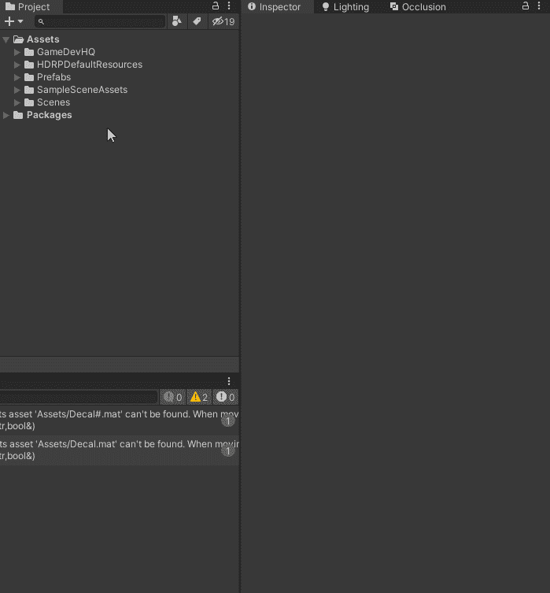
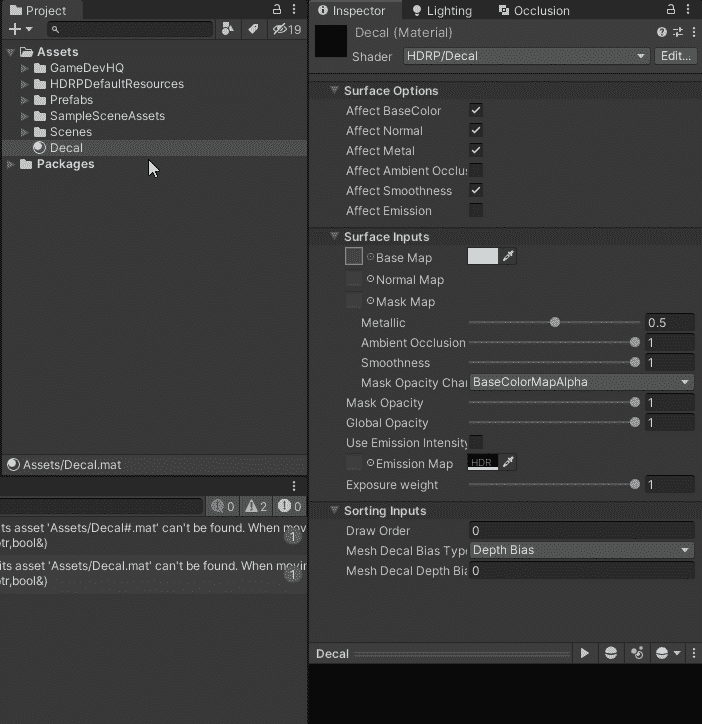
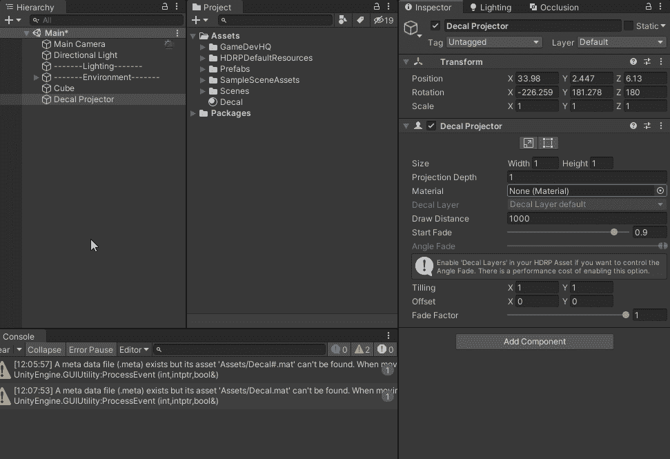

# 如何在 Unity 中使用贴花

> 原文：<https://medium.com/geekculture/how-to-use-decals-in-unity-2b2ab0c45e16?source=collection_archive---------4----------------------->

**目的**:了解 **Unity** 中的**贴花**是什么，如何使用。

## 什么是贴花？

**贴花**是**材质**在**场景**中**游戏对象**上的**投影**，该还具有**能力**将本身**包裹在**所述**对象**周围，如**圆圈**或**盒子**。

上面我有**投影**一个**图像**到一个**盒子**上，你可以看到它**如何将** **包裹在**物体上。

## 如何在场景中设置贴花

首先，我们需要确保我们的项目安装了**高清渲染管道**(*HDRP*)**，如果你不确定如何获得这个**设置**，请阅读这篇**文章**来帮助你:
[*https://Christopher hilton 88 . medium . com/High-Definition-rendering-Pipeline-in-unity-3 bee 74 BD 6c【T53*](https://christopherhilton88.medium.com/high-definition-rendering-pipeline-in-unity-3bee774bd6c)**

**下一步太**在**层次**中添加**a’**贴花投影仪**游戏对象，*在层次中右键→渲染→贴花投影仪*。**

****

**Adding a Decal Projector game object**

**接下来让我们创建一个新的 **HDRP 贴花材质**，*右键点击项目窗口→创建→材质*，命名**材质**。从这里我们需要**更新**材质**的**着色器**为**HDRP/贴花**。****

****

**现在是时候**分配**一个**纹理**到**投影**到**基础贴图区域。**该**底图**字段是**为**贴花**标识**纹理**的字段。****

**我们还需要确保我们在'**表面选项**下的'**影响基色** ' **字段框中勾选了**，因为这将**启用****贴花**到**显示**上所有**对象材料**的**。****

我不得不**调整**一些**设置** (s *平滑度、全局不透明度和金属色等，以获得我想要的图像*)。

快到了！现在我们需要**将**我们创建的**新材料贴花**分配到“**贴花投影仪**”**材料区域**:

最后，只需摆弄一下**移动**、**旋转**和**缩放工具**来**调整**贴花投影仪游戏物体进入**所需位置**。

