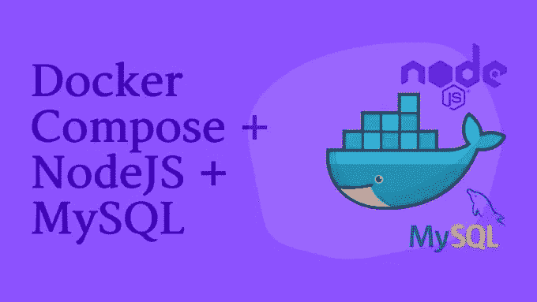

# 如何使用 Docker Compose 处理多容器 Node.js 应用程序

> 原文：<https://medium.com/geekculture/how-to-use-docker-compose-to-handle-multi-container-nodejs-applications-426d53e98bea?source=collection_archive---------14----------------------->

## 使用 Docker Compose 引导 Node.js & MySQL 应用程序

Image by the author

[Docker](https://www.docker.com/) 在发布不到十年的时间里，已经成为开发者离不开的工具。Docker 提供了轻量级的容器来独立于系统中的其他进程运行服务。如果你还没有完全…