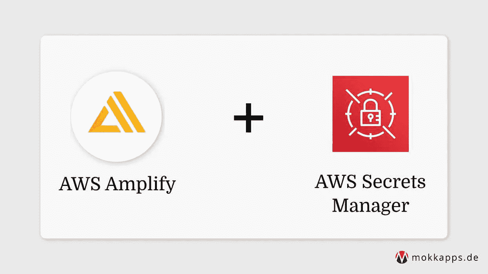
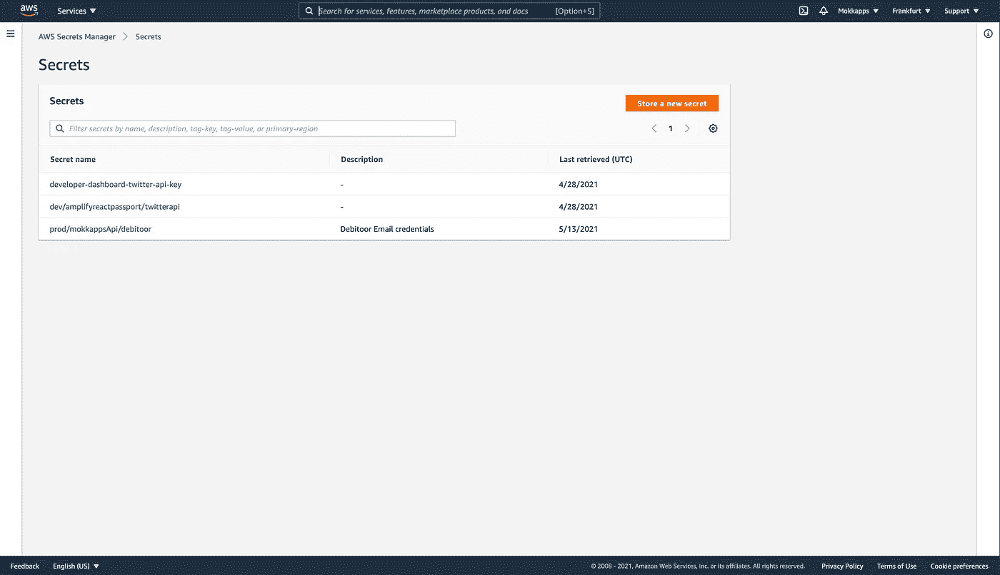
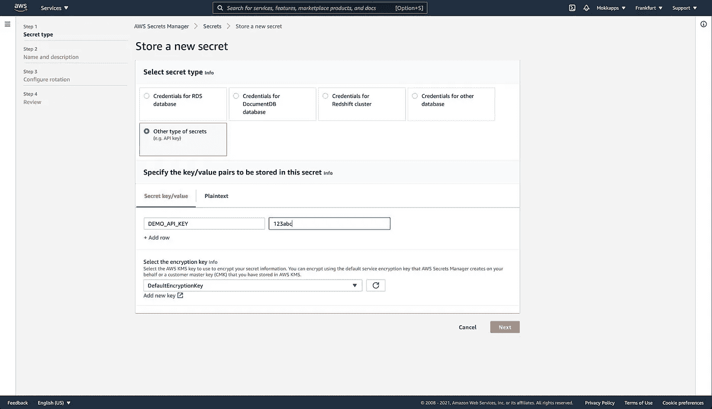
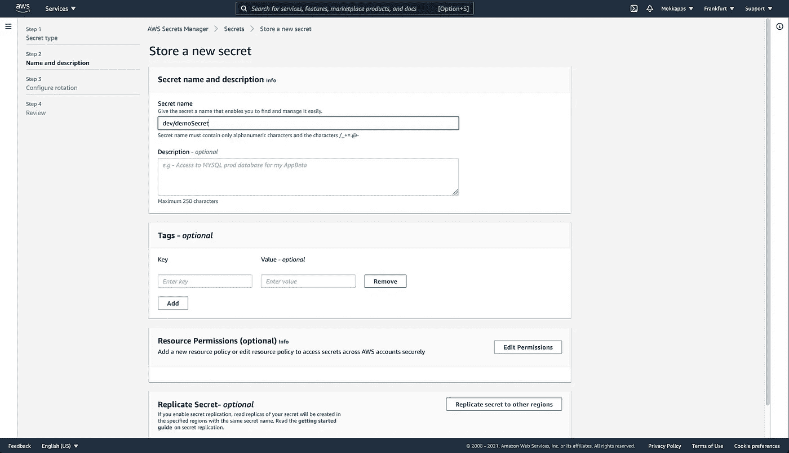
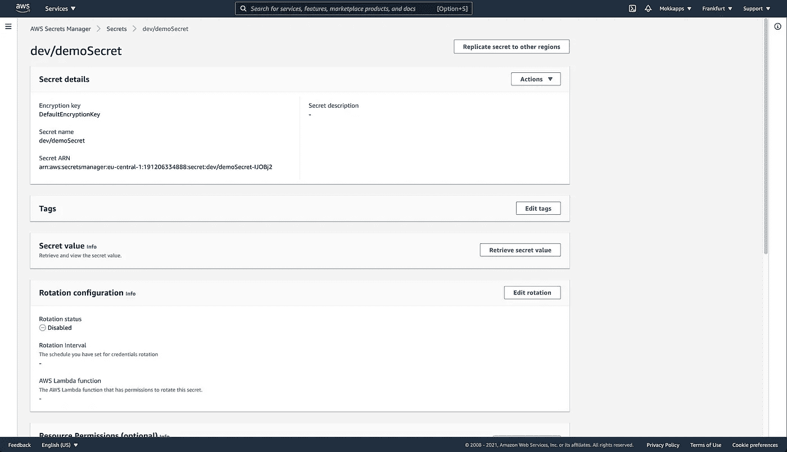

# 如何使用环境变量在 AWS Amplify 后端存储机密

> 原文：<https://medium.com/geekculture/how-to-use-environment-variables-to-store-secrets-in-aws-amplify-backend-f8637cb3d1b0?source=collection_archive---------49----------------------->



[十二要素应用](https://12factor.net/)是一种已知的构建软件即服务应用的方法。一个因素描述了应用程序的配置应该存储在环境中，而不是存储在代码中，以实现配置和代码的严格分离。

在本文中，我想演示如何使用环境变量和 [AWS Secrets Manager](https://aws.amazon.com/secrets-manager/) 向 [AWS Amplify](https://aws.amazon.com/amplify/) 后端添加敏感和不敏感的配置数据。

# 配置类型

存在许多类型的配置数据，例如:

*   超时设定
*   连接字符串
*   外部 API 配置，如 URL 和端点
*   贮藏
*   URL、端口或模式的托管配置
*   文件系统路径
*   框架配置
*   库配置
*   业务逻辑参数
*   还有更多

除了类型之外，配置数据还可以分为敏感和不敏感。

# 敏感与不敏感

敏感配置数据是任何可能被第三方利用的数据，因此必须防止未经授权的访问。此类敏感数据的示例包括 API 密钥、用户名、密码、电子邮件等。这些数据不应该是版本控制的一部分。例如，不敏感配置数据是后端端点的超时字符串，可以安全地添加到版本控制中。

# 初始化放大

> 您需要安装和配置 AWS 帐户和 Amplify CLI，以便能够执行以下步骤。[查看官方文档](https://docs.amplify.aws/start/getting-started/installation/q/integration/js)以设置先决条件。

让我们首先创建一个新的 Amplify 项目:

```
mkdir amplify-env-config-demo
cd amplify-env-config-demo

▶ amplify init
? Enter a name for the project amplifyenvconfigdemo
? Initialize the project with the above configuration? Yes
? Select the authentication method you want to use: AWS profile
? Please choose the profile you want to use default
```

接下来，我们可以添加一个 API，用于添加一些环境配置。

```
▶ amplify add api
? Please select from one of the below mentioned services: REST
? Provide a friendly name for your resource to be used as a label for this category in the project: amplifyenvconfigdemoapi
? Provide a path (e.g., /book/{isbn}): /handle
? Choose a Lambda source Create a new Lambda function
? Provide an AWS Lambda function name: amplifyenvconfigdemofunction
? Choose the runtime that you want to use: NodeJS
? Choose the function template that you want to use: Hello World
? Do you want to configure advanced settings? No
? Do you want to edit the local lambda function now? No
? Restrict API access No
? Do you want to add another path? No
```

我们基于“Hello World”Amplify 模板创建一个简单的 [Node.js](https://nodejs.org/) lambda 函数。它将在路径`/handle`上提供一个带有端点的 REST API。

Amplify CLI 在`amplify/backend/function/amplifyenvconfigdemofunction/src/index.js`生成“Hello World”功能代码:

```
exports.handler = async event => {
  // TODO implement
  const response = {
    statusCode: 200,
    //  Uncomment below to enable CORS requests
    //  headers: {
    //      "Access-Control-Allow-Origin": "*",
    //      "Access-Control-Allow-Headers": "*"
    //  },
    body: JSON.stringify('Hello from Lambda!'),
  };
  return response;
};
```

# 添加不敏感的配置数据

由于我们现在有了一个正在运行的 API，我们可以将一些不敏感的配置数据作为环境变量添加到我们的 Amplify 后端。

因此，我们需要修改`amplify/backend/function/amplifyenvconfigdemofunction/amplifyenvconfigdemofunction-cloudformation-template.json`文件。它包括一个`Parameters`对象，我们可以在其中添加一个新的环境变量。在我们的例子中，我们想要添加一个字符串变量，它可以用键`MyEnvVariableKey`访问，值为`my-environment-variable`:

```
{
  "AWSTemplateFormatVersion": "2010-09-09",
  "Description": "Lambda Function resource stack creation using Amplify CLI",
  "Parameters" : {
    ...
    "env": {
      "Type": "String"
    },
    "s3Key": {
      "Type": "String"
    },
    "MyEnvVariableKey" : {      "Type" : "String",      "Default" : "my-environment-variable"    }  },
  ...
}
```

我们还需要修改这个文件中的`Resources > Environment > Variables`对象，以便能够将新的环境键映射到一个附加到全局`process.env`变量并由 Node.js 运行时注入的变量:

```
{
  "Resources": {
    "Environment": {
      "Variables": {
        "ENV": {
          "Ref": "env"
        },
        "REGION": {
          "Ref": "AWS::Region"
        },
        "MY_ENV_VAR": {          "Ref": "MyEnvVariableKey"        }      }
    }  
  }
}
```

最后，我们需要运行`amplify push`来构建我们所有的本地后端资源，并在云中提供它们。

现在，我们可以通过访问全局`process.env`变量来访问 lambda 函数中的这个变量:

```
exports.handler = async event => {
  console.log('MY_ENV_VAR', process.env.MY_ENV_VAR);
  const response = {
    statusCode: 200,
    body: JSON.stringify('Hello from Lambda!'),
  };
  return response;
};
```

# 使用 AWS Secrets Manager 添加敏感数据

AWS 提供了 [AWS 秘密管理器](https://aws.amazon.com/secrets-manager/)，帮助“保护访问您的应用程序、服务和 IT 资源所需的秘密”。我们将使用这项服务，以便能够从我们的后端访问敏感数据。

首先，我们需要点击“存储新密码”来创建一个新密码:



接下来，我们单击“其他类型的秘密”,并在相应的“秘密密钥/值”输入中输入密钥和值:



可以向一个秘密添加多个键/值对。可以通过单击“+添加行”按钮来添加新对。

在下一个屏幕中，我们需要为我们的秘密添加一个名称和一些其他可选信息:



让我们通过单击“下一步”按钮跳过以下所有屏幕来完成向导。

现在我们可以在 AWS Secrets Manager 中打开这个秘密并检查它的值:



我们需要复制“秘密 ARN”值，因为我们需要在 Cloudformation 配置文件`amplifyenvconfigdemofunction-cloudformation-template.json`中添加一个新的配置对象:

```
"lambdaexecutionpolicy": {
  "DependsOn": ["LambdaExecutionRole"],
  "Type": "AWS::IAM::Policy",
  "Properties": {
  "PolicyName": "lambda-execution-policy",
  "Roles": [{ "Ref": "LambdaExecutionRole" }],
  "PolicyDocument": {
    "Version": "2012-10-17",
    "Statement": [
        {          "Effect": "Allow",          "Action": ["secretsmanager:GetSecretValue"],          "Resource": {            "Fn::Sub": [              "arn:aws:secretsmanager:${region}:${account}:secret:key_id",              {                 "region": {                  "Ref": "AWS::Region"                },                "account": {                  "Ref": "AWS::AccountId"                }              }            ]          }        }      ]
    }
  }
}
```

同样，我们需要运行`amplify push`来构建我们所有的本地后端资源，并在云中提供它们。

现在我们需要添加一些 JavaScript 代码来访问 Node.js lambda 函数内部的秘密。

首先，我们需要通过运行以下命令将 AWS SDK 添加到`amplify/backend/function/amplifyenvconfigdemofunction/src/package.json`:

```
npm install aws-sdk
```

然后我们可以使用`SecretsManager`通过传递我们在 AWS 秘密管理器中定义的“秘密名称”来获得我们的秘密值:

```
const AWS = require('aws-sdk');const secretsManager = new AWS.SecretsManager();
exports.handler = async event => {
  console.log('MY_ENV_VAR', process.env.MY_ENV_VAR);

  const secretData = await secretsManager    .getSecretValue({ SecretId: 'dev/demoSecret' })    .promise();  const secretValues = JSON.parse(secretData.SecretString);  console.log('DEMO_API_KEY', secretValues.DEMO_API_KEY);
  const response = {
    statusCode: 200,
    body: JSON.stringify('Hello from Lambda!'),
  };
  return response;
};
```

# 结论

在本文中，我演示了如何向 AWS Amplify 后端添加敏感和不敏感环境配置。如果你更喜欢视觉教程，你也可以观看 Nader Dabit 的这个视频。

如果你喜欢这篇文章，请在 [Twitter](https://twitter.com/mokkapps) 上关注我，从我这里获得关于新博客文章和更多内容的通知。

*最初发布于*[*https://www . mokkapps . de*](https://www.mokkapps.de/blog/how-to-use-environment-variables-to-store-secrets-in-aws-amplify-backend/)*。*