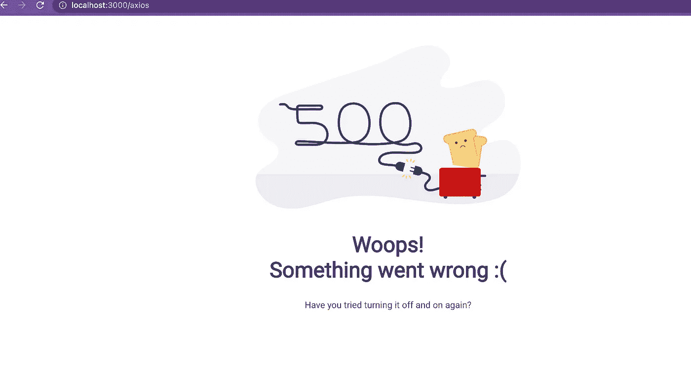

# 如何在 React 中使用带有回退 UI 的错误边界？

> 原文：<https://medium.com/geekculture/how-to-use-error-boundaries-with-fallback-ui-in-react-ca5993b5eab5?source=collection_archive---------1----------------------->

How to use Error Boundaries with Fallback UI in React

下面的文章将帮助你理解如何在 React 初学者指南中使用错误边界

React 用户，React 16 引入了“错误边界”的新概念。React 15 在不同的方法名称下包含了非常有限的错误边界支持:`unstable_handleError`。