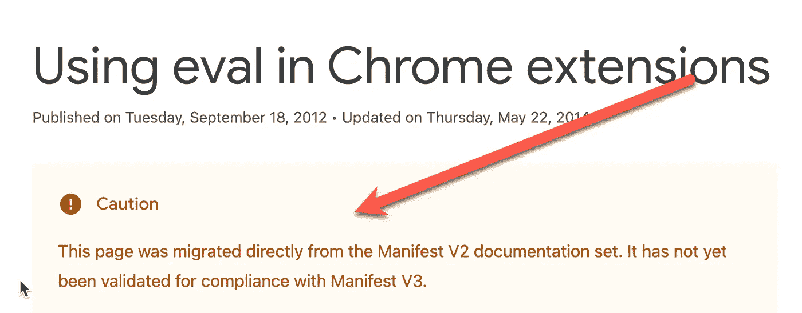

# 如何在 V3 chrome 扩展中使用“eval”

> 原文：<https://medium.com/geekculture/how-to-use-eval-in-a-v3-chrome-extension-f21ca8c2160c?source=collection_archive---------1----------------------->

如今，Chrome 扩展开发者正在慢慢地将他们的代码从 V2 迁移到 V3，不幸的是，这并不总是一项简单的工作。

我看到开发人员面临的一个问题是他们应该如何迁移`eval`。当我迁移我自己的扩展[时也是如此，我自己的扩展](https://github.com/scaljeri/oh-my-mock)到处都在使用`eval`。这是 V3 中出现的错误

`Error in event handler: EvalError: Refused to evaluate a string as JavaScript because 'unsafe-eval' is not an allowed source of script in the following Content Security Policy directive: "script-src 'self'".`

在 V2，你可以在任何地方使用`eval`，但是在 V3 中，你不能在任何地方使用它。但是幸运的是，有一个解决这个问题的方法，在这里[描述了这个方法](https://developer.chrome.com/docs/extensions/mv3/sandboxingEval/)



V3 sandbox documentation

不幸的是，所描述的解决方案是直接从 V2 抄袭来的，开箱即用效果不佳。它描述了如何在后台脚本中使用 iframe 来保护你的`eval`代码。在后台脚本中运行 iframe 解决方案在 V2 是一个完美的解决方案，但在 V3 中不再是了，因为后台脚本是一个服务工作者。它不能创建 iframes。因此，解决方案很简单，只需在其他地方创建 iframe(除了内容脚本)。在我的例子中，我使用了弹出的 html 文件，并添加了以下 html 代码

```
<iframe src=”../sandbox.html” id=”sandbox” style=”display: none”></iframe>
```

其中*sandbox.html*包含执行`eval`的代码

```
<html>
    <script>
        window.addEventListener('message', async function (event) {
            event.source.window.postMessage(eval(event.data), event.origin);
        });
    </script>
</html>
```

别忘了将`sandbox.html`配置为真正的沙箱

```
"sandbox": {
    "pages": [
      "sandbox.html"
    ]
  }
```

这应该添加到 *manifest.json* 文件中。

最后，与沙箱通信的代码

```
const iframe = document.getElementById('sandbox');window.addEventListener('message', (event) => {
   console.log('EVAL output', event.data);
});iframe.contentWindow.postMessage('10 + 20', '*');
```

就是这样。干杯