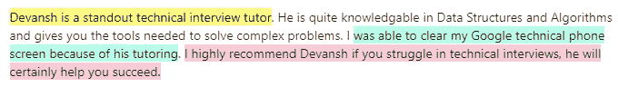
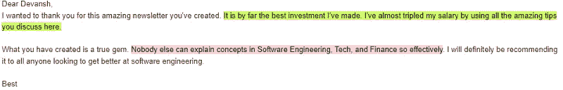
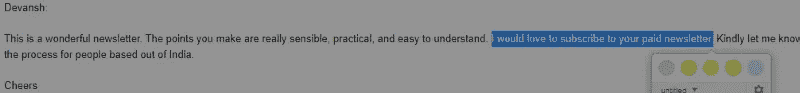
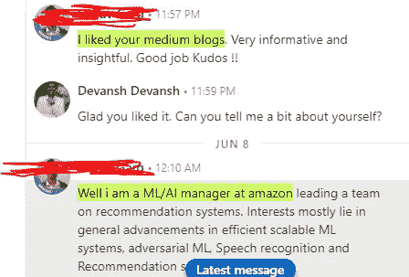
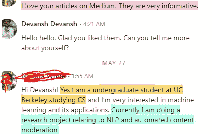

# 如何使用 Github 获得你的第一份软件工作

> 原文：<https://medium.com/geekculture/how-to-use-github-to-land-your-first-software-job-2d89280d9681?source=collection_archive---------6----------------------->

## 不，我不会告诉你为一个公司建立一个惊人的功能。

为了帮助我了解您[请填写此调查(匿名)](https://forms.gle/7MfQmKhEhyBTMDUD7)

最近我和一个人进行了一次非常有趣的对话，

他们很喜欢我关于 [**LinkedIn 优化**](https://codinginterviewsmadesimple.substack.com/p/how-i-get-interviews-without-applying) 和 [**网络**](https://codinginterviewsmadesimple.substack.com/p/how-i-got-a-referal-by-getting-strangled) 的建议。然而，他们提出了一个有趣的观点。像我这样的人通过活动认识了很多人，并活跃在 LinkedIn 上。认识人很容易。他们接触的许多程序员都要内向得多。*程序员想整天呆在家里写代码，因为他们喜欢这样。他们不喜欢和陌生人说话，不知道如何在 LinkedIn 上建立关系网，或者做我建议的任何其他事情。我关于通过网络和活动结识他人的建议并不适用于这些人。*

有趣的是，我和这种人一起工作过。真正喜欢编码的人，回家后从事个人项目。那种为了娱乐而观看和参加科技会议的人。是的，那些种类。

If you’re looking for assistance with building your profile, coding interviews, or networking, feel free to reach out. Great success with all parties.

在这篇文章中，我将分享我是如何帮助这些人利用他们的 Github 建立关系网的。相信我，你不会想错过这个的。这条建议将更适合学生和职业生涯刚起步的人。然而，许多这些也将有助于老年人…ehmm 更成熟的开发者。

# 突出

1.  **这是给谁的——**这种建议是给非常特殊的一类人的。如果你只想突出自己的编码技能，那么使用 Github 作为你的主要平台是有意义的。但这需要付出很多努力。
2.  **伟大的 GitHub 谎言——**大多数 Github 的建议都是错误的。你不需要贡献一个惊人的功能来引起注意。你的 GitHub 贡献列表不需要比 2000 年代中期的说唱视频更多的绿色。这很有帮助。但这不是必须的。
3.  **Github 也是一个社交网络-** 当然它的功能不像你的典型社交媒体。但这在很大程度上是一种联系志同道合、对相同事物感兴趣的人的方式。这是每个社交网络的卖点。这样用会对你有很大帮助。
4.  没有捷径可走- 最终，你将需要投入工作，即使是在这种情况下。你肯定不用在其他东西上花那么多钱。是的，与人交谈通常令人沮丧，而且毫无结果。所以这种方法很大程度上忽略了这一点。然而，你仍然需要花费大量的时间来编码和参与这样的社区。**最终，这不是一条更容易的路，只是一条不同的路。**

听起来有趣吗？让我们开始吧。

For more amazing Career Advice, check out my newsletter [Coding Interviews Made Simple](https://codinginterviewsmadesimple.substack.com/)

# 弄清楚这是不是给你的

要做的第一件重要的事情是这个建议是否适用于你。你是怎么做到的？试着花一些有意义的时间(**至少 6 个月**)为开源社区做出贡献。那确实是最简单的方法。如果你最终喜欢这个过程，那么很有可能你至少喜欢足够的编码来使这个方法有意义。

这里有一些问题可以帮助你决定这样的方法对你是否有效。

*   你对学习最新的语言/框架感兴趣吗？
*   你喜欢为编码项目工作很长时间吗，即使他们没有为你带来金钱上的收益？
*   是否有特定种类的发展(机器学习、移动、游戏、Web 等。)是你喜欢到愿意花更多时间去做的事情吗？比如挖掘框架和架构的复杂性。

最后一条尤为重要。我发现机器学习很有趣。我花了很多时间研究人工智能。但是我没有耐心去研究 AI 框架(TensorFlow，Keras，Scikit 等)来了解这些库的实现细节。你是真正喜欢实施细节的人，还是只关心最终结果？如果你走 Github 路线，你需要成为前者。

如果你不确定，就试一下。尝试新事物并没有错，即使它们并不成功。在你的领域有更多的经验只会有所帮助。你会更了解自己。

假设这是你想探究的事情，让我们进入下一部分——关于如何使用好 Github，大多数建议都是错误的。

# GitHub 在撒谎

很多好心人会告诉你，通过 Github 找工作有两种方式。首先，你找到一个欣欣向荣的项目，然后开始做贡献。一旦你贡献了惊人的东西，你将获得很大的影响力。然后你所要做的就是选择最好的报价。

这不是不真实的。对大多数人来说，这不是一个好建议。想一想实际构建令人惊讶的有意义的特性有多难。当然，如果你可以，你可能会获得很多关注和机会。但是把这个作为你的策略就像计划中彩票一样。尤其是如果你是一个技能和经验有限的初学者。

第二个要温和得多。有一个很棒的 Github 简介，有很多贡献。把它链接到你的简历里。当招聘人员/招聘经理看到它时，他们会意识到你在编写耶稣代码。你的面试(和工作)是有保证的。让你的活动看起来像下面这样。

This requires almost no breaks. Not a smart idea. This is not healthy.

我们已经被告知[招聘人员会花 6 秒钟看你的简历](https://www.inhersight.com/blog/applying/6-second-scan)。大多数人不会花时间去浏览你的链接。尤其是如果他们在大型科技公司，那里有数百万的申请人。

显然，要想擅长编码，你必须多编码。贡献很多会增加你做出正确贡献的机会，推动你前进。然而，这可能会导致滑坡。你必须休息，无论是充电还是学习和掌握新的想法/工具/框架。仅仅为了投稿而投稿(或者仅仅保持绿色)会导致你做很多无用的工作，并且可能会阻止你充分利用你在 Github 上的时间。

那么你应该怎么做呢？让我们接下来讨论这个问题。

For more such content, check out my other content on Substack, YouTube, Instagram, and Twitter. Links are shared at the end of every email/post

# 正确使用 Github

当我告诉许多人他们应该使用 Github 作为社交媒体网站时，他们感到困惑。这是什么意思？我是在告诉你在 Github 上上传你的狗的自拍和照片吗？

别担心，你不需要那样做。我的意思很简单。你想用 Github 联系和你对同样的事情/想法感兴趣的志同道合的人。如果这些人在职业生涯中比你走得更远，那么他们也许能够指导你。

我举个小例子。想象一下，你非常喜欢游戏开发，你开始在 Github 上为一个非常酷的开源游戏开发社区做贡献。当您对项目进行更改时，您必须提交一个 pull 请求，将这些更改合并到主项目中。到目前为止，一切顺利。

这就是事情变得有趣的地方。在项目中更有地位的人通常会审查你的公关并批准/拒绝它。有了这个，他们可能会给你一些反馈(如果他们否定你的 PR，你肯定会收到反馈)。

现在我想让你看看反馈，并从中学习。目前为止没什么革命性的。但是回到评审者那里，感谢他们的反馈。告诉他们你认为反馈的哪一部分最有影响力。越具体越详细越好。伸出手时要真诚。就这样，你和和你有同样经历的人建立了联系。

With the Internet and Remote work, don’t overlook the power of the network effect. Photo by [Alina Grubnyak](https://unsplash.com/@alinnnaaaa) on [Unsplash](https://unsplash.com/)

除此之外，参与社区活动。毫无疑问，网络社区将会有很多互动。开始参加团体、活动等。如果有不和谐/懈怠/GC，加入其中。如果没有，就创建一个。这将是为项目社区增加价值的好方法。这样，当你开始找工作时，社区里的人会很乐意帮助你。

注意，最后，你仅仅是把 Github 作为认识更多人的一种方式。只是做同样事情的方式不同而已。人类是群居动物。他们总是更有可能帮助与他们有联系的人。不利用这一点就是对抗人类数百万年的进化。你不会赢得与生物的斗争。

然而，在你决定采用这个策略之前，还有最后一件事你必须记住。现在让我们来讨论这个问题。

# 没有捷径，只有权衡

如果你走这条路，与人建立融洽的关系/在一个社区中确立自己的地位将会更加困难。当我在孟菲斯的时候，只花了 1.5 个月就和我们 BJJ 健身房的大多数人成为了朋友。在我不同的搏击馆里，当我第一次遇到他们时，有人会给我介绍/帮助。我所做的只是提到我在 AI，他们为我提供推荐或者把我介绍给空间中的朋友。其中一些是大公司，如 Meta、Palantir、BNY-梅隆和微软。他们甚至不需要看到我的编码技能就想帮助我。训练结束后，我们在一起聊天，聊了 5 分钟。

My articles have been another great way that I have been able to network. The key is in putting yourself out there.

**如果你走 Github 路线**就不会这样了。你必须花更多的时间去了解社区里的人。例如，与 PR reviewer 的联系，你可能需要与他进行多次互动，然后才能有这种关系来寻求帮助。事实上，在许多网络社区中，如果你马上开始寻求帮助/推荐，你就会被列入黑名单/被踢出去。*为了让人们开始转发你的个人资料，你的编码技能很有可能必须非常高超。*

请记住这一点。当然，你可以把所有的时间都花在编码上。如果你喜欢传统的网络，那么 Github 是一个强大的选择。没有无聊的闲聊和随意的对话。但是在很多方面，你获得推荐和工作机会的道路需要更多的时间和耐心。你只能选择战斗，而不能避免战斗。

以上是我的简讯[中的一段，是对简单](https://codinginterviewsmadesimple.substack.com/)的编码采访。更多此类高水平的免费分析，请查看。时事通讯不需要名字，不需要个人信息。只有你的邮件。而且没有垃圾邮件。永远不会。

对于机器学习来说，结合软件工程、数学和计算机科学的基础至关重要。它将帮助你概念化，建立和优化你的 ML。我的每日时事通讯，[Coding interview make simpled](https://codinginterviewsmadesimple.substack.com/)涵盖了算法设计、数学、最近的技术事件、软件工程等主题，让你成为更好的开发人员。 [**我目前正在进行全年八折优惠，所以一定要去看看。**](https://codinginterviewsmadesimple.substack.com/subscribe?coupon=1e0532f2)

我创建了[编码面试，使用通过指导多人进入顶级科技公司而发现的新技术，使面试变得简单](https://codinginterviewsmadesimple.substack.com/p/faqs-and-about-this-newsletter?r=4tnbw&s=w&utm_campaign=post&utm_medium=web)。时事通讯旨在帮助你成功，避免你在 Leetcode 上浪费时间。我有一个 100%满意的政策，所以你可以尝试一下，没有任何风险。[您可以阅读常见问题解答，并在此了解更多信息](https://codinginterviewsmadesimple.substack.com/p/faqs-and-about-this-newsletter?r=4tnbw&s=w&utm_campaign=post&utm_medium=web)

如果你也有任何有趣的工作/项目/想法给我，请随时联系我。总是很乐意听你说完。

以下是我的 Venmo 和 Paypal 对我工作的金钱支持。任何数额都值得赞赏，并有很大帮助。捐赠解锁独家内容，如论文分析、特殊代码、咨询和特定辅导:

https://account.venmo.com/u/FNU-Devansh

贝宝:[paypal.me/ISeeThings](https://www.paypal.com/paypalme/ISeeThings)

# 向我伸出手

使用下面的链接查看我的其他内容，了解更多关于辅导的信息，或者只是打个招呼。另外，查看免费的罗宾汉推荐链接。我们都得到一个免费的股票(你不用放任何钱)，对你没有任何风险。**所以不使用它只是损失免费的钱。**

查看我在 Medium 上的其他文章。https://rb.gy/zn1aiu

我的 YouTube:[https://rb.gy/88iwdd](https://rb.gy/88iwdd)

在 LinkedIn 上联系我。我们来连线:[https://rb.gy/m5ok2y](https://rb.gy/f7ltuj)

我的 insta gram:[https://rb.gy/gmvuy9](https://rb.gy/gmvuy9)

我的推特:【https://twitter.com/Machine01776819 

如果你正在准备编码/技术面试:【https://codinginterviewsmadesimple.substack.com/ 

获得罗宾汉的免费股票:[https://join.robinhood.com/fnud75](https://join.robinhood.com/fnud75/)