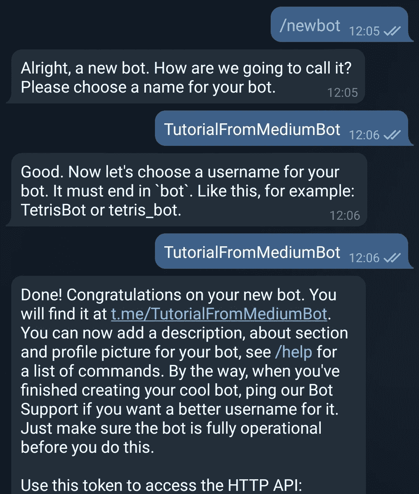
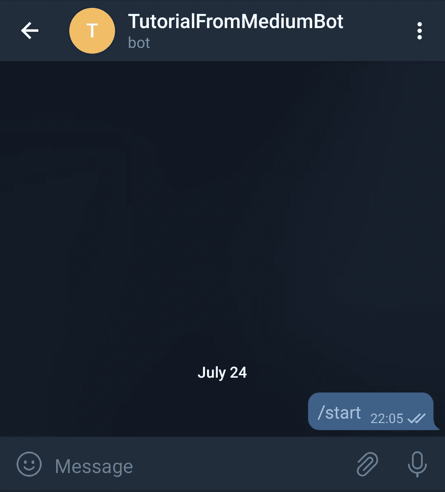
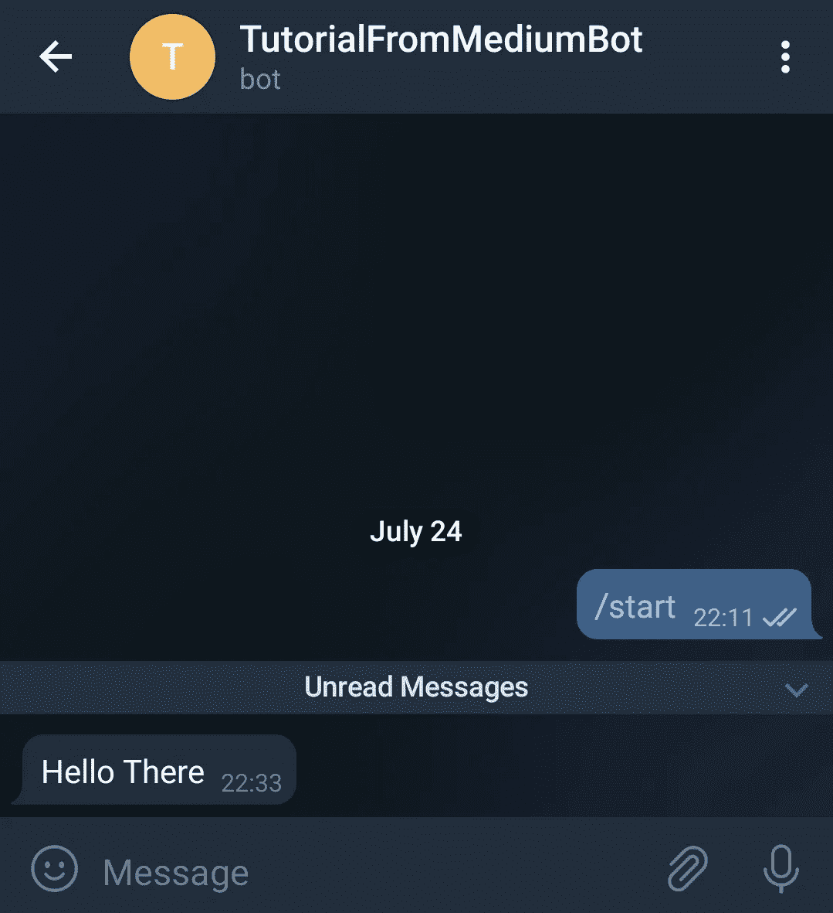
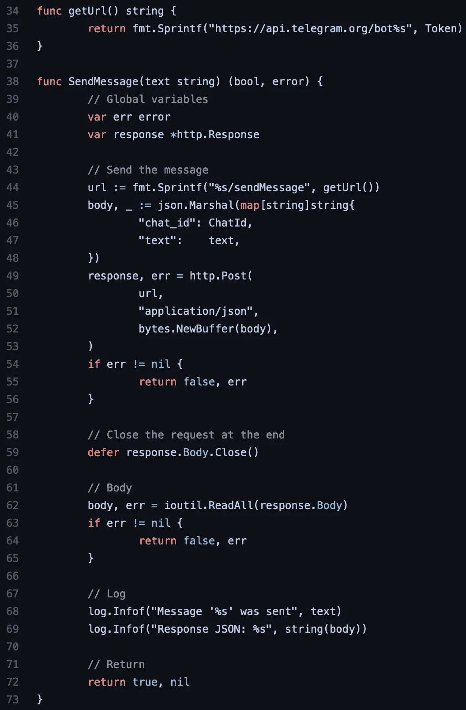

# 如何使用 Go 向您的手机发送电报信息

> 原文：<https://medium.com/geekculture/how-to-use-go-to-send-telegram-messages-to-your-phone-a819bdf7f35c?source=collection_archive---------7----------------------->

## 关于如何使用 Go 从服务器通过电报发送消息的简短指南


Photo by [Eugene Chystiakov](https://unsplash.com/@eugenechystiakov?utm_source=medium&utm_medium=referral) on [Unsplash](https://unsplash.com?utm_source=medium&utm_medium=referral)

本指南将介绍创建电报机器人的步骤，以及如何使用它向您的手机或平板电脑发送消息。你需要的只是电报 app 和围棋基础知识。

# 观众

软件工程师、开发工程师、系统管理员、其他知道或打算学习围棋的人

# 先决条件

*   装有 Linux 或 macOS 的计算机
*   安装在该计算机上— [指令](https://golang.org/doc/install)
*   安装在那台计算机上的 git—[指令](https://git-scm.com/downloads)
*   智能手机或带有 SIM 卡的平板电脑(Telegram 应用程序需要电话号码)

# 步伐

## [ 1 ].创建一个电报机器人

在手机或平板电脑上安装 Telegram 应用程序:

*   对于苹果设备:[应用商店](https://apps.apple.com/app/telegram-messenger/id686449807)
*   对于 Android 设备: [Google Play](https://play.google.com/store/apps/details?id=org.telegram.messenger)

如果您还没有帐户，请按照说明在此应用程序上创建帐户。

打开应用程序，在右上角你应该可以找到搜索图标。在那里，搜索“*僵尸爸爸*”。


现在，使用 */newbot* 命令，并按照屏幕截图中显示的电报应用程序的指示进行操作:



在您的计算机中打开一个终端窗口，将令牌放入一个变量中，然后像下面这样导出:

```
# This is just an example, use your own unique tokenexport TOKEN="0123456789:FAEEbVYdi_MyqlL7NTzyvR1PT9JidSLotJ0"
```

让终端窗口保持打开状态，以便执行后续步骤。

## [ 2 ].找出聊天 ID

现在你需要找到你的电报用户名的聊天 ID。这是必需的，因为机器人必须知道将要发送的消息的目的地。

要找到它，您必须向您的 bot 发送消息，如下所示，然后运行 GET 请求。所以，让我们开始吧。

在你的手机或平板电脑中，打开电报应用程序，搜索你的机器人名称，按下下面的开始按钮。这将发送第一条消息，该消息将是“ */start* ”。



现在，我们可以在同一个终端窗口中运行以下命令:

```
curl -s [https://api.telegram.org/bot${TOKEN}/getUpdates](https://api.telegram.org/bot${TELEGRAM_TOKEN}/getUpdates)
```

输出应该类似于:

```
{"ok":true,"result":[{"update_id":116133001,"message":{"message_id":1,**"from":{"id":12345678**,"is_bot":false,"first_name": "Marius","username": "<USERNAME_REMOVED>","language_code":"en"},"chat":{"id":90851090,"first_name":"Marius","username":"<USERNAME_REMOVED>","type":"private"},"date":1627153519,"text":"/start","entities":[{"offset":0,"length":6,"type":"bot_command"}]}}]}
```

我知道，那是又长又丑，但光秃秃的跟我在一起。进一步需要的信息以粗体格式显示—**" from ":{ " id ":12345678**

在同一终端窗口中，键入以下内容:

```
export CHAT_ID="12345678"# This is just an example, use your own chat ID
```

## [ 3 ].使用 Go 发送消息

在终端窗口上，运行以下命令:

```
git clone [https://github.com/marius-lupu/medium.com.git](https://github.com/marius-lupu/medium.com.git)
cd medium.com/Go/send-telegram-message/
go run main.go -message "Hello There"
```

输出应该类似于:

```
INFO[0000] Message 'Hello There' was sent               
INFO[0000] Response JSON: {"ok":true,"result":{"message_id":8,"from":{"id":1005622813,"is_bot":true,"first_name":"TutorialFromMediumBot","username":"TutorialFromMediumBot"},"chat":{**"id":12345678**,"first_name":"Marius","username":"<USERNAME_REMOVED>","type":"private"},"date":1627155181,**"text":"Hello There"**}}
```

现在，您应该会在智能手机或平板电脑上收到一条信息:



就是这样！

在本文接下来的部分，我将解释一下围棋程序的神奇之处。

我不能在这篇文章中粘贴完整的源代码，所以，我会添加一个 GitHub 的链接，我只粘贴最重要的部分——github.com



*   在 *SendMessage* 函数中，第 44 行的 *url* 变量如下所示:
    *https://api.telegram.org/bot<令牌> /sendMessage*
*   从第 45–48 行开始，我们必须添加将在 POST 请求中使用的 JSON 有效负载。在那里，我们必须添加聊天 ID 和需要发送的文本消息。
*   从第 49–53 行，您可以看到发送消息的实际 POST 请求。
*   我们必须关闭第 59 行的请求，就这样。

# 前进部分

*   Telegram WebHooks 的文档，当聊天中发送某个消息时，机器人执行某个动作的一种方式—[telegram.org](https://core.telegram.org/bots/webhooks)

# 更多信息

*   一些关于电报机器人的有用信息:[core.telegram.org](https://core.telegram.org/bots#)
*   bot API 的文档:[core.telegram.org](https://core.telegram.org/bots/api)
*   http Go 包的文档: [pkg.go.dev](https://pkg.go.dev/net/http)