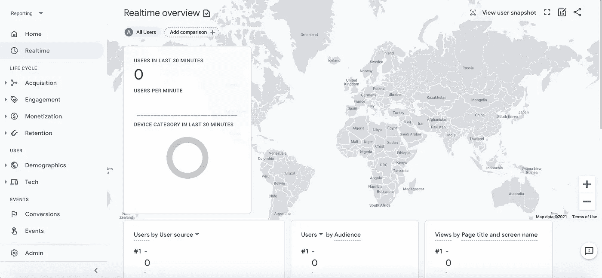
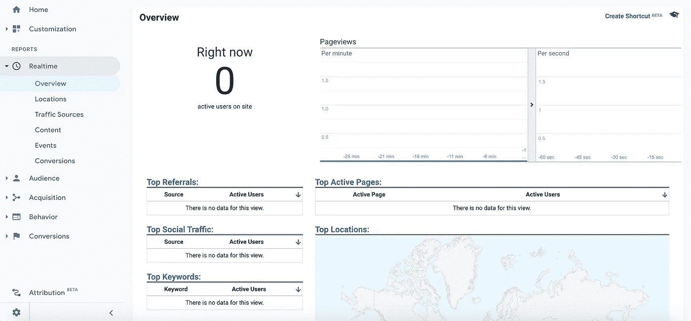
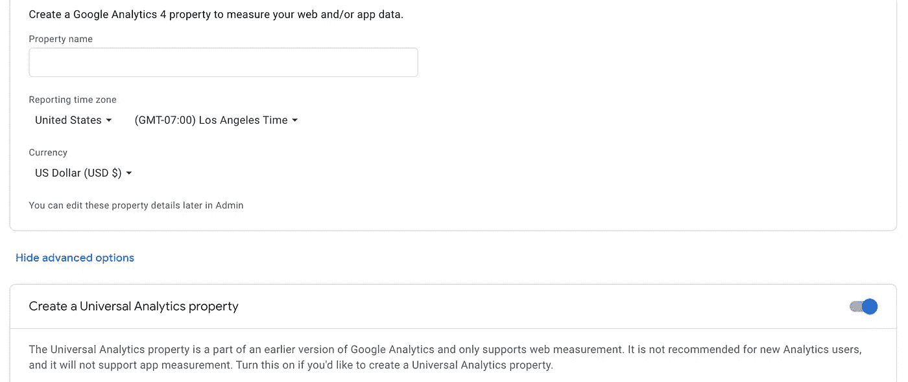
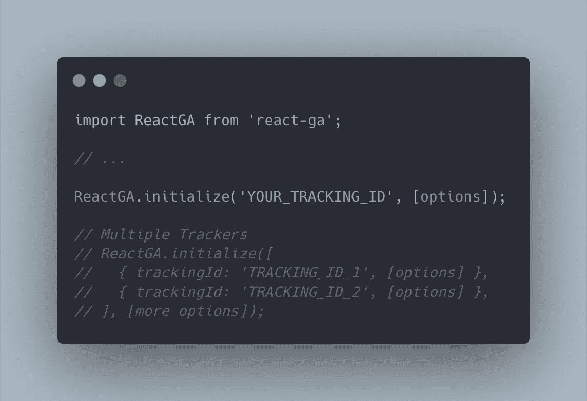
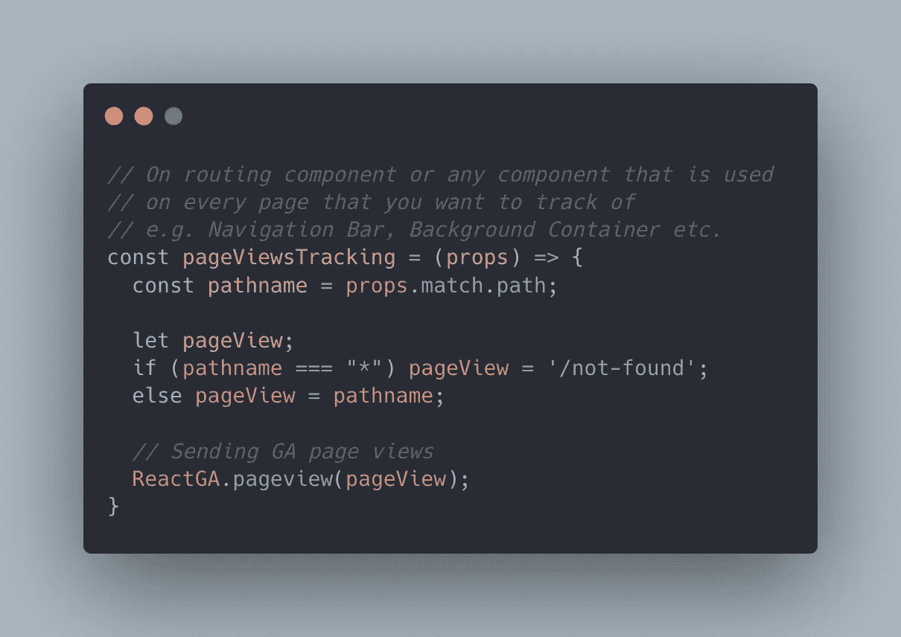
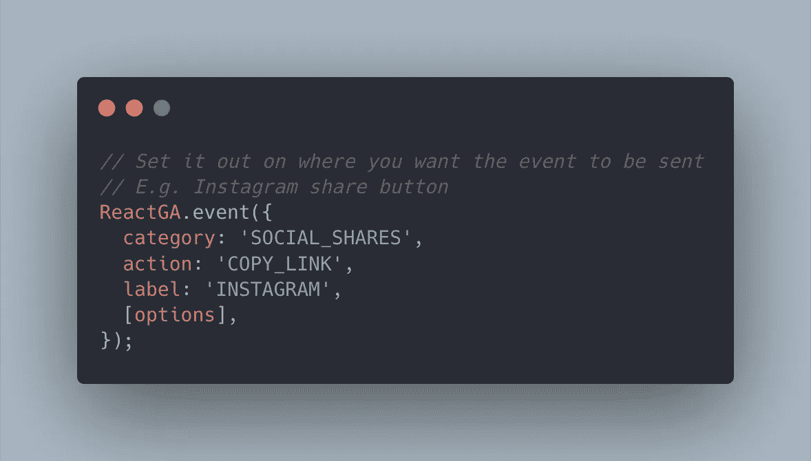
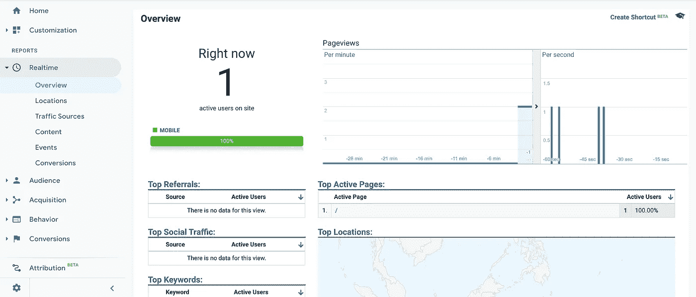

# 如何在 5 分钟内使用 ReactJS 上的谷歌分析

> 原文：<https://medium.com/geekculture/how-to-use-google-analytics-on-reactjs-in-5-minutes-7f6b43017ba9?source=collection_archive---------0----------------------->


我正在分享如何在 [ReactJS](https://reactjs.org) 上使用[谷歌分析](https://analytics.google.com)和通用分析属性的指南。简单介绍一下我们将要讨论的两种产品:

ReactJS 是一个 SPA(单页应用程序)Javascript 库，用于构建和维护用户界面，这意味着应用程序将根据来自服务器或本地状态的新数据动态编写当前页面，而不是像多页应用程序那样采用浏览器加载整个新页面的默认方法。

谷歌分析(GA)是谷歌的一个分析工具，当用户访问你的网站时，你可以很容易地跟踪重要的用户信息。截至 2020 年第四季度，谷歌推出了新的谷歌分析 4 (GA4)资产，具有更先进的跟踪功能和更好的仪表板。在这篇文章中，我们专门探讨了通用分析(UA)属性，它是 Google Analytics 的旧版本。



Google Analytics 4 Property



Universal Analytics Property

# 准备

首先，您需要按照这些简单的步骤获得您的网站的跟踪 ID。

1.  去谷歌分析网站，如果你是第一次用户，你会被要求建立一个账户，包括你的数据共享设置。
2.  创建新属性—记得选择通用分析属性选项。您可以选择创建 UA 和/或 GA4 属性。
3.  填写其余信息以设置您的帐户和属性；然后您将获得跟踪 ID(例如 UA-123456789–1)。



Don’t forget to select on Universal Analytics property

# 装置

当我在 Google Analytics 和 ReactJS 上使用 UA property 时，我最习惯使用 [React-GA](https://www.npmjs.com/package/react-ga?activeTab=readme) 库。截至本文撰写之时，它在 NPM 的每周下载量已经超过 45 万次。通过在 ReactJS 应用程序上运行这段代码，可以很容易地安装它。

```
# npm
npm i -s react-ga# yarn
yarn add react-ga
```

在你的应用程序的第一个根，你只需要用你的 GA 跟踪 ID 初始化它。对于更复杂的营销活动，公司通常有一个以上的网站跟踪 ID。你也可以在这个库上使用多个跟踪器。



# 履行

你可以在你网站上使用两个简单的 GA 实现。

页面浏览量跟踪——当用户访问您的网站时，您可以跟踪您的用户旅程，以了解关于特定目标漏斗的更多信息，只需在您想要跟踪的每个页面的组件数量上使用这行代码。

```
ReactGA.pageview(window.location.pathname);
```

快速提示:对于动态页面视图跟踪，您可以使用 HOC 在路由组件上实现它。



事件跟踪—您可以跟踪网站上与您的活动目标一致的重要事件，例如成功结账、社交分享、点击特定按钮等。



# 您如何知道已经在 ReactJS 应用程序上正确实现了 Google Analytics？

简单！您只需打开 ReactJS 应用程序或在本地运行它，然后在 GA 仪表板上打开实时报告的 Overview 选项卡。你会看到你的网站上有一个当前活跃的访问者，那就是你！



…瞧！

就是这样！您已经成功地使 GA 能够跟踪您的用户访问的页面视图以及您希望在 ReactJS 应用程序上跟踪的重要事件。

如果您有兴趣了解更多关于 Google Analytics 的信息，我建议您从以下来源了解:

[谷歌分析学院:面向初学者的谷歌分析](https://www.youtube.com/playlist?list=PLI5YfMzCfRtZU5Qwzx57HjmZyNE2o5YDN)

[谷歌分析学院:高级谷歌分析](https://www.youtube.com/playlist?list=PLI5YfMzCfRtYPbAhaAMHtSOO_ZS-cmW22)

[谷歌分析学院:面向高级用户的谷歌分析](https://www.youtube.com/playlist?list=PLI5YfMzCfRtYsmijShTK-Xkz8fISlKX5I)

> 希望这篇短文能够回答你的一些问题，或者激发你学习在你的网站上实现分析的兴趣。谢谢你看我的文章！