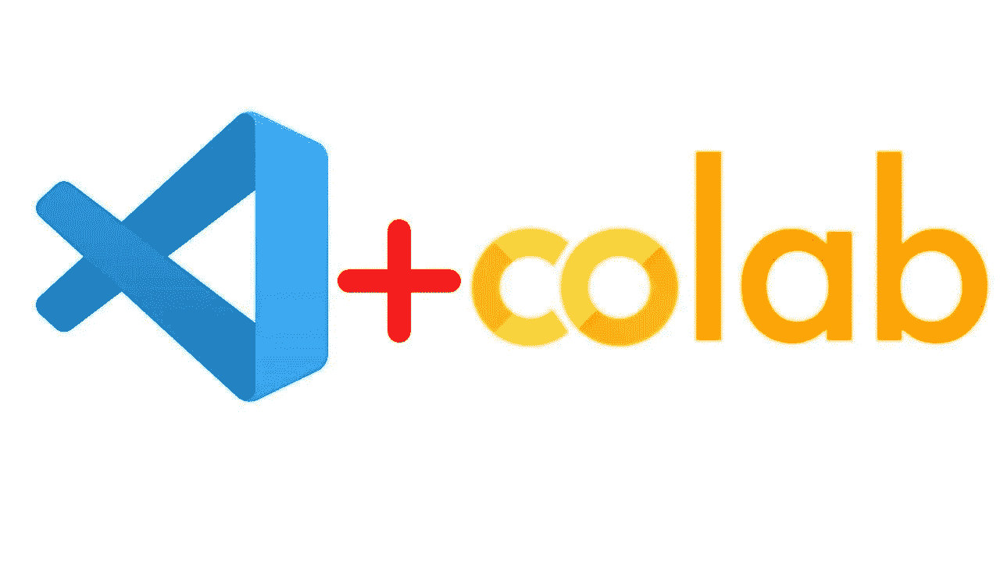
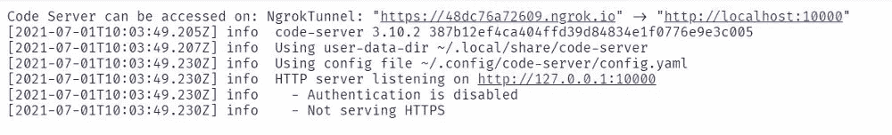
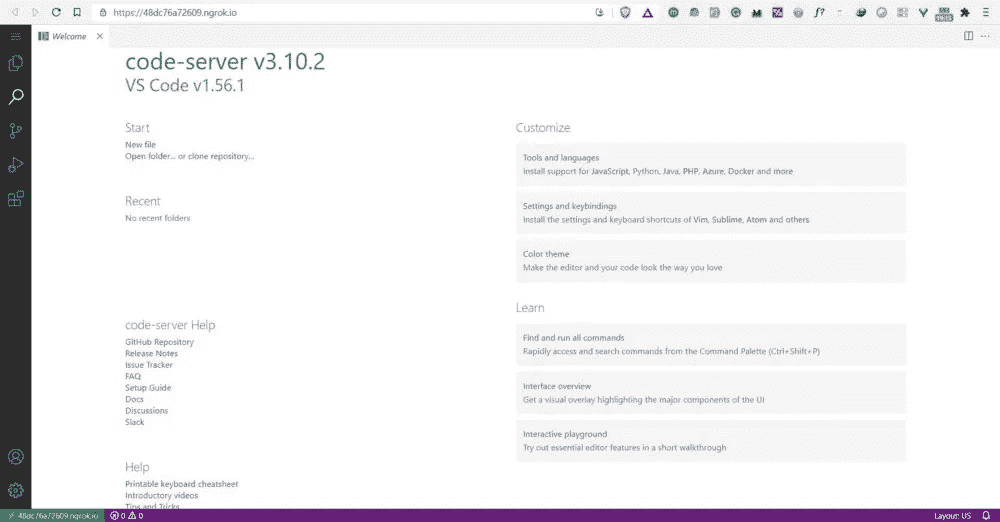
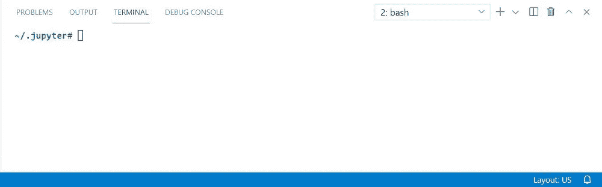
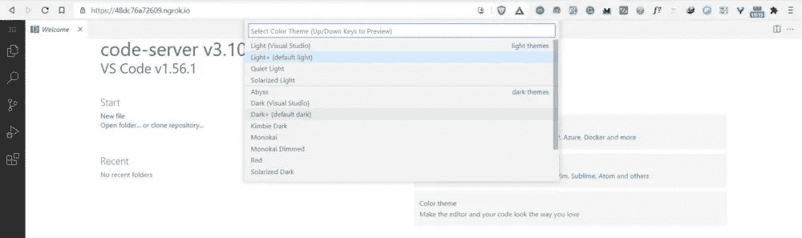
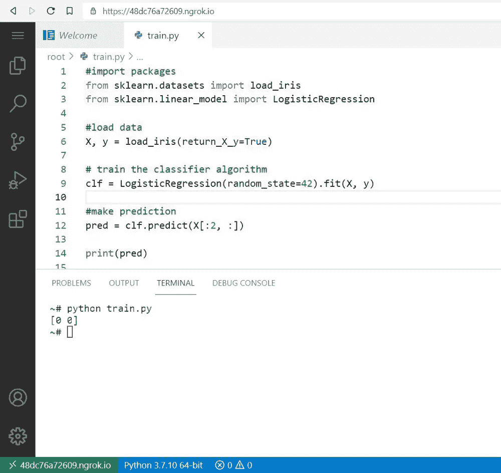

# 如何用 VS 代码使用 Google Colab

> 原文：<https://medium.com/geekculture/how-to-use-google-colab-with-vs-code-8d4876def8ed?source=collection_archive---------6----------------------->

## 像在本地机器上一样利用成熟的代码编辑器。



**Google Colab** 和 **VS Code** 是许多 Python 开发者和研究人员用来开发不同技术解决方案或系统(尤其是在机器学习&数据科学中)的最流行的编辑器工具。

许多 Python 开发人员和数据科学家都知道如何使用 Google Colab，但是您知道吗，您可以在 Google Colab 上设置一个 VS 代码，并像在您的本地机器中一样将其用作编辑器。

**在这篇文章中，你会学到**

1.  如何安装 colabcode python 包？
2.  如何启动 VS 代码(代码服务器)。
3.  如何访问在线 VS 代码？
4.  打开终端。
5.  运行 python 文件。

# 如何在 VS 代码中使用 Google Colab 的步骤

## **1。打开 Colab 笔记本**

第一步是在您的 Google colab 中启动一个新的 Colab 笔记本，您可以根据需要重命名该文件。

比如 **run_vscode.ipynb**

## **2。安装 colabcode python 包**。

要将 Google Colab 与 VS Code(代码服务器)一起使用，需要安装 colabcode python 包。这是一个很棒的开源 python 包，由 Abhishek Thakur 开发。

要安装该软件包，请在您的笔记本单元中运行以下命令。

```
!pip install colabcode
```

## **3。导入代码**

下一步是从包中导入 ColabCode 类。

```
from colabcode import ColabCode
```

## **4。创建 ColabCode 的实例**

导入 ColabCode 后，您需要创建 ColabCode 的一个实例，并设置以下参数。

*   **端口** —您想要运行代码服务器的端口。例如，端口=10000
*   **密码** —您可以设置一个密码来保护您的代码服务器免受未经授权的访问。这是一个可选参数。
*   **mount_drive** —如果你想使用你的 Google drive。这是一个布尔参数，意味着你可以设置真或假。这是一个可选参数。

```
ColabCode(port=10000)
```

## **5。启动代码服务器**

运行 ColabCode 实例后，它将启动服务器并显示访问代码服务器的链接。



你需要点击链接，它会在一个新的标签中打开。



现在，您可以利用成熟的代码编辑器，在 Colab VM 上运行不同的实验。

**注意:**如果您检查您的 Colab 笔记本，您将观察到运行 ColabCode 实例的单元正在持续运行。除非你想关闭运行 VS 代码的代码服务器，否则不要关闭你的 Colab 笔记本。

# 在 Google Colab 上使用 VS 代码的技巧

启动代码服务器后，以下提示将帮助您开始在 Google Colab 上使用 VS 代码。

## **1。打开端子**

要在 Google Colab 上运行的 VS 代码上打开终端，使用下面的快捷命令

```
**Ctrl + Shift + `**
```



## **2。改变主题**

您可以通过单击设置图标(左下角)然后单击“颜色主题”来更改编辑器的主题。它将打开一个弹出窗口，您可以选择不同的主题选项。



## **3。运行 Python 文件**

您可以通过单击侧边栏上的“文件”部分来创建 python 文件，然后选择“新建文件”选项卡。


在下面的示例中，您将看到如何运行一个简单的 python 文件，该文件训练机器学习算法将鸢尾花分为三个种类(setosa、versicolor 或 virginica ),然后进行预测。



# 关于如何在 VS 代码中使用 Google Colab 的最终想法

恭喜👏👏，你已经做到这篇文章的结尾了！我希望你学到了新的东西。你可以在 Google Colab 上设置 VS 代码，让你的编码更上一层楼。

也可以使用 Kaggle 平台上的 colabcode python 包来运行 VS 代码。你只需要遵循上面提到的相同步骤。

如果你学到了新的东西或者喜欢阅读这篇文章，请分享给其他人看。在那之前，下期帖子再见！

你也可以在推特上找到我 [@Davis_McDavid](https://twitter.com/Davis_McDavid?ref=hackernoon.com) 。

*最后一件事:在下面的链接中阅读更多类似的文章*

[](/nerd-for-tech/python-substrings-everything-you-need-to-know-4cca526c07eb) [## Python 子字符串:您需要知道的一切

### 在 python 中，字符串是一系列字符，可能包含特殊字符或字母数字字符，用于…

medium.com](/nerd-for-tech/python-substrings-everything-you-need-to-know-4cca526c07eb) [](/geekculture/ai-vs-ml-whats-the-difference-2e2e73e98d9c) [## AI vs ML:有什么区别？

### 了解人工智能和机器学习之间的区别

medium.com](/geekculture/ai-vs-ml-whats-the-difference-2e2e73e98d9c) [](/geekculture/scikit-learn-0-24-top-5-new-features-you-need-to-know-7af15d8cdeac) [## sci kit-学习 0.24:您需要了解的 5 大新功能

### Scikit-learn 仍然是最受欢迎的 Python 开源免费机器学习库之一。的…

medium.com](/geekculture/scikit-learn-0-24-top-5-new-features-you-need-to-know-7af15d8cdeac) 

*本文首发于* [*这里。*](https://hackernoon.com/how-to-use-google-colab-with-vs-code-mm1k3765)