# 如何将 Google Firestore 与 React 类组件一起使用

> 原文：<https://medium.com/geekculture/how-to-use-google-firestore-with-react-class-components-e34881e84c3a?source=collection_archive---------8----------------------->


## 介绍

这个有点特别。我最近建立了一个项目，需要一个谷歌 Firestore 后端和一个反应前端。问题是 React 应用程序必须使用类组件来存储状态，而不是使用 React 挂钩的功能组件。

如果你想在实时数据库中使用 Google Firebase，或者想在 React 应用中添加 Firestore 并使用 React Hooks，有很多不同的教程，但我找不到设置具体配置的教程，所以我自己写了一个！

## 设置 Firestore

本教程假设您已经熟悉 Firebase，并且它是许多产品。如果你不是，我强烈建议你从官方文件开始阅读。它们非常好，涵盖了所有不同类型的应用程序，从 web 到 iOS，到 Android，甚至是 Unity now。

前往 https://firebase.google.com/[的火力基地控制台](https://firebase.google.com/)

在那里，用你的谷歌账户登录，然后点击开始。您将被引导到包含所有 Firebase 项目的页面。如果您以前从未使用过 Firebase，这应该是空白的。在使用 Firebase 时，项目是顶层组件，它包含 in 中每个产品的所有信息。

单击添加项目，并在出现提示时输入项目名称。在本教程中，我们将使用“Firestore-React-Classes”这个名称

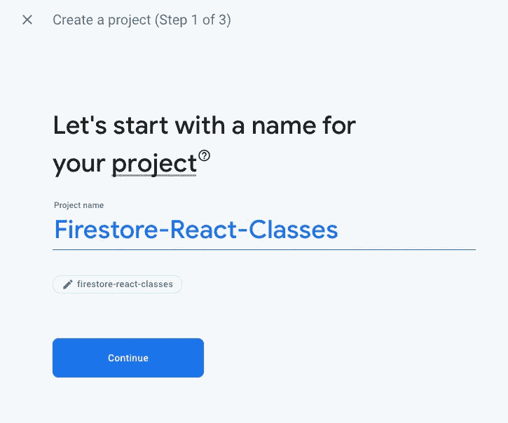

您将被要求启用您的谷歌分析帐户。如果你还没有，只需点击底部的开关选择退出并选择创建项目。

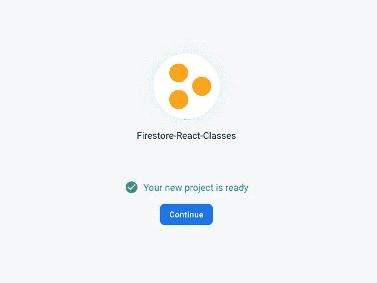

You will see something like this when it is done.

单击“继续”后，您将进入项目的主概览页面。在左侧，您可以看到 Firebase 提供的所有产品，如身份验证、实时数据库、存储、托管和功能。


今天，我们只关心云 Firestore，让我们从点击它开始。

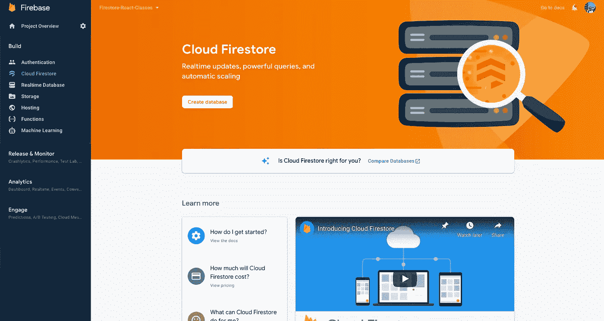

单击屏幕中央的“创建数据库”按钮开始。您将希望以“测试模式”启动数据库，以便可以轻松地向数据库发送数据和从数据库接收数据，而不用担心权限问题。我们可以回头改变这一点。

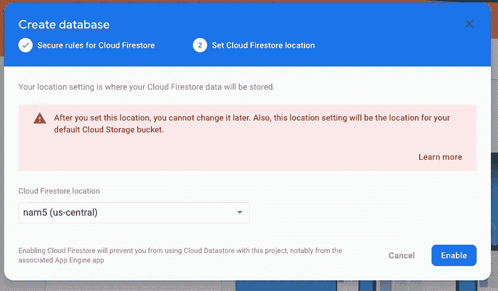

选择一个离你最近的地方。这将有助于提高调用云服务器的速度，因为它离你的位置更近。一般来说，这没有太大关系，尤其是对于像我们今天这样的小应用程序。

创建数据库后，您将看到如下所示的屏幕:

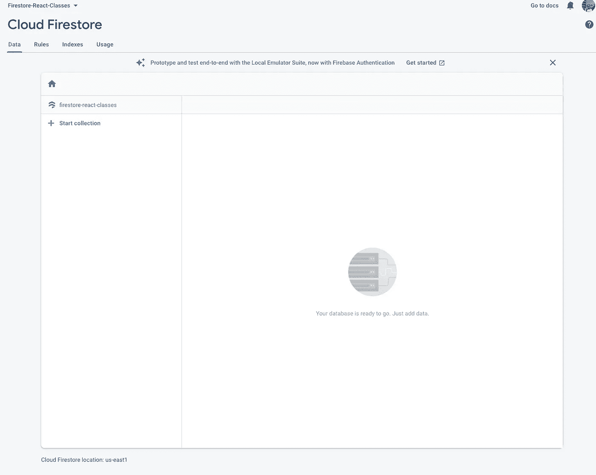

该集合基本上是 Firestore 服务器上所有数据的目录。您可以在同一个服务器上拥有多个集合，并且您可以在您的前端分别访问每个集合，我将在后面进行演示。

让我们创建两个集合。用户和消息

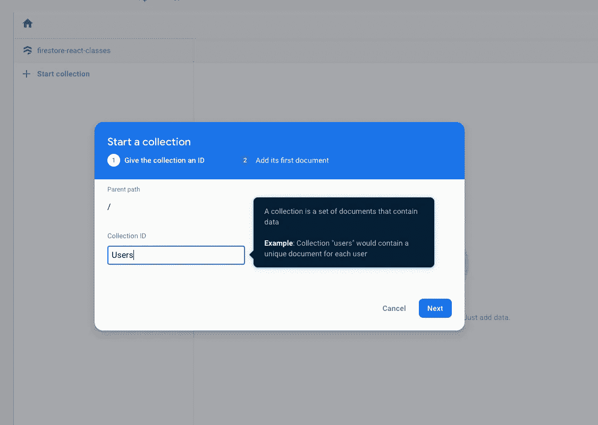

单击“开始收集”,并将其中的每一项添加为收集 ID。

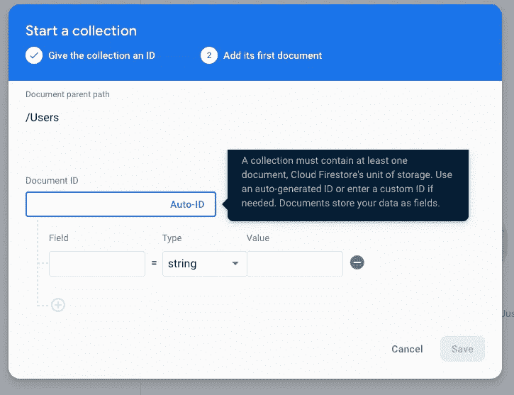

接下来，您将看到一个类似这样的屏幕。DocumentID 将是 Firestore 为输入其中的每条数据生成的唯一 ID。在此之下，每一段 dat 都将包含具有特定数据类型和值的字段。

在几个步骤中，我们将从前端的一个表单中添加所有这些信息，但现在，让我们播种一些初始数据，以便我们可以下拉我们的应用程序。

我正在后台观看大都会队的春训比赛，所以在本教程中，我们的用户将是大都会队的球员。

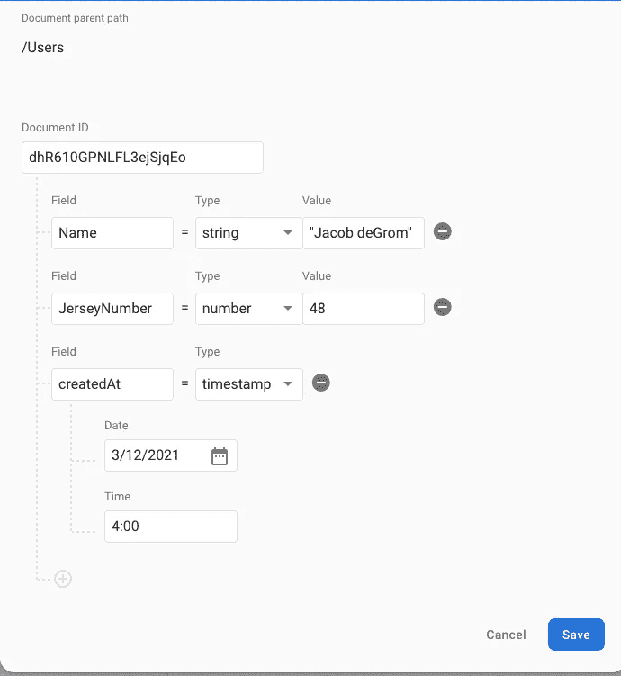

Jacob de🐐

当您创建完两个集合并在每个集合中添加一些种子数据后，您的 Firestore 控制台应该如下所示:

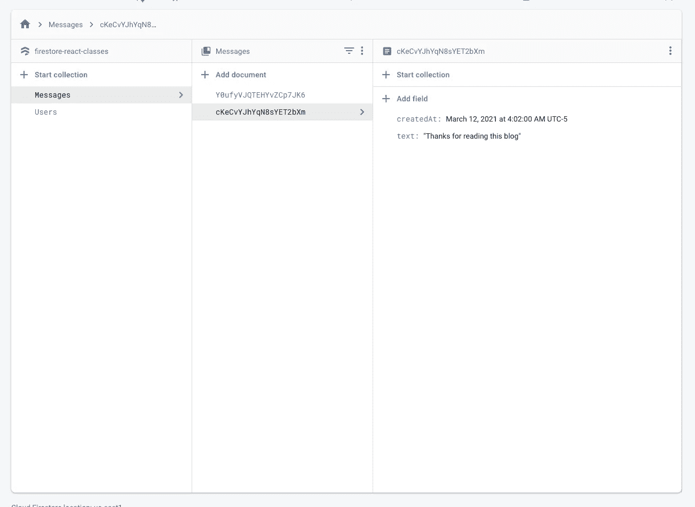

2 different collections with seeded data

现在回到 Firestore-React-Classes 的项目概述页面，因为是时候链接我们的 web 应用程序 React 了。

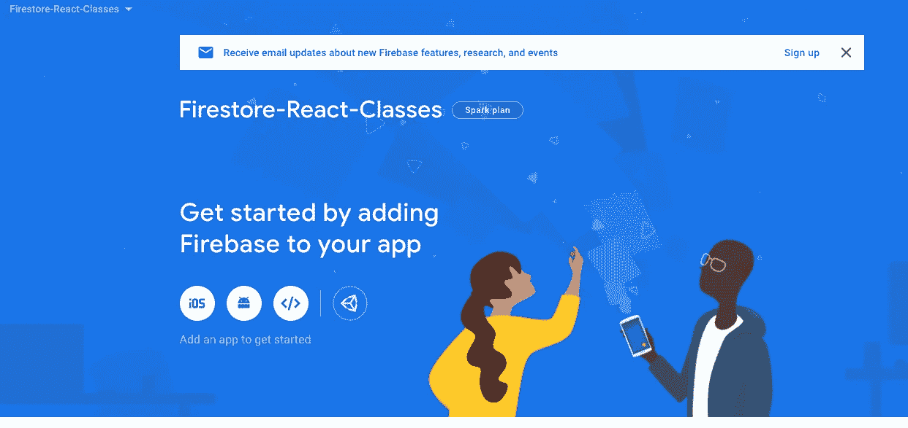

点击>符号开始。你需要通过给你的应用起一个名字来注册你的应用，这个名字只是你和 Google 用来参考的一个内部名字。除了你没人会看到这个。让我们保持一致，称之为“Firestore with React Classes Demo”。现在让我们跳过托管选项。

当你点击下一步时，你将得到一个 configObject，它将被用来把你的 React 应用链接回 Firebase。现在你不需要复制它，只需按继续。

## 设置 React

现在，让我们开始创建我们的 React 应用程序。

我最喜欢的方法是使用 [Create React 应用程序节点](https://reactjs.org/docs/create-a-new-react-app.html)。如果您没有安装它，请按照该链接获取如何设置它的说明。

假设您已经安装了它，请按顺序运行以下命令

```
npx create-react-app react-firestore
cd react-firestore
npm start
```

这将创建、加载并启动显示默认页面的应用程序:

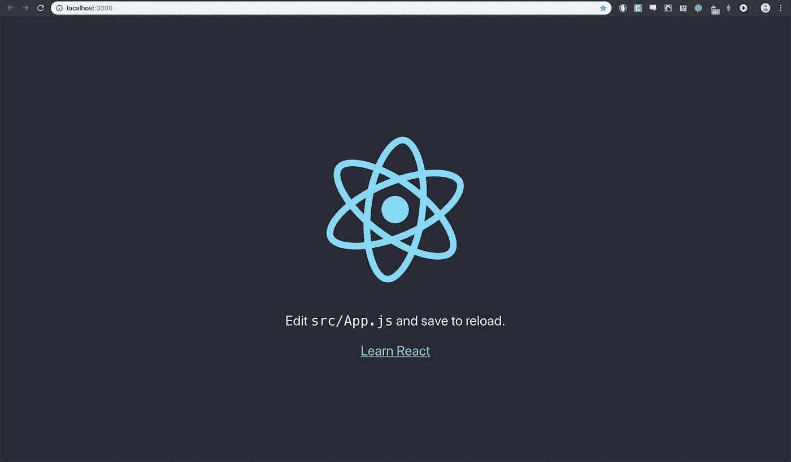

转到 App.js 组件，删除所有样板文本。

然后在您的终端运行:

```
npm i firebase
```

这将把 firebase 包添加到 package.json 文件中，并允许您访问 firebase 和 firestore 库。

在应用顶部导入以下内容:

```
import firebase from 'firebase/app'import 'firebase/firestore'
```

firebase/app 必须排在第一位，然后才是 firebase/firestore

完成后，App.js 应该是这样的:

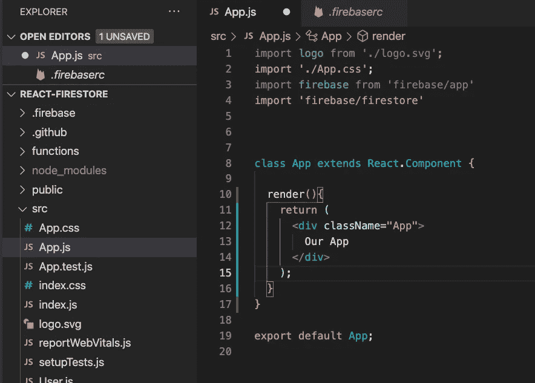

## 将 Firestore 链接到 React 应用程序

现在，我们将返回 Firestore 控制台，获取之前的配置对象。回到你的 Firestore-React-Classes 页面，点击齿轮图标。然后进入项目设置选项卡。

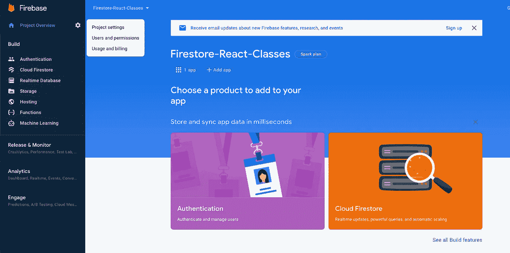

如果你向下滚动设置页面，你会看到一个“你的应用”部分。单击配置气泡并复制该 fireBaseConfig 对象。为了本教程的目的，以防万一，我将改变我的👀。

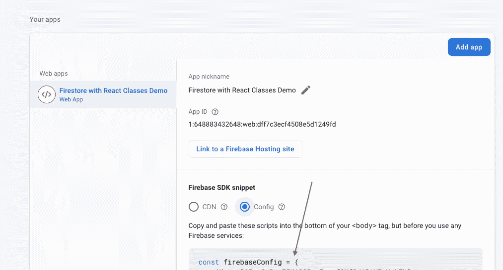

回到 React 应用程序，我们将创建一个名为 Firestore.js 的独立组件

我们将使用它，以便在 React 应用程序中只有一个对我们数据库的引用，我们可以根据需要将其导入不同的组件。

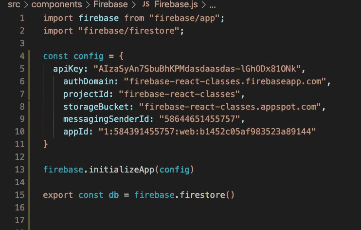

确保导入 firebase 和 firebase/firestore。然后复制您的配置对象，并使用它来调用。通过将配置传入。这就是 React 和我们的 Firebase 项目之间的联系。在底部，我们设置 db 等于 firebase.firestore()并导出它。

现在，当我们在其他应用程序中导入 Firebase 组件时，我们将可以直接访问这个表示 Firestore 连接的数据库变量。从那里，我们将能够在应用程序上调用一堆不同的方法。

## 从 Firestore 获取信息

现在，让我们回到 App.js 文件。

在其中，我们将编写一个方法来获取当前在 Firestore 中的消息，并将它们存储在 React 应用程序的状态中。

```
import Firebase from './components/Firebase/Firebase'class App extends React.Component { state = {
    user: false,
    messages: []
  }fetchMessages = () => {
  const query = db.collection('Messages').orderBy('createdAt');
  query.onSnapshot((snapshot) => {
    snapshot.docChanges().forEach((change) => {
      const messageObj = {}
      messageObj.data = change.doc.data()
      messageObj.id = change.doc.id
      this.setState({
        ...this.state,
        messages: [messageObj, ...this.state.messages]
      })
    })
  })
}
```

在这种方法中，我们使用了一种叫做。onSnapshot 在我们的 Firestore 上为任何变化创建一个监听器，当一个变化发生时，我们捕捉变化并将其发送到应用程序。

首先，我们从保存 Firebase 组件的地方导入它(在我的例子中)。/components/fire base/fire base . js ')。接下来，我们创建一个变量“query”，并将其设置为等于 db . collection(“Messages”)。orderBy('createdAt ')。

请记住，db 对象只是我们之前导入的 Firestore 的引用。然后我们打电话。集合，并传入“Messages”来告诉它在 Firestore 中名为“Messages”的集合中查找。从那里。orderBy 方法允许我们按照接收数据对象的顺序进行排序，在本例中是按照它们的 createdAt 属性排序(较新的优先)。

接下来，我们调用。这个查询对象上的 onSnapshot(记住它只是对 Firestore 的消息集合的引用)将为任何更改创建一个监听器。从技术上来说，应用程序第一次加载时，其中的所有消息都会被认为是变化的，所以一开始你只会收到所有消息的完整列表。

当我们获得所有这些更改时，我们使用 this.setState 将它们分别添加到我们应用程序状态的 messages 属性中。这很有用，因为当我们的 Firestore 发生任何更改时，该函数将触发 setState 方法，该方法会将新消息添加到我们的商店并为我们重新呈现应用程序，这样我们就不需要刷新它来加载新消息。

将它与 React 类组件一起使用的最后一个关键部分是，我们需要将这个侦听器添加到我们的 App.js 组件 componentDidMount()函数中，以便在每次加载组件后调用它。

为此，在 App.js 的 render 函数下添加以下代码:

```
componentDidMount(){
  this.fetchMessages()
}
```

现在，我们已经成功地在应用程序上为 Firestore 中的任何更改创建了一个监听器，它将在每次实时更改时重新呈现我们的应用程序。

今天就到这里吧！请关注我的下一篇博客，我将在这篇博客上展开，向您展示如何使用 React 类组件在 Firestore 中添加和删除内容。当它完成的时候我会在这里链接它！