# 如何配合 Kubernetes 使用 Helm？

> 原文：<https://medium.com/geekculture/how-to-use-helm-with-kubernetes-363d5eee6371?source=collection_archive---------7----------------------->

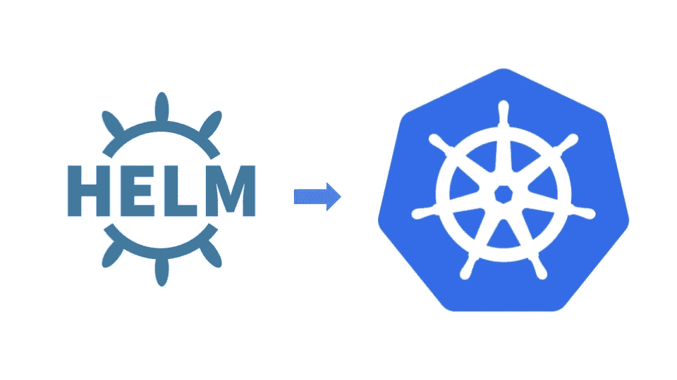

# Kubernetes 简介

从根本上来说，ubernetes 是一个在机器集群上运行和协调容器化应用的系统。它是一个平台，旨在使用提供可预测性、可伸缩性和高可用性的方法来完全管理容器化应用程序和服务的生命周期。

作为 Kubernetes 用户，您可以定义您的应用程序应该如何运行，以及它们应该能够与其他应用程序或外部世界交互的方式。您可以扩大或缩小您的服务，执行平稳的滚动更新，并在不同版本的应用程序之间切换流量，以测试功能或回滚有问题的部署。Kubernetes 提供了接口和可组合平台原语，允许您以高度的灵活性、功能和可靠性来定义和管理您的应用程序。

# 什么是头盔？

简单来说，Helm 是 Kubernetes 的一个包经理。Helm 是 K8s 相当于 yum 或者 apt。Helm 部署图表，您可以将其视为打包的应用程序。它是所有版本化的、预先配置的应用程序资源的集合，这些资源可以作为一个单元进行部署。然后，您可以使用一组不同的配置部署图表的另一个版本。

Helm 在三个关键方面提供帮助:

*   提高生产力
*   降低微服务部署的复杂性
*   支持云原生应用的改编

# 为什么要用头盔？

为所有需要的 Kubernetes 对象编写和维护 Kubernetes **YAML 清单**可能是一项耗时且乏味的任务。对于最简单的部署，您至少需要 3 个具有重复和硬编码值的 YAML 清单。Helm 简化了这一过程，并创建了一个可以向您的集群发布的软件包。

# 什么是舵图？

舵轮图是简单的 Kubernetes YAML 清单组合成一个单一的软件包，可以广告到您的 Kubernetes 集群。打包后，将 Helm Chart 安装到集群中就像运行一个 **helm install** 一样简单，这真正简化了容器化应用程序的部署。

# 先决条件

成功且安全地使用 Helm 需要以下先决条件。

1.  库伯内特星团
2.  决定将哪些安全配置应用于您的安装(如果有)
3.  安装和配置 Helm。

***在这篇博客中，我们将创建一个简单的具有后端 MYSQL 连接的 wordpress helm 图表。***

## 在配置 wordpress helm 图表之前设置 MySQL 部署

因为 wordpress 需要一个后端数据库来运行，所以让我们首先为它创建一个部署。

为此，我们可以使用 yaml 文件进行部署:-

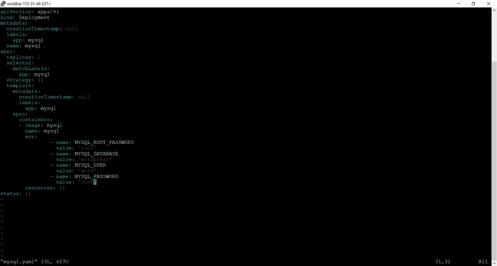

MySQL.yaml deployment file

使用以下命令运行该文件:-

***# kubectl apply-f MySQL . YAML***

创建部署后，公开服务，以便 wordpress 可以使用:-

***# kubectl expose deploy MySQL—port:3306—type = NodePort***

3306 是 MYSQL 的默认端口号。

## 现在让我们为 wordpress 配置一个舵图

## 步骤 1:配置 k8s 集群

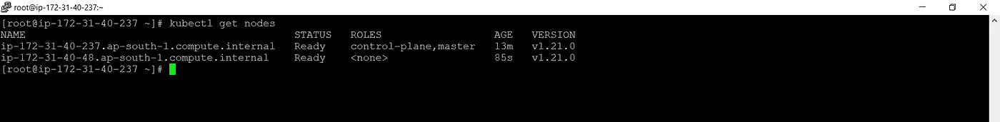

K8s cluster configured

上图所示的集群已经配置好，并在本教程中使用。

## 步骤 2:安装舵

根据操作系统，Helm 可以使用下面提到的链接和 **wget 命令**或任何其他命令进行安装

[https://get.helm.sh/helm-v3.5.2-linux-amd64.tar.gz](https://get.helm.sh/helm-v3.5.2-linux-amd64.tar.gz)

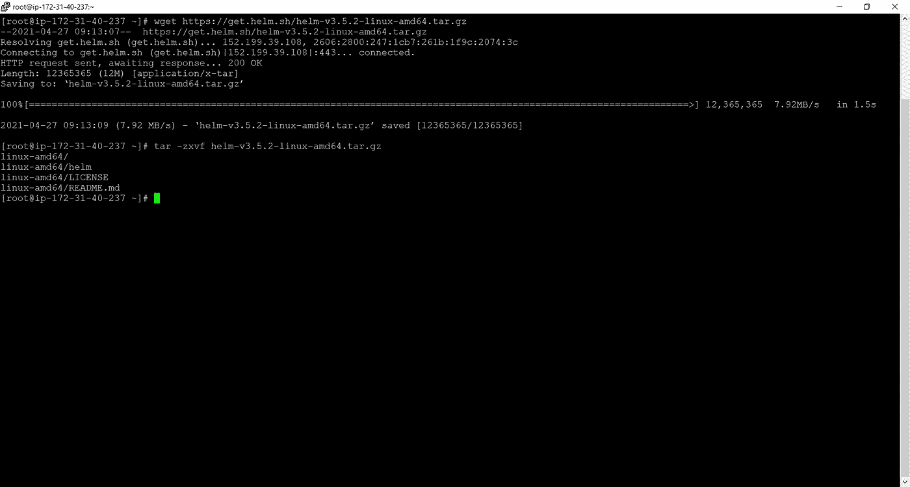

下载头盔后:-

拆开(***# tar-zxvf helm-v3.5.2-linux-amd64.tar.gz***)

在解压缩的目录中找到`helm`二进制文件，并将其移动到所需的目的地(`***mv linux-amd64/helm /usr/bin/***`

## 第三步:安装舵图

对于安装或创建舵图表，首先创建一个空目录，用您想要创建的图表的名称可以用 ***mkdir*** 命令来完成。在我们的例子中。

现在，在目录中安装舵图的基本要求是图文件的默认名称为 **Chart.yaml** 。其中包含了舵图的基本信息。

Chart.yaml file

现在，可以通过执行命令 helm install[chart _ name][directory _ name]/将 helm chart 安装到目录中

***#掌舵安装*/WordPress**

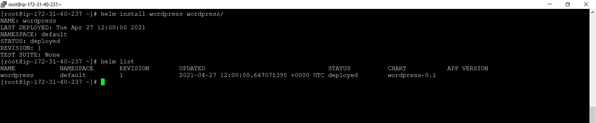

helm installed in the directory

## 步骤 4:在舵图中添加 yaml 文件

为了在 helm chart 目录中添加 yaml 文件，创建另一个名为 templates 的目录/文件夹(默认情况下)。

并在其中添加所有的 Yaml 文件。此配置中使用了两个文件

1.  部署文件包含后端 MySQL 的环境值的详细信息。

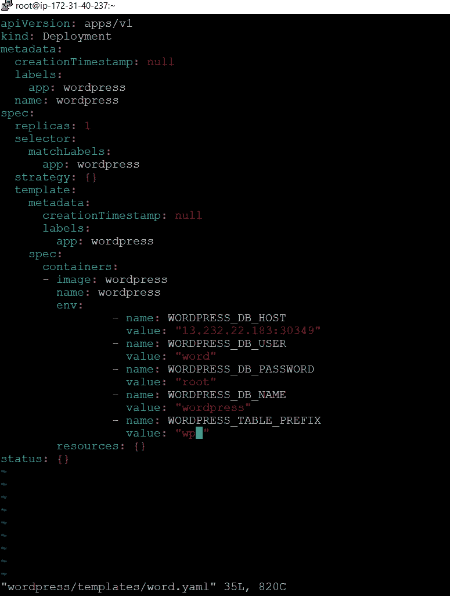

wordpress deployment file

2.这个服务文件公开了 wordpress 部署的公共世界连接服务。

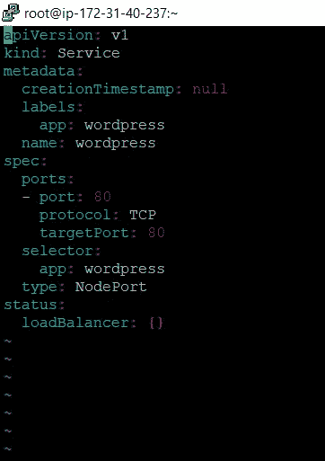

service file for exposing the wordpress alongside

## 第五步:头盔升级

因此，一些新的文件被添加到舵图中，以影响变化，如果我们再次试图安装舵图，它会给我们错误。

现在我们将不得不借助头盔升级命令:-

***#helm 升级 wordpress/***

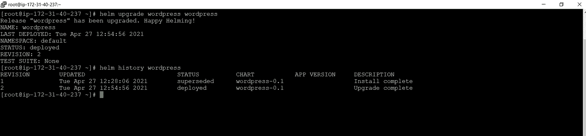

output of upgrade command

现在将分别启动所需的资源

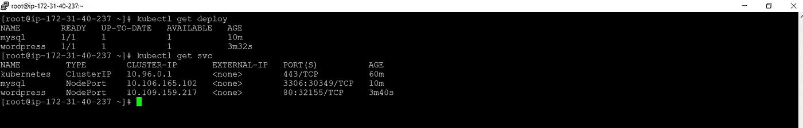

resources launched successfully

因此，我们的舵图已成功设置和配置。

## 结果:访问 wordpress 站点

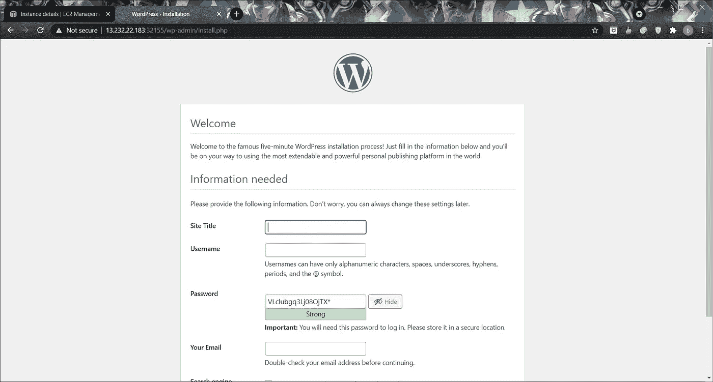

wordpress successfully configured

在此页面上创建帐户后，将出现一个登录页面

login page

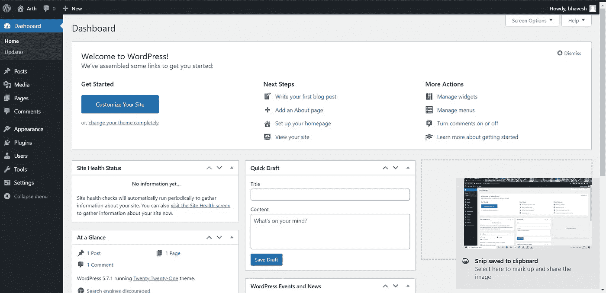

由于登录仪表板出现后，通过这一点，我们可以得出结论，舵轮图已配置成功，并已与后端 MYSQL 正确连接。

所有文件可从以下网址获得:-

 [## bhaveshkumawat/kubernetes-helm-chart-WordPress

### 在 GitHub 上创建一个帐户，为 bhaveshkumawat/kubernetes-helm-chart-WordPress 的开发做出贡献。

github.com](https://github.com/bhaveshkumawat/kubernetes-helm-chart-wordpress) 

# 让我们的图表更加动态

为了使我们的图表在前面的文件中更加动态，mysql 数据库的值是硬编码和固定的，任何人都可以有他们不同的值。

因此，价值观的概念应运而生。为了动态取值，创建一个缺省名为 ***values.yaml*** 的文件，并在该文件中定义变量值。

例如，让我们以自己的图表为例:-

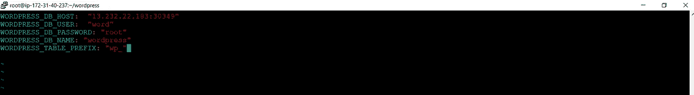

values.yaml file

并使用该值作为***{ { . values . variable _ name } }***

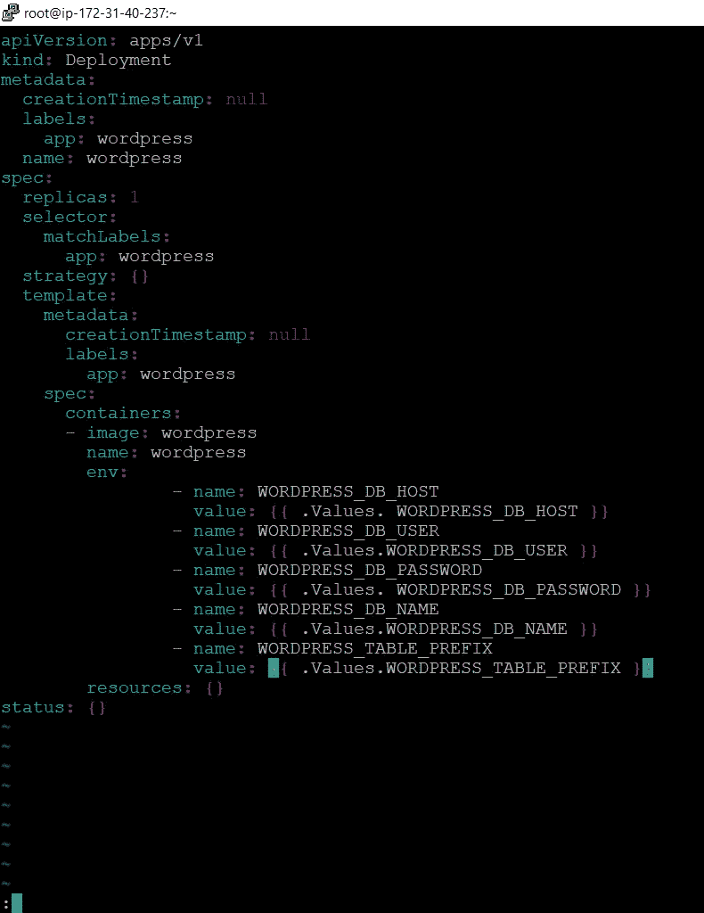

dynamic values fille

现在，在安装图表之前，可以在文件中定义自己的值，wordpress 将相应地进行配置。