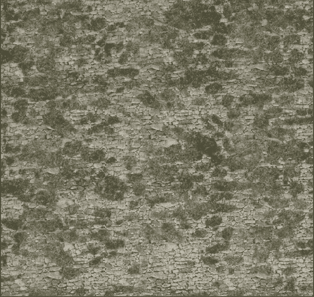
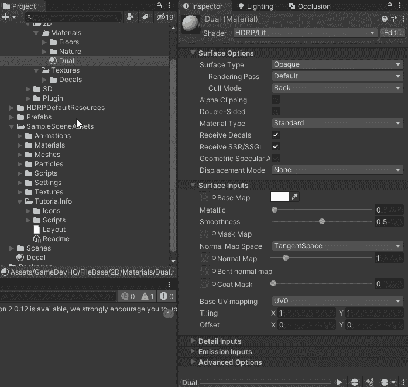
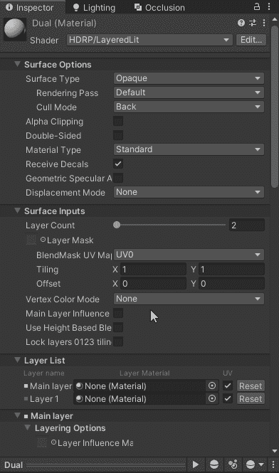
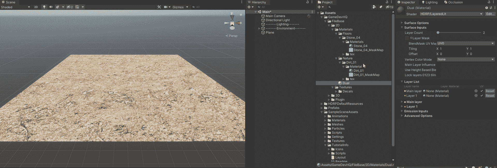
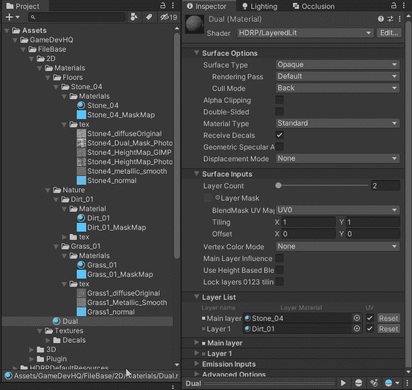
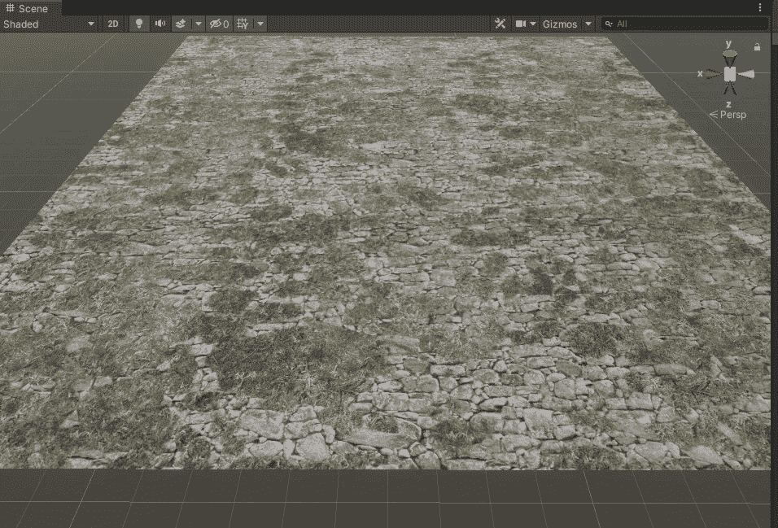

# 如何在 Unity 中使用分层光照混合纹理贴图

> 原文：<https://medium.com/geekculture/how-to-use-layered-lit-to-mix-texture-maps-in-unity-a9eb70b4fbc9?source=collection_archive---------13----------------------->

**目的**:了解 **Unity** 中的**分层光照**是什么，如何用它来混合**纹理贴图**。

Two materials layered one on the other

## 什么是分层照明？

这是**高清渲染管道** ( *HDRP* )中的一个功能，允许你在**同一个游戏对象上**顶部**的**上**堆叠**另一个**。**这是一个非常酷的功能，如果你想将**和**两种**材料**混合，比如说 ***沙子*** *和* ***水*** 或 ***污垢*** *和* ***草*** 甚至是 ***污垢***

## 如何获得分层照明设置？

开始**在你的**项目**窗口中创建**一个**新材质**，并将其命名为“ **Dual** ”。从这里我们需要设置**着色器**为**HDRP/图层光照**:

你现在会注意到你的**材质**已经在**检查器**的**表面选项**下被赋予了一个**层数**。**分层点燃**可以有多达 **4 种不同的材料**。当您将此更改为 3 或 4 时，您会注意到在下面的'**层列表**中，**会自动为您的**层**创建**新材料**字段**，您可以在其中**拖动**和**将**放入:

我们现在可以**拖动**和**将 **2 材质**放到这些**字段**中，并且**还可以将**双****材质**拖动到我们在**场景中创建的 **3D 平面**上:******

你会注意到在这个**阶段**只有**污垢层**是**显示的**，这是因为**主层**是 **4 中最下一层**的**，**下一层的**一个**是层 1、层 2、层 3** 。所以因为**污垢**在**层 1** 上，所以它是目前**可见的**。**

接下来，我们需要一个**图层蒙版**来得到这些**图层混合**和**混合**。让我们**拖动**纹理**中的**到这个**字段框**:

最后，我将替换'**污垢** ' **材质**为'**草** ' **材质**，我将确保它保持为**层 1** ，因为我希望它是顶部的**石头**。然后**稍微调整**底图的颜色并为**草**和**石头**使用一些**拼贴**，这就是**最终产品**:

想出新的**材料**的方式多酷啊！