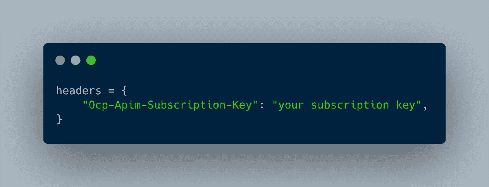
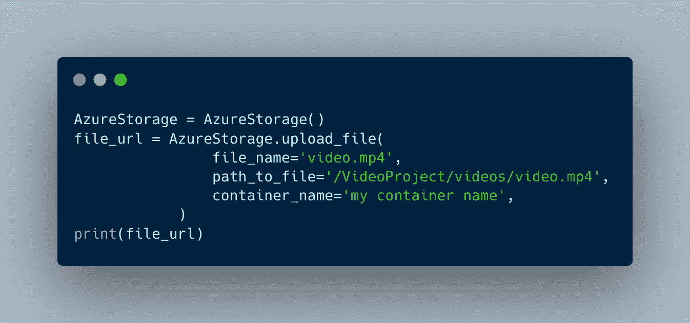

# 如何在 Python 中使用 Microsoft 视频索引器

> 原文：<https://medium.com/geekculture/how-to-use-microsoft-video-indexer-with-python-2e93baffe0a0?source=collection_archive---------9----------------------->

Photo by [Bernard Hermant](https://unsplash.com/@bernardhermant?utm_source=unsplash&utm_medium=referral&utm_content=creditCopyText) on [Unsplash](https://unsplash.com/collections/5034618/colorful-connect?utm_source=unsplash&utm_medium=referral&utm_content=creditCopyText)

曾经不得不分析大量的视频吗？像很多人一样，你不可能看完 2000 年。如果这是一个听起来很熟悉的问题，那么[视频索引器](https://vi.microsoft.com/en-us)就是你的朋友。

这是一个微软 API，可以分析视频中的音频和图像，输出非常丰富的数据。我发现它也非常强大，但需要相当多的时间来建立一个强大的管道，以便您可以大规模使用 API，这就是这篇文章背后的基本原理。

如果你只想上传一个视频，那么在视频索引网站上手动上传会容易得多。但是如果你想定期分析大量的视频，那么希望这篇文章适合你。

## 视频索引器设置

不幸的是，即使只是建立一个账户，有时也会感觉像是在迷宫中找到自己的路。首先，前往 [API 门户](https://api-portal.videoindexer.ai)点击开始，然后创建一个帐户。

完成后，选择 products 选项卡。如果你找不到它，那么你可以直接导航到这个[网址](https://api-portal.videoindexer.ai/products)，点击授权，然后订阅(如果你还没有的话)。请务必保存好您的订阅密钥，您稍后会需要这些密钥！

现在去另一个[不同的视频索引站点](https://www.videoindexer.ai)——我不知道为什么有两个——点击最左边的设置。从本页复制您的帐户 ID。

一旦完成，您就可以前往[他们的交互式 API 门户](https://api-portal.videoindexer.ai/api-details#api=Operations&operations=Get-Account-Access-Token)并获得认证 API 调用所需的访问令牌。如果你想以编程的方式对他做什么，就向下面的 URL 发出一个 GET 请求:

> [https://API . video indexer . ai/Auth/trial/Accounts/your-account-id-goes-here/access token？allowEdit=true](https://api.videoindexer.ai/Auth/trial/Accounts/your-account-id-goes-here/AccessToken?allowEdit=true)

但是，要使 GET 请求工作，您需要在请求头中包含您的订阅密钥，如下所示:

唷，希望你还在我身边。它很快就会少一些管理，多一些 python...

## 与 Azure 的集成

你要解决的下一个问题是如何向 API 发送视频。你可以在 POST 请求中用类似于上面的一些 URL 的语法发送它，但是这不是最好的主意。

这背后的原因是，如果你这样发送，你很可能会丢失数据。视频通常是相当大的文件，因此这可能会产生一些性能问题；此外，它仅限于 2GB，这也可能产生一些其他问题。微软实际上有一篇关于如何大规模使用视频索引器的很好的文章[这里](https://azure.microsoft.com/en-gb/blog/six-things-to-consider-when-using-video-indexer-at-scale/)。

所有这些的解决方案是使用 Azure 存储帐户。这确实要花钱，但非常便宜——我上次检查时大约是每 001 美元，而且是按使用量付费的。

我不打算像刚刚用 Video Indexer 那样设置 Azure 存储帐户，因为这是一个简单得多的过程。这里有一篇关于如何做的很好的文章——你需要的只是这篇文章中提到的连接字符串，然后你就可以开始上传视频了。

## 如何用 Python 把视频上传到 Azure

一旦你得到了最重要的连接字符串，这里有一些代码可以用来上传你的视频。

如果你想使用上面脚本中的类来上传一个视频文件并获取 URL，那么这就是你要做的！

为此，你需要在 Azure 中为你的视频创建一个容器。我认为在 Azure 中手动这样做很简单，然后将容器名称传递到脚本中——你可以只将其称为视频，并将其用于所有视频。

## 发送视频进行分析

一旦你完成了所有这些，你现在——终于——可以上传你的视频了。

这一点并不太难——您只需要以正确的格式将数据发送给 API。这里有一些我写的代码，你可以用它来达到这个目的；微软 API 设计得非常好，有一些非常有用的错误代码，你可以捕捉到，以确保你的上传顺利进行。

请注意，我没有包括一个回调网址，但这是你可以做的事情；也就是说，如果您希望在视频处理完成后收到来自 Microsoft API 的 POST 请求，您可以指定接收该请求的 URL。如果你热衷于此，在这里阅读更多。

总之，这是代码。这与上面的结构相似；我已经创建了一个 VideoIndexer 类，并在稍后的脚本中实例化了它——这次是在第 145 行的入口点之后——以便向 API 发送或接收视频。

您还可以使用它来检索结果——相关的内容在第 156 行及以下。当您的视频处理完成时，您会收到一个通知，通知会发送到您注册时使用的电子邮件地址，因此，在您使用这部分代码调用 API 之前，最好等待它们到达。

## 包裹

就是这样！希望这能帮助你导航一个非常有用和强大的微软 API，它(至少对我来说)需要很多耐心的摆弄才能启动和运行。但是一旦你做了最初的前期投资，我肯定你会得到大量的回报。