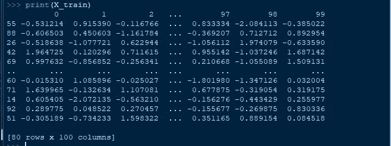
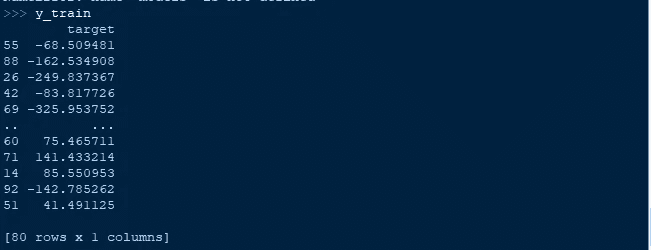
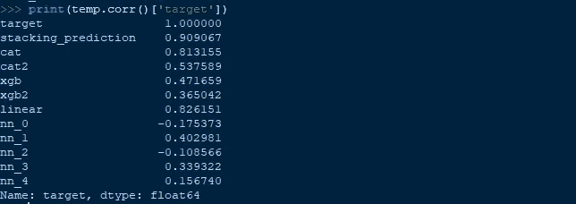
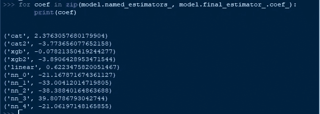

# 如何使用“模型堆叠”来改进机器学习预测

> 原文：<https://medium.com/geekculture/how-to-use-model-stacking-to-improve-machine-learning-predictions-d113278612d4?source=collection_archive---------5----------------------->

# 什么是模型堆叠？

模型堆叠是一种通过组合多个模型的输出并通过另一个称为元学习器的机器学习模型运行它们来改善模型预测的方法。这是一种用来赢得 kaggle 竞赛的流行策略，但尽管它们很有用，但它们很少在数据科学文章中被提及——我希望改变这种情况。

本质上，堆叠模型通过“元学习者”(通常是线性回归器/分类器，但也可以是决策树等其他模型)运行多个模型的输出来工作。元学习者试图最小化每个模型的缺点，最大化每个模型的优点。结果通常是一个非常健壮的模型，可以很好地概括看不见的数据。

下图说明了堆叠模型的体系结构:


# 如何建立堆叠模型？

通过使用 sklearn 的 stacking regressor/分类器库，构建堆叠模型是最容易完成的。下面我将导入所有必要的库，创建一个神经网络架构，然后向您展示如何创建堆叠模型。

```
# First import necessary libraries
import pandas as pd
from sklearn.ensemble import StackingRegressor# Decision trees
from catboost import CatBoostRegressor
from xgboost import XGBRegressor# Neural networks
from tensorflow.keras.models import Sequential
from tensorflow.keras.layers import Add, Input, Dense, Dropout
from tensorflow.keras.layers import BatchNormalization, Embedding
from tensorflow.keras.layers import Flatten, Concatenate
from tensorflow.keras import regularizers
from keras.regularizers import l1
from keras.regularizers import l2from tensorflow.keras import regularizers# Wrapper to make neural network compitable with StackingRegressor
from tensorflow.keras.wrappers.scikit_learn import KerasRegressor# Linear model as meta-learn
from sklearn.linear_model import LinearRegression# Create generic dataset for regression
from sklearn.datasets import make_regression
from sklearn.model_selection import train_test_split# Create regression dataset
X, y = make_regression(n_targets=1, random_state=42)# Convert to pandas
X = pd.DataFrame(X)
y = pd.DataFrame(y)#Rename column
y = y.rename(columns={0: 'target'})# Split into validation set
X_train, X_val, y_train, y_val = train_test_split(X, y,
                                                  test_size=0.2,
                                                  random_state=42)
```

浏览我们的训练数据:



我们的目标变量:



好了，现在我们已经定义了训练数据集，我们可以开始构建实际的模型了。对于模型，我们只是要创建一个 CatBoostRegessor，XGBRegressor，LinearRegression 和一些神经网络。

首先是一些构建神经网络的代码。我们稍后将在堆叠模型中使用它。(理解神经网络对于本教程来说不是必需的，但它涉及到创建跳过连接和批量规范化，这有助于提高正确数据的性能)

```
def create_neural_network(input_shape=510, depth=10, batch_mod=2, num_neurons=250, drop_rate=0.1, learn_rate=.001,
                      r1_weight=0.02,
                      r2_weight=0.02):
    '''A neural network architecture built using keras functional API'''
    act_reg = l1(r2_weight)
    kern_reg = l1(r1_weight)

    inputs = Input(shape=(input_shape,))batch1 = BatchNormalization()(inputs)hidden1 = Dense(num_neurons, activation='relu', kernel_regularizer=kern_reg, activity_regularizer=act_reg)(batch1)
    dropout1 = Dropout(drop_rate)(hidden1)
    hidden2 = Dense(int(num_neurons/2), activation='relu', kernel_regularizer=kern_reg, activity_regularizer=act_reg)(dropout1)

    skip_list = [batch1]
    last_layer_in_loop = hidden2

    for i in range(depth):
        added_layer = concatenate(skip_list + [last_layer_in_loop])
        skip_list.append(added_layer)b1 = None
        #Apply batch only on every i % N layers
        if i % batch_mod == 2:
            b1 = BatchNormalization()(added_layer)
        else:
            b1 = added_layer

        h1 = Dense(num_neurons, activation='relu', kernel_regularizer=kern_reg, activity_regularizer=act_reg)(b1)
        d1 = Dropout(drop_rate)(h1)
        h2 = Dense(int(num_neurons/2), activation='relu', kernel_regularizer=kern_reg, activity_regularizer=act_reg)(d1)
        d2 = Dropout(drop_rate)(h2)
        h3 =  Dense(int(num_neurons/2), activation='relu', kernel_regularizer=kern_reg, activity_regularizer=act_reg)(d2)
        d3 = Dropout(drop_rate)(h3)
        h4 =  Dense(int(num_neurons/2), activation='relu', kernel_regularizer=kern_reg, activity_regularizer=act_reg)(d3)last_layer_in_loop = h4c1 = concatenate(skip_list + [last_layer_in_loop])
    output = Dense(1, activation='sigmoid')(c1)

    model = Model(inputs=inputs, outputs=output)optimizer = Adam()
    optimizer.learning_rate = learn_rate

    model.compile(optimizer=optimizer,
                  loss='mse',
                  metrics=['accuracy'])return model
```

现在是构建堆叠模型的一些代码:

```
def get_stacking(input_shape=None):
    '''A stacking model that consists of CatBoostRegressor,
    XGBRegressor, a linear model, and some neural networks'''
    # First we create a list called "level0", which consists of our base models"
    # These models will get passed down to the meta-learner later
    level0 = list()level0.append(('cat', CatBoostRegressor(verbose=False)))
    level0.append(('cat2', CatBoostRegressor(verbose=False, learning_rate=.0001)))
    level0.append(('xgb', XGBRegressor()))
    level0.append(('xgb2', XGBRegressor(max_depth=5, learning_rate=.0001)))
    level0.append(('linear', LinearRegression()))#Create 5 neural networks using our function above
    for i in range(5):
        # Wrap our neural network in a Keras Regressor to make it
        #compatible with StackingRegressor
        keras_reg = KerasRegressor(
                create_neural_network, # Pass in function
                input_shape=input_shape, # Pass in the dimensions to above function
                epochs=6,
                batch_size=32,
                verbose=False)
        keras_reg._estimator_type = "regressor"
        # Append to our list
        level0.append(('nn_{num}'.format(num=i), keras_reg))# The "meta-learner" designated as the level1 model
    # In my experience Linear Regression performs best
    # but feel free to experiment with other models
    level1 = LinearRegression()# Create the stacking ensemble
    model = StackingRegressor(estimators=level0, final_estimator=level1, cv=2, verbose=1)
    return model
```

现在我们可以把它们放在一起:

```
#Get our input dimensions for neural network
input_dimensions = len(X_train.columns)# Create stacking model
model = get_stacking(input_dimensions)model.fit(X_train, y_train.values.ravel())# Creating a temporary dataframe so we can see how each of our models performed
temp = pd.DataFrame(y_val)# The stacked models predictions, which should perform the best
temp['stacking_prediction'] = model.predict(X_val)# Get each model in the stacked model to see how they individually perform
for m in model.named_estimators_:
        temp[m] = model.named_estimators_[m].predict(X_val)# See how each of our models correlate with our target
print(temp.corr()['target'])# See what our meta-learner is thinking (the linear regression)
for coef in zip(model.named_estimators_, model.final_estimator_.coef_):
    print(coef)
```

下面我们可以看到，通过最小的微调，我们的堆叠模型的性能大大高于任何其他模型，相关性高达 0.909。尽管没有一个模型被优化，有些甚至对整体模型有害，具有负相关性，但在元学习者的帮助下，这不是问题，我们得到了奇妙的结果。通过对表现不佳的模型进行更多的微调和修剪，您可以轻松获得更好的结果。



这里你可以看到每个模型是如何影响元学习者的预测的。所有这些系数的组合有助于掩盖或提升每个单独模型的优势/劣势。



# 结论:

创建堆叠模型可以使从模型中“挤出”每一点点性能变得微不足道。在一些数据科学问题中，每一点点的性能都非常重要，因此堆叠模型是实现这一点的快速而方便的解决方案。

但是，请记住，堆叠模型通常需要长得多的训练时间，并且比其他模型的延迟要慢得多。因此，如果您需要将快速预测发送给用户，那么堆叠模型可能并不理想。

无论如何，感谢阅读！如果你喜欢我的简短教程，记得鼓掌。

下面是完全可复制的笔记本:

[https://colab . research . Google . com/drive/11 tu D7 YC 6 heyaotgmboag 0 XB _ nwqxokd 6 # scroll to = qimy 45 csuiaf](https://colab.research.google.com/drive/11TUd7Yc6hEyAotGMBoAG0xB_NWQXOkD6#scrollTo=qimy45csuiAf)