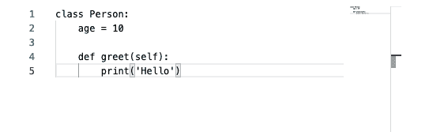
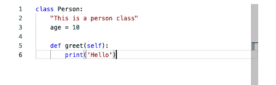
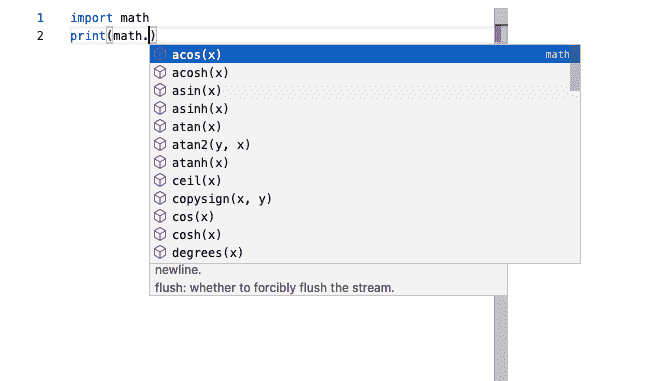
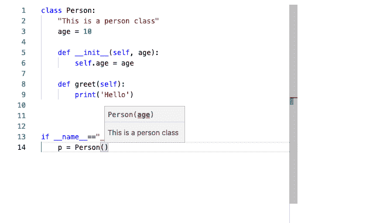
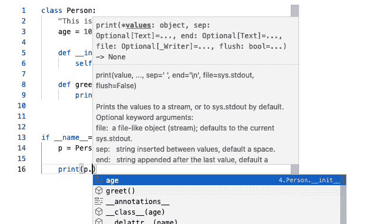

# 如何使用 VueJS 中的摩纳哥编辑器:失踪的指南

> 原文：<https://medium.com/geekculture/how-to-use-monaco-editor-in-vuejs-the-missing-guide-1aa7ac61ed12?source=collection_archive---------1----------------------->


Monaco Port Hercule, Photo by [Matthias Mullie](https://unsplash.com/@matthiasmullie?utm_source=unsplash&utm_medium=referral&utm_content=creditCopyText) on [Unsplash](https://unsplash.com/s/photos/monaco?utm_source=unsplash&utm_medium=referral&utm_content=creditCopyText)

如果你知道你在找什么或看到一些代码，立即检查这个 git repo。

随着教育技术平台的蓬勃发展，有一天你可能会在一个有人想教编码的网站上找到一份工作，这并不奇怪。编码教学是一个互动的过程。你必须展示代码，让学生写代码，代码需要在某个地方测试，还有各种各样的麻烦。

今天，我想重点介绍如何在浏览器中的强大代码编辑器中显示/编写代码。能够在浏览器上提供类似 vs-code 的功能，包括语法高亮、自动缩进，甚至自动完成，这难道不好吗？

是的，这可以通过[摩纳哥-编辑](https://microsoft.github.io/monaco-editor/)来完成。这是一件很棒的事情。但我挣扎过。我努力想融入 Vue-js。是的，已经有很多第三方插件使得使用 monaco-editor 和 Vue 变得轻而易举。但是使用它们，我无法启用自动完成、文档字符串可视化、定位定义等功能。所以我采取了强硬手段。

本文是多日来浏览 SO、medium 帖子、github 问题的总结。我终于能让它工作了。但我毫不惭愧地承认，我仍然对一些部分感到困惑，如果你知道/发现任何更好的方法，请提出建议。让我们开始吧:

# 前端

我假设你已经有一个 vue js 项目启动并运行。我正在使用一个空的 vue 项目，并且刚刚创建了一个空的组件，如下所示:

```
<template>
    <div></div>
</template>

<script>
export default {
    name: 'Editor'
}
</script>
```

下一件事你需要做的是，安装摩纳哥编辑器和其他一些依赖工作与 vue js。

```
npm install monaco-editor monaco-editor-webpack-plugin monaco-languageclient @monaco-editor/loader
```

现在您需要添加一些配置来使这些库与您的 vue 项目一起工作。如果您的项目中没有 **vue.config.js** 文件，请在 **package.json** 所在的同一级别创建，并将以下内容放入其中:

```
const MonacoWebpackPlugin = require("monaco-editor-webpack-plugin");
const path = require("path");
module.exports = {
  configureWebpack: {
    plugins: [
      new MonacoWebpackPlugin({
        languages: ["python"],//configure your languages here
        features: ["coreCommands", "find"],
      }), // Place it here
    ],
  },
  chainWebpack: (config) => {
    config.resolve.alias.set(
      "vscode",
      path.resolve(
        "./node_modules/monaco-languageclient/lib/vscode-compatibility"
      )
    );
  },
};
```

你可以看到我只是为 **python** 配置它，你应该可以用任何支持的语言来做。

现在我们可以去组件那里初始化一个编辑器。

现在让我们给模板中的 div 一个 id，并设置高度和宽度。

```
<template>
    <div id="editor" style="width: 500px; height: 500px"></div>
</template>
```

这个高度和宽度不一定要固定成这样。您也可以通过编程来设置它们。但是你必须设置它们，否则编辑器是不可见的。

现在在**脚本**部分，你必须像这样初始化编辑器:

```
import loader from "@monaco-editor/loader";

export default {
 name: "Editor",
 async mounted() {

   loader.init().then((monaco) => {

     monaco.editor.create(document.getElementById("editor"));

   });

 },
};
```

在这里，loader 将做一些幕后工作，使编辑器在浏览器中工作，并给你一个 **monaco** 的实例，你需要根据你的需要调整它。

在这一步之后，如果你重新加载浏览器，你会看到一个编辑器，在那里你可以写代码。下面是编辑器的一个片段，我在其中粘贴了一些代码:



Editor on browser fist look

哦耶！有一个很好看的带有行号的编辑器，右边还有我们在 vs 代码中经常看到的小地图。但是嘿！语法高亮在哪里？如果你试着自己写而不是粘贴，你会注意到所有 python 编辑器支持的自动缩进也不起作用。

我们要做的是，在初始化期间，我们必须提到编辑器正在处理哪种语言，就像这样:

```
export default {
  name: "Editor",
  async mounted() {

    loader.init().then((monaco) => {
      const editorOptions = {
           language: "python",
           minimap: { enabled: false },
       };

      monaco.editor.create(document.getElementById("editor"),   editorOptions);

    });

  },
};
```

现在让我们看看编辑器是什么样子的:



Editor looks great with syntax highlighting!

是的。现在有了语法高亮和自动缩进功能。我选择禁用小地图来证明这是可能的。在这里你可以找到所有可用的选项。我们创建了一个包含选项的对象，并在编辑器初始化期间将它传递给工厂。

但是仍然缺少一样东西。即代码建议、自动完成等。浏览器本身不能做到这一点。现在你必须有一个后端语言服务器。

# 后端

在你电脑的某个地方，最好是在你的 vue 项目的文件夹旁边，创建一个名为 **lang-server** 或者其他有意义的目录。 **Cd** 到这个目录，用这个初始化一个 npm 包:

```
npm init
```

这将在 lang-server 文件夹中创建一个 **packages.json** 和 **node_modules** 。这将有助于将依赖项与计算机中的基本节点安装分开。现在，使用以下命令安装所需的库:

```
npm install  vscode-ws-jsonrpc vscode-languageserver ws
```

现在你需要安装一个名为 python-language-server**的 python 库，它将真正提供 python 的自动完成、建议等功能。**

```
pip install python-language-server
```

**我假设您的机器上已经安装了 python。如果没有，您必须这样做，但这超出了本文的范围。**

**现在，您必须创建一个中间件来确保您的前端和 python 语言服务器之间的通信。在 **lang-server** 目录下创建一个名为 **py-ls-middleware.js** 的文件，内容如下:**

```
const rpc = require('vscode-ws-jsonrpc')
const server = require('vscode-ws-jsonrpc/lib/server')
const lsp = require('vscode-languageserver')

const WebSocket = require('ws');

const wss = new WebSocket.Server({ port: 8989 });

function launch (socket) {
  const reader = new rpc.WebSocketMessageReader(socket)
  const writer = new rpc.WebSocketMessageWriter(socket)
  const socketConnection = server.createConnection(reader, writer, () => socket.dispose())
  const serverConnection = server.createServerProcess('JSON', 'pyls')
  server.forward(socketConnection, serverConnection, message => {
    console.log(message)
    if (rpc.isRequestMessage(message)) {
      if (message.method === lsp.InitializeRequest.type.method) {
        const initializeParams = message.params
        initializeParams.processId = process.pid
      }
    }
    return message
  })
}

wss.on('connection', function connection(ws) {
  const socket = {
    send:(content)=>ws.send(content,(error)=>{
      if(error){
        console.log(error)
      }
    }),
    onMessage:(cb)=>ws.on('message',cb),
    onError:(cb)=>ws.on('error',cb),
    onClose:(cb)=>ws.on('close',cb),
    dispose:(cb)=>ws.close()
  }
  launch(socket)
})
```

**它在端口 8989 公开一个 websocket 连接，并在语言客户端和语言服务器之间传递消息。**

**现在只剩下一件事了。也就是在 vue app 和这个中间件之间建立通信。**

# **前端…又来了**

**为此，我们现在必须在我们的 vue 应用程序中安装 monaco-languageclient 和 vscode-ws-jsonrpc。**

```
npm install monaco-languageclient vscode-ws-jsonrpc
```

**现在，在脚本标记中执行以下导入操作:**

```
import { listen } from "vscode-ws-jsonrpc";

window.setImmediate = window.setTimeout;

import {
  MonacoLanguageClient,
  CloseAction,
  ErrorAction,
  createConnection,
  MonacoServices,
} from "monaco-languageclient";
```

**然后在 loader 的 init 方法的回调函数的末尾添加以下两行:**

```
MonacoServices.install(monaco);
this.connectToLangServer();
```

**第一行将使语言客户端能够使用编辑器实例。第二行是我们必须写的方法调用。我们将把它写在 vue 的方法中。**

**看起来是这样的:**

```
connectToLangServer: function () {
      const webSocket = new WebSocket("ws://127.0.0.1:8989");

      listen({
        webSocket: webSocket,
        onConnection: (connection) => {
          var languageClient = this.createLanguageClient(connection);
          var disposable = languageClient.start();

          connection.onClose(function () {
            return disposable.dispose();
          });

          connection.onError(function (error) {
            console.log(error);
          });
        },
      });
    },
```

**这里我们连接到由 lang-server 中间件打开的套接字，然后用所需的参数覆盖 vscode-ws-jsonrpc 的 listen 方法。我们必须编写另一个在 **connectToLangServer，**内部调用的方法，就是这个:**

```
createLanguageClient: function (connection) {

      return new MonacoLanguageClient({
        name: "Monaco language client",
        clientOptions: {
          documentSelector: ["python"],
          errorHandler: {
            error: () => ErrorAction.Continue,
            closed: () => CloseAction.DoNotRestart,
          },
        },

        connectionProvider: {
          get: (errorHandler, closeHandler) => {
            return Promise.resolve(
              createConnection(connection, errorHandler, closeHandler)
            );
          },
        },
      });
    },
```

**现在要运行整个系统，您必须运行中间件和开发服务器。像这样运行中间件:**

```
node py-ls-middleware.js
```

**现在检查编辑器，它显示建议:**

****

**还显示了文档字符串和类签名:**

****

**也显示了一个类的其他属性！**

****

**这就是你开始的全部。这只是一些玩具代码。可能需要许多层次强化和重构。比如处理与 lang 服务器的突然断开，模块化 vue 组件等等。我也计划尝试其他语言服务器。密切关注提到的回购下文。**

**https://github.com/Ruhshan/Vue-monaco-demo**