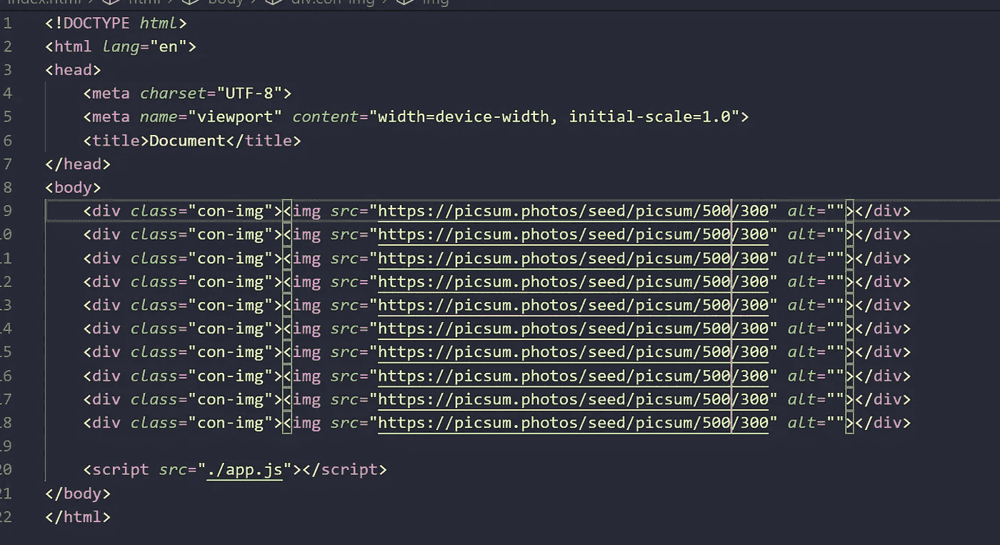
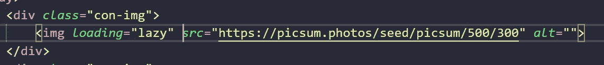
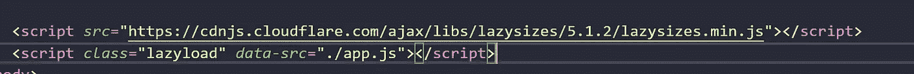
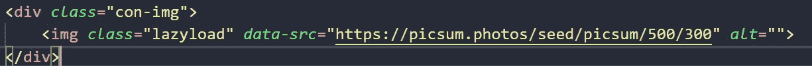
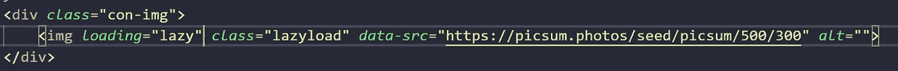
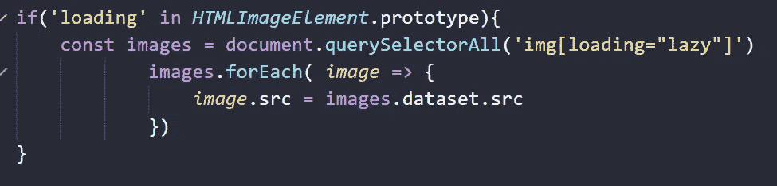
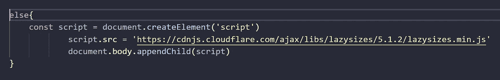
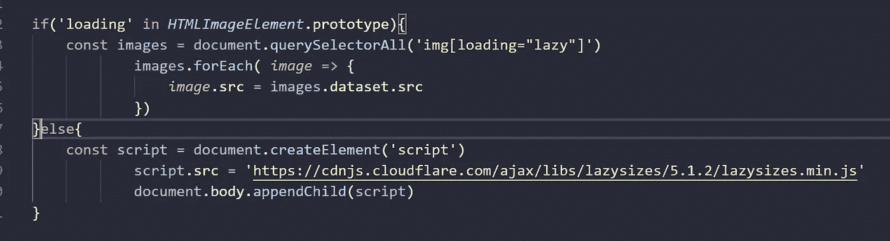

# 如何使用本机映像延迟加载和 lazysizes 库来提高性能

> 原文：<https://medium.com/geekculture/how-to-use-native-image-lazy-loading-and-lazysizes-library-to-increase-performance-1cec9fda1dc6?source=collection_archive---------2----------------------->


如果你真的想提高你的网站的性能，并且你正在寻找一个简单的图片延迟加载的方法，请到这里来，我们将会提高这一部分。

首先，我们需要太多的图像，我们将使用一个网站，它创建随机图像，它被称为 picsum 照片。



Example adding images on our index.html

# 添加本机延迟加载

记住在 chrome 76 以后，我们可以使用这个属性 **loading="lazy"** 并有三个值 **auto** 就好像我们不使用它一样， **lazy** 是最重要的，因为它在视口达到计算的距离时工作，而 **eager** 只立即加载资源。

```
<div *class*="con-img">
    
</div>
```



Example native lazy loading in action

但不是所有的浏览器都支持这种原生属性，这就是为什么我们需要 lazysizes。

# 懒人图书馆

这是一个非常有用的图像快速惰性加载库，要使用它，我们只需要添加这个库，把 src 换成 data-src，然后添加 lazyload 类，就这样。



Adding lazysizes libary to our index.html

```
<div *class*="con-img">
   
</div>
```



Example lazysizes in action

# 如何使用这两者

如果浏览器支持和不支持本地惰性加载，我们需要添加本地和惰性到图像标签。

```
<div *class*="con-img">
   
</div>
```



Example adding both of them to the img tag

之后，我们使用一个简单的 if 来检查事件是否被分配给了 HTMLimage.prototype。如果是，我们调用所有带有 loading 属性的图像，并添加带有数据路由的 src 属性-src。

```
if('loading' in *HTMLImageElement*.prototype){const images = document.querySelectorAll('img[loading="lazy"]')images.forEach( *image* => {*image*.src = *image*.dataset.src})}
```



Example check is supports the native lazy loading attribute

接下来，我们只使用 JavaScript 创建一个脚本，将 lazysizes 库的路由或 CDN 路由添加到 src 属性中，并使用 appendChild 方法将脚本添加到主体中。

```
else{
 const script = document.createElement('script')script.src = 'https://cdnjs.cloudflare.com/ajax/libs/lazysizes/5.1.2/lazysizes.min.js' document.body.appendChild(script)
}
```



Example if the browser doesn’t support the native lazy laoding



Complete code for JavaScript


Example how the images load really fast

# 结论

如果你想提高图片的加载量，这是一种提高性能的方法，而且非常简单，试试看，享受灯塔测试的新数据吧。

# 来源

[https://web.dev/native-lazy-loading/?utm_source=lighthouse&UTM _ medium = devtools](https://web.dev/native-lazy-loading/?utm_source=lighthouse&utm_medium=devtools)
[https://picsum.photos/](https://picsum.photos/)
[https://github.com/aFarkas/lazysizes](https://github.com/aFarkas/lazysizes)