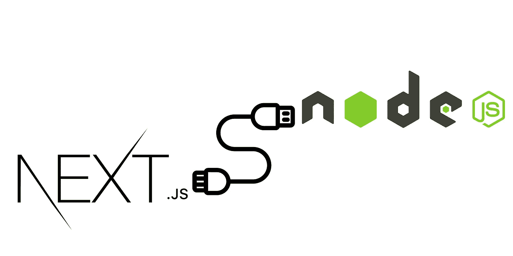

# 如何为您的 Next.js 项目(或两者)使用 Nodejs 后端。

> 原文：<https://medium.com/geekculture/how-to-use-nodejs-backend-for-your-next-js-project-or-both-b36d9dc9ab0a?source=collection_archive---------1----------------------->



我找不到任何理由不在我的 react 项目中使用 Next.js，我想我不必解释它的好处，这就是我喜欢 Next.js 胜过其他框架的原因。

1.  写得很好的文档。
2.  很棒的开发经验。
3.  文件系统路由。
4.  从一开始就做好生产准备。

但是为了处理后端，Next.js 会在部署时自动将“页面/api”路由转换成独立的函数。这种基础设施被称为功能即服务。虽然这避免了维护单独服务器的复杂性，但有时我们可能需要 Nodejs 来处理后端。

在我的例子中，首先我尝试了 Next.js 内置服务器来处理我的后端，这涉及到许多 MongoDB 交互。它运行良好，但经常遇到问题，我很难找到它的文档。所以由于时间限制，我选择放弃 Next.js 后端的想法，而使用 Nodejs。所以在我的研究中，我发现了很多使用 Next.js 的自定义后端的方法，我认为如果你想快速设置项目，这是最好的选择。

在这种情况下，我们唯一需要关心的文件是 next.config.js。我们使用的方法是 next.js 重写。重写可以充当前端和后端之间的代理。要使用重写，只需打开 next.config.js 并添加重写功能。

```
module.exports = {
  async rewrites() {
    return [
      {
        source: <api endpoint in used in the front end>,
        destination: <nodejs handler endpoint>,
      },
    ]
  },
}
```

因此，当使用 Next.js 内置服务器时，概念很简单，我们将所有后端处理程序放在 pages/api/目录中。当使用 rewrites 时，请求首先命中 next.config.js 文件，该文件首先在 api/目录中查找所请求的端点，如果找到，则请求被路由到该端点。如果源目的地不在 api/目录内，那么请求被路由到目的地端点，该端点可以是独立的后端服务器或 Next.js 内置服务器中的不同端点。因为 rewrites 函数返回重写对象的数组，所以我们可以定义尽可能多的重写。

**优势**

1.  由于重写充当 URL 代理，我们可以直接从服务器设置 cookies，无需进一步配置。
2.  同时使用不同后端架构的灵活性。
3.  更好的前端和后端隔离，易于维护。
4.  更好地分配服务器资源。
5.  我们可以忘掉 CORS。

**劣势**

1.  对于具有大量 API 端点的大型应用程序，next.config.js 文件会变得很长，需要手动重写所有端点。
2.  如果外部服务器需要更多的时间来发送回响应，连接将被关闭，并将抛出一个内部服务器错误。我认为我们需要为这种情况配置等待时间或避免沉重的负载。

所以我还没有发现使用这种方法的其他缺点。关于重写的更多细节可以在 Next.js 文档中找到。如果有人觉得我遗漏了什么，请留下评论，并分享你的想法。