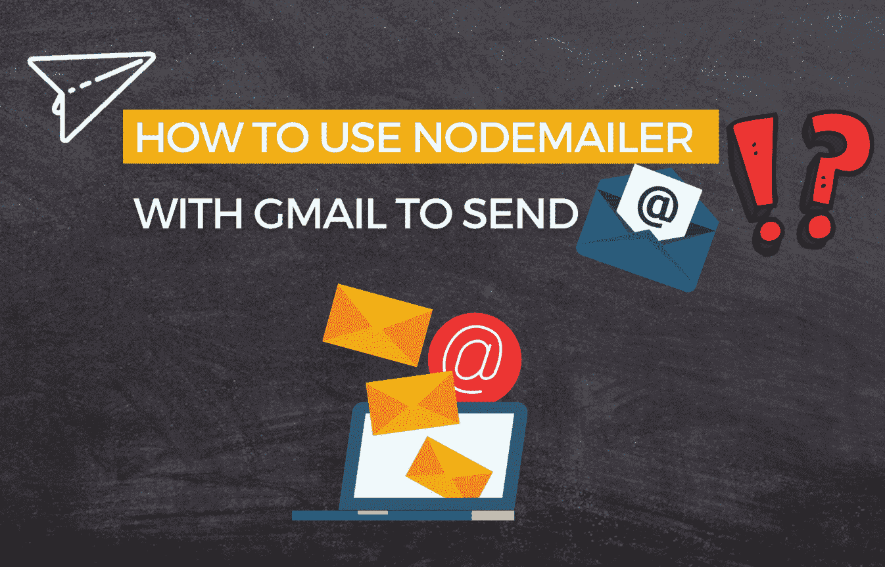

# 如何配合 Gmail 使用 Nodemailer 发送邮件？

> 原文：<https://medium.com/geekculture/how-to-use-nodemailer-with-gmail-to-send-e-mails-7198e707025d?source=collection_archive---------3----------------------->

## 设置 Nodemailer 并开始发送电子邮件的步骤

By FAM

嗨，

本文介绍了在 Node JS 应用程序中发送 Gmail 电子邮件。如果你想发送一封没有附加文件的简单邮件，你可能不得不考虑使用 HTML 而不安装额外的依赖。