# 如何使用 PDF.js 以及如何用 JavaScript 为您的网站创建一个简单的 PDF 查看器

> 原文：<https://medium.com/geekculture/how-to-use-pdf-js-and-how-to-create-a-simple-pdf-viewer-for-your-web-in-javascript-5cff608a3a10?source=collection_archive---------0----------------------->

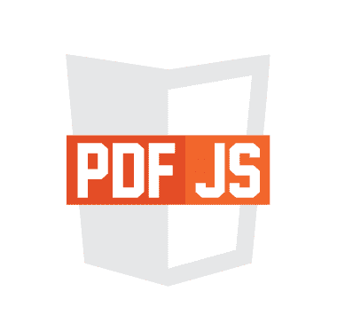

我看到了这个库，它在 PDF 方面给了我很大的帮助，我可以用纯 JavaScript 可视化 PDF 在线更改页面。令人惊讶的是，我正在共享这个库和代码，为您的网站创建一个动态 PDF 可视化工具。

Video example how to create a PDF viewer with PDF.js

我制作了一个视频，如果你也想看的话📽📹📼它有你需要的一切，我会在最后分享代码，谢谢和享受。

首先你需要创建 route 应用程序，我只有两个目录，一个用于代码，一个用于 pdf。

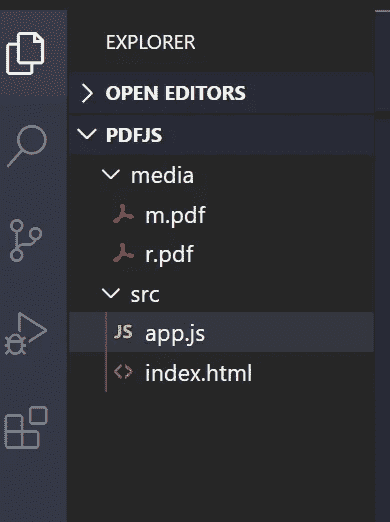

Document to start

然后用两个按钮创建 Index.html 一个 span 和一个 canvas 每个人都有各自的 id，这个库非常重要我也链接了我的 app.js 文件。

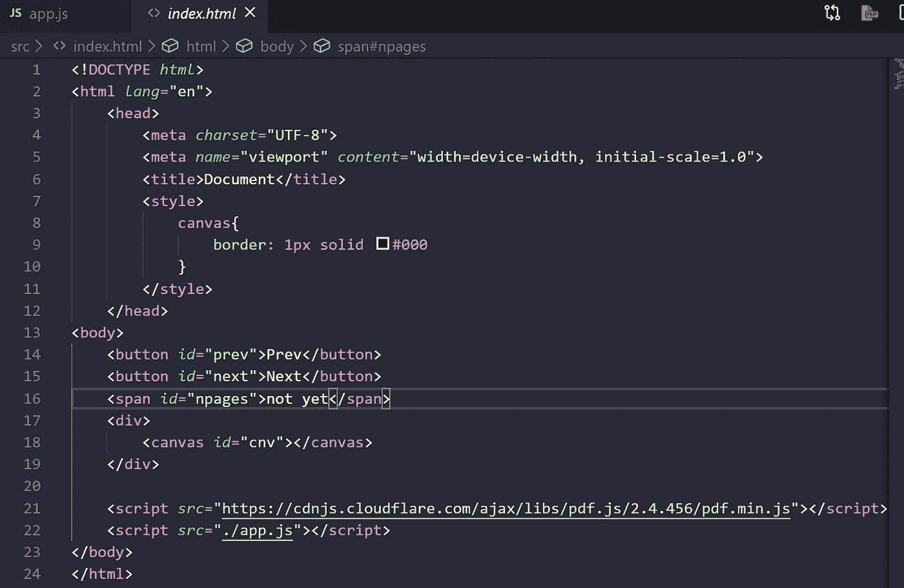

Writing some basic structure

这是代码

```
<!DOCTYPE *html*><html *lang*="en"><head><meta *charset*="UTF-8"><meta *name*="viewport" *content*="width=device-width, initial-scale=1.0"><title>Document</title><style>canvas{border: 1px solid #000}</style></head><body><button *id*="prev">Prev</button><button *id*="next">Next</button><span *id*="npages">not yet</span><div><canvas *id*="cnv"></canvas></div><script *src*="https://cdnjs.cloudflare.com/ajax/libs/pdf.js/2.4.456/pdf.min.js"></script><script *src*="./app.js"></script></body></html>
```

然后我们会看到这样的东西

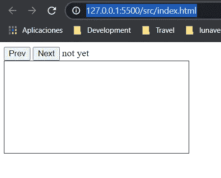

Example how will see the viewer

我可以从 JavaScript 开始，你需要使用 load 事件来启动我们的 JavaScript 和两个函数来启动我传递了我们的 PDF 文件的路径，使它有点动态

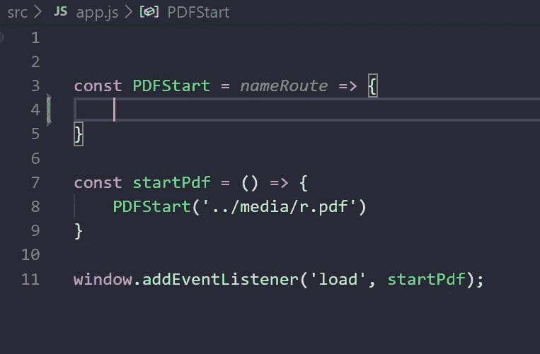

Example how we can start our function

```
const PDFStart = *nameRoute* => {}const startPdf = () => {PDFStart('../media/r.pdf')}window.addEventListener('load', startPdf);
```

之后，我们需要对这个库很重要的变量，我们从 loadingTask 开始这个变量有关于 PDF 的所有信息，我们传递了名称 Route 我们的 PDF 文件的路径，pdfDoc 画布和画布的上下文，比例和页数。


The most important variables for PDF.js

```
let loadingTask = pdfjsLib.getDocument(*nameRoute*),pdfDoc = null,canvas = document.querySelector('#cnv'),ctx = canvas.getContext('2d'),scale = 1.5,numPage = 1;
```

然后我创建了 promise 来获取 PDF 的信息(PDF.js 与 promises 一起工作),并设置 PDF 的页数范围。我们将生成另一个名为 GeneratePDF(numPage)的函数。我传递了 numPage 变量，该变量目前为 1。

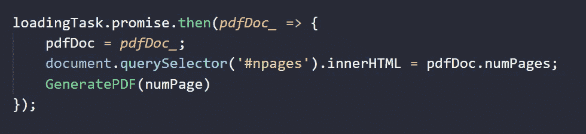

Example for the first page

```
loadingTask.promise.then(*pdfDoc_* => {pdfDoc = *pdfDoc_*;document.querySelector('#npages').innerHTML = pdfDoc.numPages;GeneratePDF(numPage)});
```

GeneratePDF 函数是关键，因为它会将 PDF 打印到画布上，我使用 pdfDoc 获得具有另一个承诺的页面，然后我们需要页面视口(宽度和高度),我设置画布大小和 renderContext 对象，我插入 ctx 和视口，接下来我使用 renderContext 内的信息渲染页面，并使用 npages 的范围更新被渲染的页面的编号。

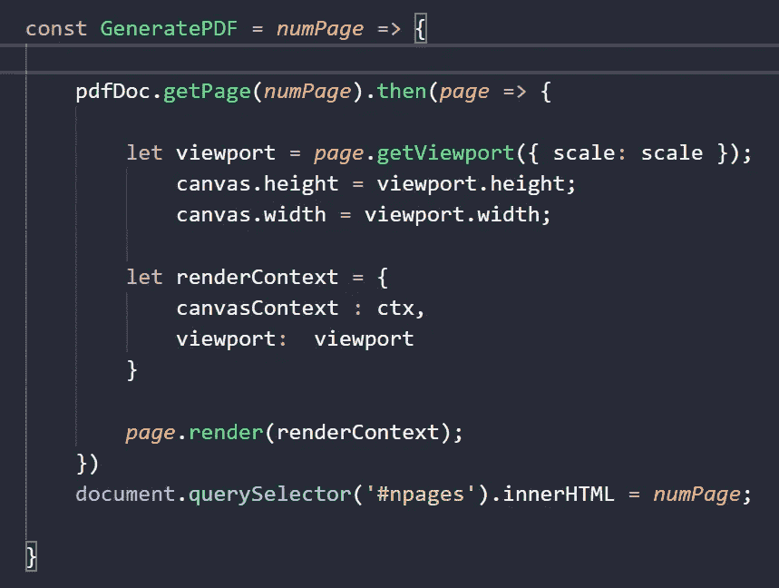

creating the viewer with PDF.js

```
const GeneratePDF = *numPage* => {pdfDoc.getPage(*numPage*).then(*page* => {let viewport = *page*.getViewport({ scale: scale });canvas.height = viewport.height;canvas.width = viewport.width;let renderContext = {canvasContext : ctx,viewport:  viewport}*page*.render(renderContext);})document.querySelector('#npages').innerHTML = *numPage*;}
```

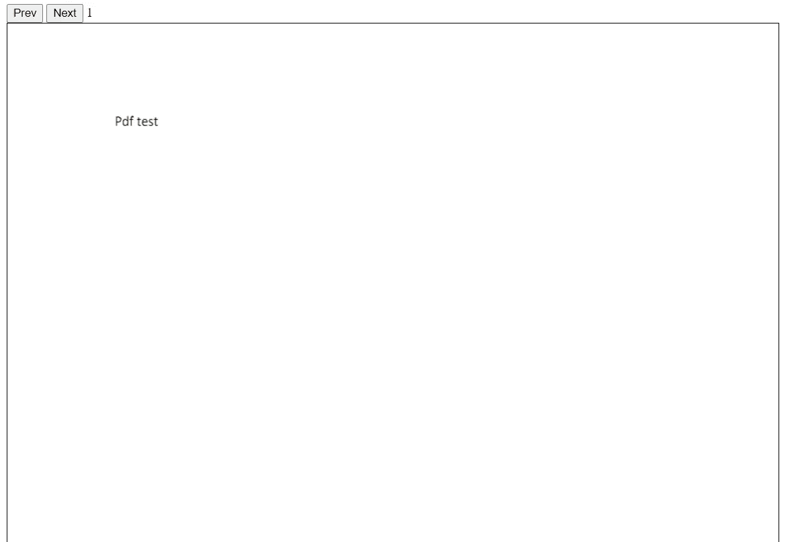

Example how we see the PDF on the browser

对于按钮，我需要创建事件和函数，但逻辑并不复杂，下一个和上一个几乎相同，我用 addEventListener 和 click 事件调用

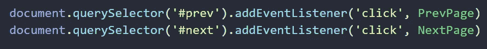

Example ho we use the buttons to create interactions with the viewer

```
document.querySelector('#prev').addEventListener('click', PrevPage)document.querySelector('#next').addEventListener('click', NextPage)
```

prev 函数需要一个条件才能正常工作，如果页数等于 1，则不返回任何其他内容。再次调用 generate pdf(numPage ), numPage 将减少 1。

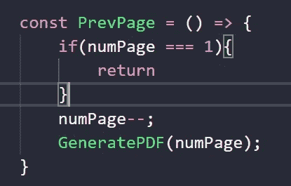

Creating the Previous button

```
const PrevPage = () => {if(numPage === 1){return}numPage--;GeneratePDF(numPage);}
```

下一个页面函数类似，但是如果 numPage 等于或大于 pdfDoc.numPages 返回 nothing other numPage 将增加 1，并再次调用 GeneratePDF(numPage)

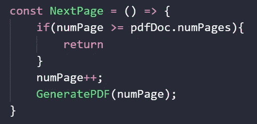

Creating the next button for PDF.js

```
const NextPage = () => {if(numPage >= pdfDoc.numPages){return}numPage++;GeneratePDF(numPage);}
```

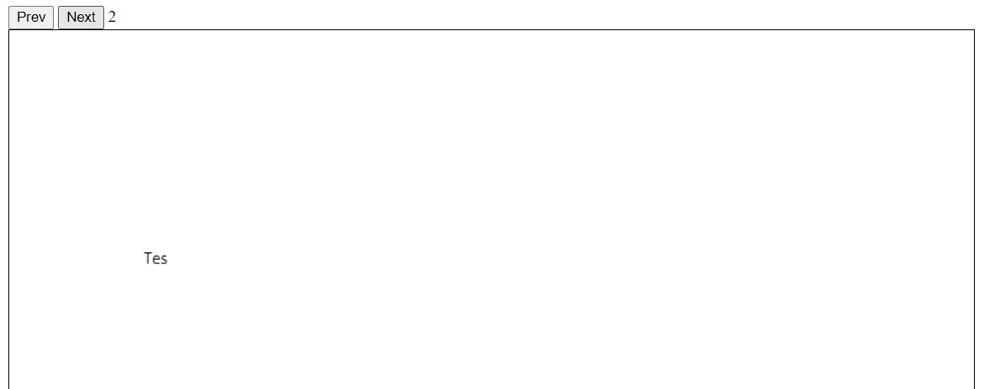

Changing pages with PDF.js

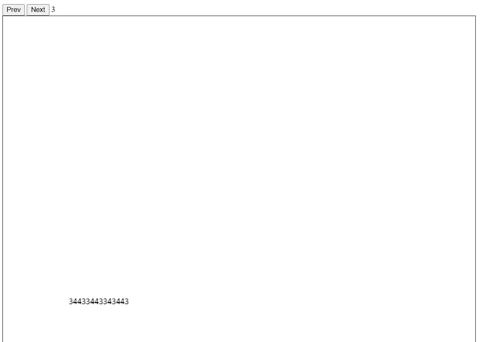

Changing pages with PDF.js

# 结论

这是一个可视化 PDF 在线更改页面的很好的库，并且很容易学习，文档是直接的，然后你可以在你的项目中使用这个库。

# 来源

[https://mozilla.github.io/pdf.js/](https://mozilla.github.io/pdf.js/)
[https://cdnjs.com/libraries/pdf.js](https://cdnjs.com/libraries/pdf.js)
[https://mozilla.github.io/pdf.js/examples/](https://mozilla.github.io/pdf.js/examples/)

# 代码

[https://github.com/rodrigofigueroa/pdfjsvizsaliserforweb](https://github.com/rodrigofigueroa/pdfjsvizsaliserforweb)
[https://youtu.be/l0Z_nJ2KebU](https://youtu.be/l0Z_nJ2KebU)