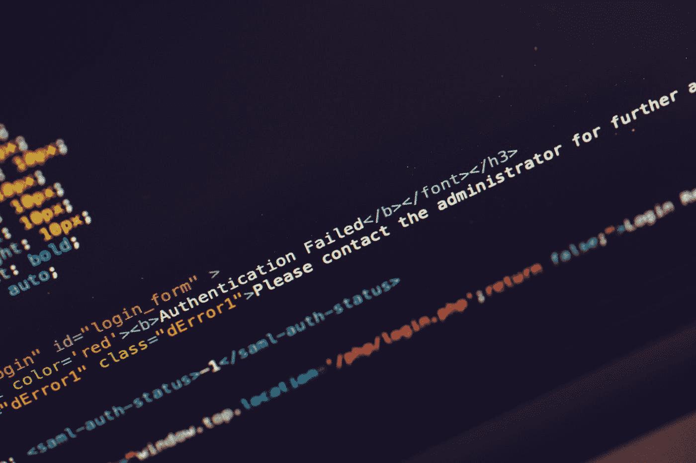

# 如何使用波利，改装和。网络 5

> 原文：<https://medium.com/geekculture/how-to-use-polly-refit-and-net-5-c15d492678f4?source=collection_archive---------0----------------------->

Photo by [Markus Spiske](https://unsplash.com/@markusspiske?utm_source=medium&utm_medium=referral) on [Unsplash](https://unsplash.com?utm_source=medium&utm_medium=referral)

Polly 允许你使你的项目更加可靠，不那么脆弱，并且容错。Polly 创建了一个抽象，所以你可以使用重试模式和断路模式，而没有任何顾虑或影响。改装，使 HTTP 客户端和 API 连接。

# 这将如何工作

我创建了两个项目，API 项目，这是一个标准而简单的 Web 应用程序，所以…