# 如何在 Heroku 上使用 Postgres 数据库？

> 原文：<https://medium.com/geekculture/how-to-use-postgres-database-on-heroku-bfe9431dd18d?source=collection_archive---------18----------------------->

1.  首先，在 [heroku](https://www.heroku.com/) 上创建一个新的应用

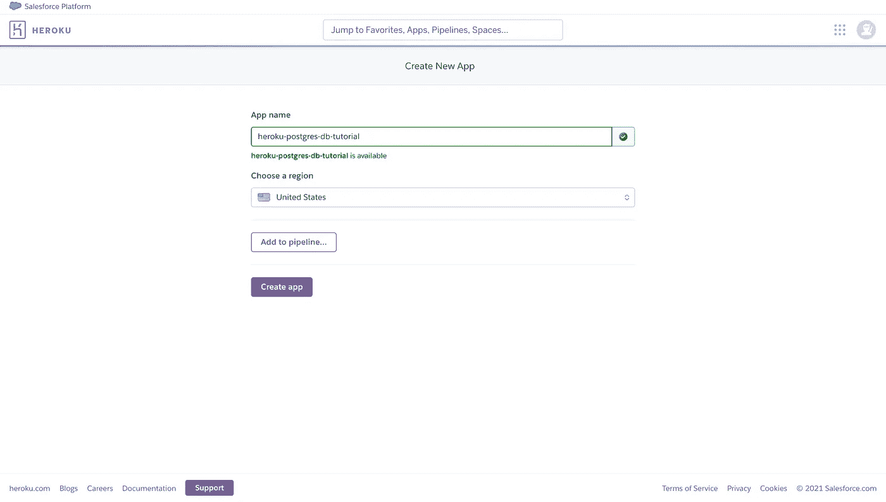

2.创建你的 heroku 应用程序后，你会看到这样的界面。

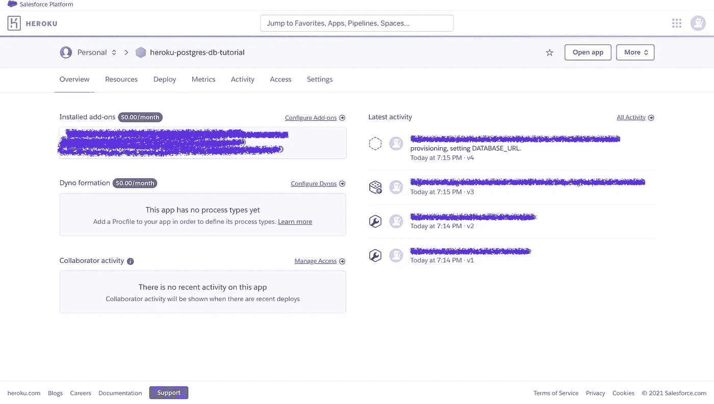

> 假设:我假设你已经知道如何在 heroku 上部署后端服务器。

 [## 如何将 Node.js 应用程序部署到 Heroku

### 简介 Heroku 以使服务器配置变得简单和容易而闻名。我们可以更快地构建，而不必担心…

scotch.io](https://scotch.io/tutorials/how-to-deploy-a-node-js-app-to-heroku) 

3.转到**资源**选项卡。

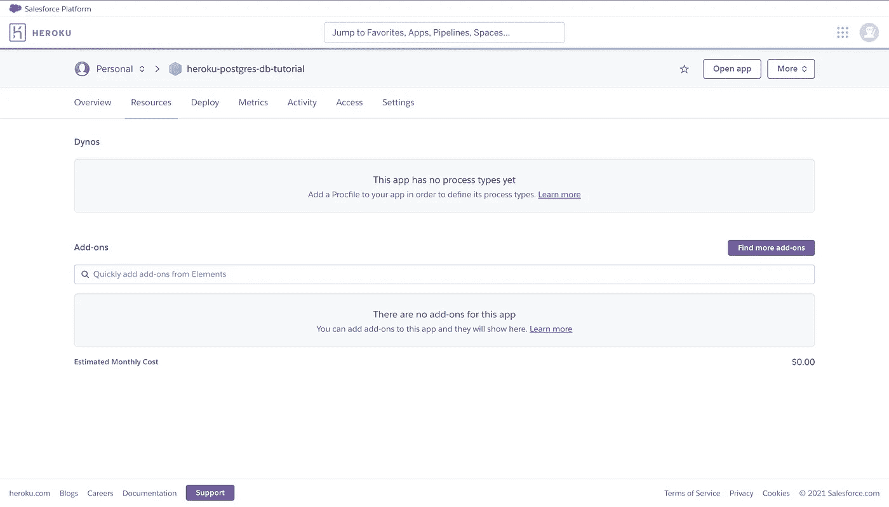

4.在**附件**标题下，搜索 **Heroku Postgres。**

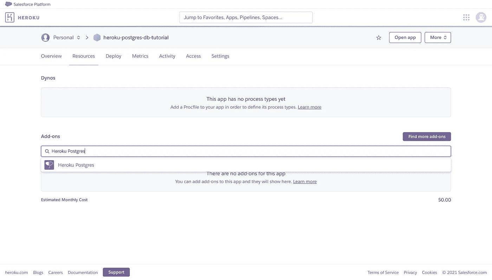

5.选择 **Heroku Postgres** 选项&你会看到这样一个弹出窗口。

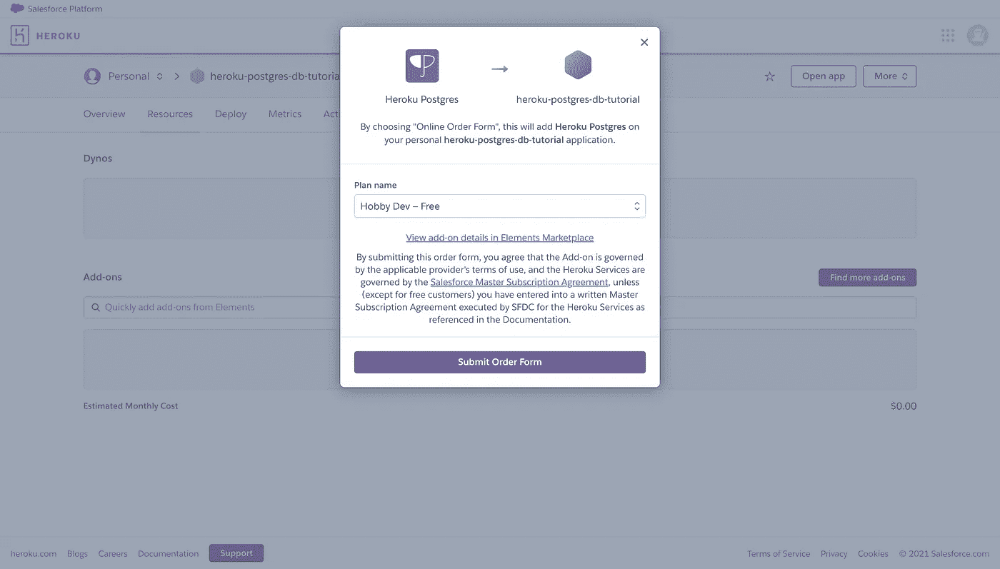

6.继续按你的选择选择计划名称，但首先我使用了**业余爱好开发-自由**计划。

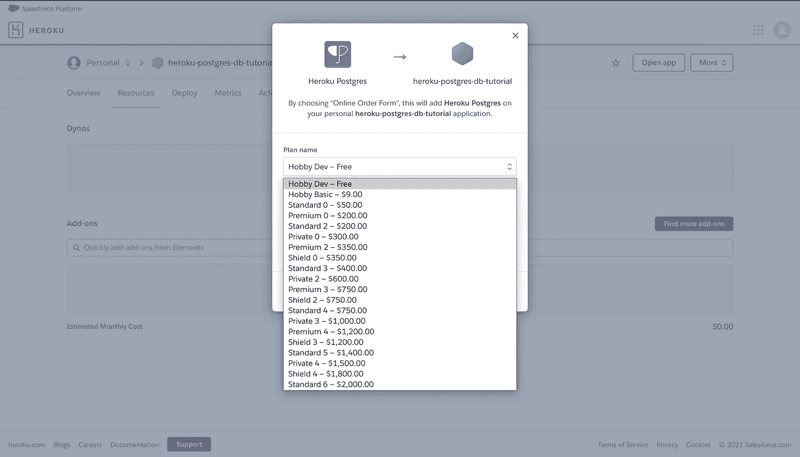

7.选择计划后，点击**提交订单。**

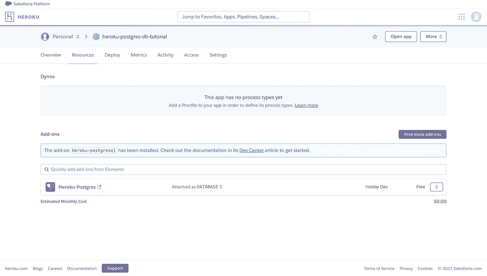

8.现在，点击下面突出显示的 **Heroku Postgres** 。

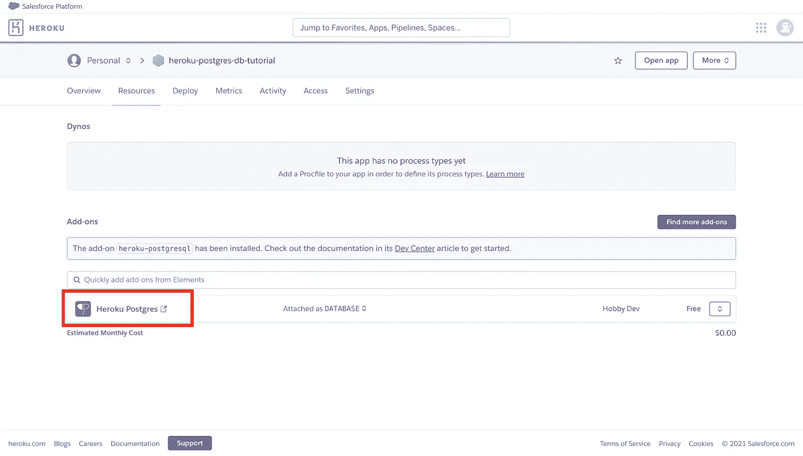

9.您将被重定向到 heroku 提供的数据库管理网站。

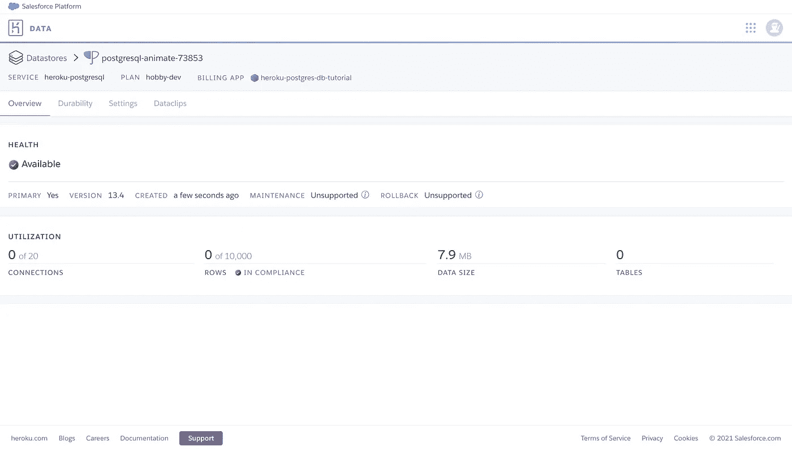

10.选择**设置**选项卡。

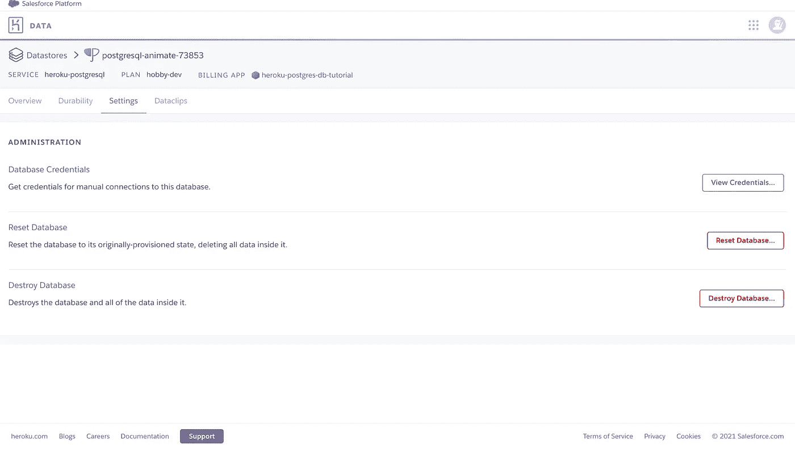

11.点击**查看凭证。**

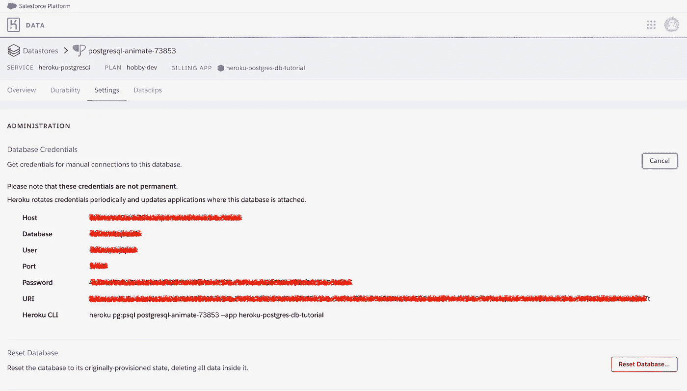

在 node js 应用程序(或任何其他应用程序)中使用这些数据库凭证&就是这样！

> `*console.log(‘Connected to Database!! Yippee.’)*`