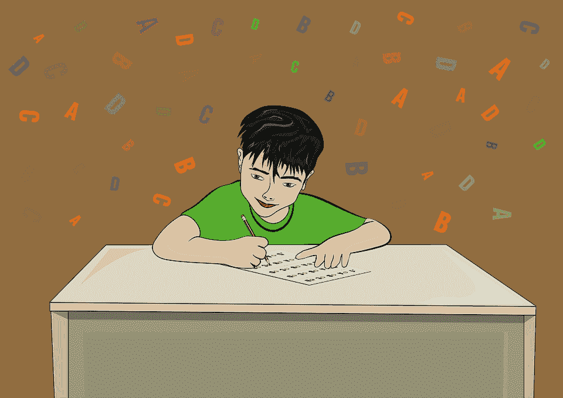

# 如何使用 Python 将数字等级转换成字母等级

> 原文：<https://medium.com/geekculture/how-to-use-python-to-convert-numerical-grades-to-alphabetical-ones-47333d989ade?source=collection_archive---------4----------------------->

我参加了 Udacity 的一个免费的数据分析入门课程，并遇到了一个练习，其中数字成绩应该转换为字母成绩。这个任务应该用 Python 来完成。我想出了自己的解决方案，但也包括了教师的解决方案，以给读者提供几个如何着手的选项…