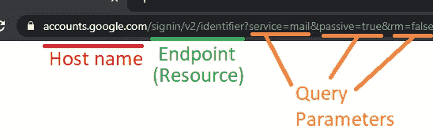
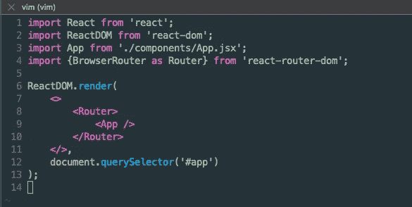
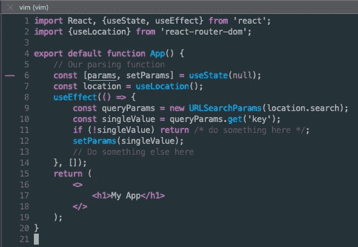
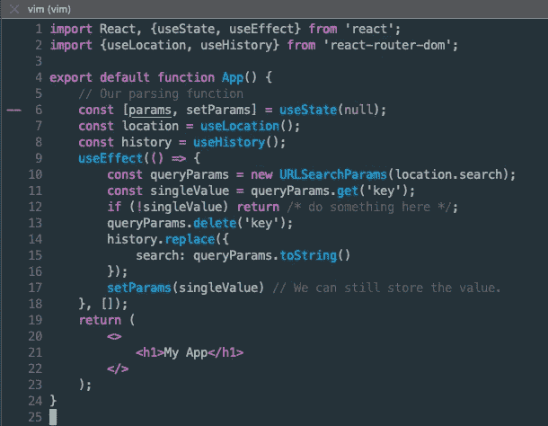

# 如何在 React 中使用查询参数？JS + React 路由器

> 原文：<https://medium.com/geekculture/how-to-use-query-parameters-with-react-js-react-router-86237c1ec456?source=collection_archive---------1----------------------->

## 什么是查询参数？

> **查询参数**是附加在 url 末尾的一组定义好的**参数**。

更简单地说，它们是我们可以附加到 url 上的键=值对，用作向应用程序传递数据的多种方式之一。

## 一些先决条件

首先，这需要一个您可能熟悉的附加依赖项，***react-router-DOM***。

**安装:** `npm i --save react-router-dom`

# 第一步:用路由器包装你的项目。

在您的`index.jsx`文件中，当我们将项目渲染到 DOM 时，您必须将最外层的组件包装在一个路由器标签中。这将允许我们为下一步确定查询参数的范围。

# 第二步:编写一个函数来解析查询参数

这个片段有很多内容，所以让我们一步步来。我还想指出的是，对于上面的代码片段，我使用了 useEffect 方法，假设我们想在安装组件时对查询参数做一些事情。

## **首先**我们使用一种叫做`useLocation`的钩子

[***此处链接到文档***](https://reactrouter.com/web/api/Hooks/uselocation)

> `useLocation`钩子返回代表当前 URL 的`[location](https://reactrouter.com/web/api/location)`对象。你可以把它想象成一个每当 URL 改变时就返回一个新的`location`的`useState`。

我们对此很感兴趣，因为我们想要获取整个 URL，这样我们就可以访问参数，并且我们从从`useLocation()`返回的`location`对象中调用方法`search`。

## 其次，我们要看看 URLSearchParams

[***此处链接到文档***](https://developer.mozilla.org/en-US/docs/Web/API/URLSearchParams)

> `**URLSearchParams**`接口定义了使用 URL 查询字符串的实用方法。

如上所述，这是一个我们可以用来连接给定 URL 的查询字符串的接口。所以我们正在构造一个新的接口，并为参数传递我们的`location.search`对象。

## **最后，我们将使用许多实用方法中的一种来获取数据**

在这个代码片段中，我们将使用来自`URLSearchParams`接口的`.get()`方法。检索一个键=值对需要一个参数。有很多方法可以更有意义地检索数据，而不仅仅是获取一个，我建议浏览文档以最适合您的用例。

# 额外收获:从 URL 中删除查询参数

这是我在最近的一个项目中需要使用的东西，它没有被很好地记录，所以我想分享一种实现它的方法，因为你可能也想从 URL 中删除/编辑查询参数。

