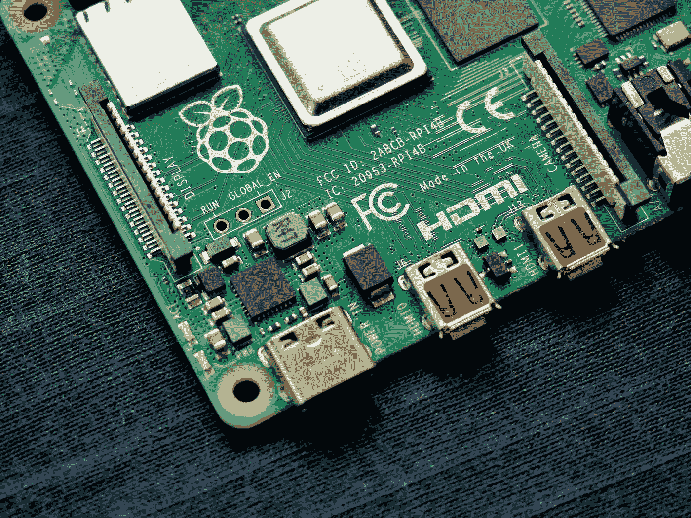

# 如何使用树莓皮作为媒体中心与果冻

> 原文：<https://medium.com/geekculture/how-to-use-raspberry-pi-as-a-media-center-with-jellyfin-462b33e19d40?source=collection_archive---------4----------------------->

Raspberry 是一个很棒的迷你电脑，在这篇文章中，我们将学习如何用 Jellyfin 把它设置成你的媒体服务器。

Photo by [Vishnu Mohanan](https://unsplash.com/@vishnumaiea?utm_source=medium&utm_medium=referral) on [Unsplash](https://unsplash.com?utm_source=medium&utm_medium=referral)

你是否正在寻找一种方法将你的房子变成智能家居？如果是这样，树莓派可能是完美的解决方案。

Raspberry Pi 是一款小巧、经济的电脑，可用于多种任务，包括…