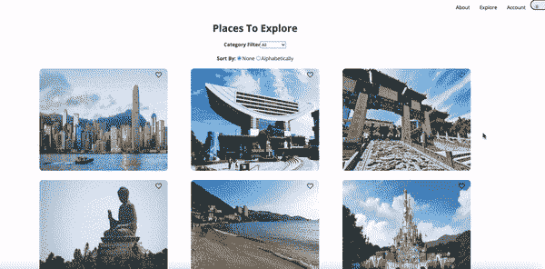
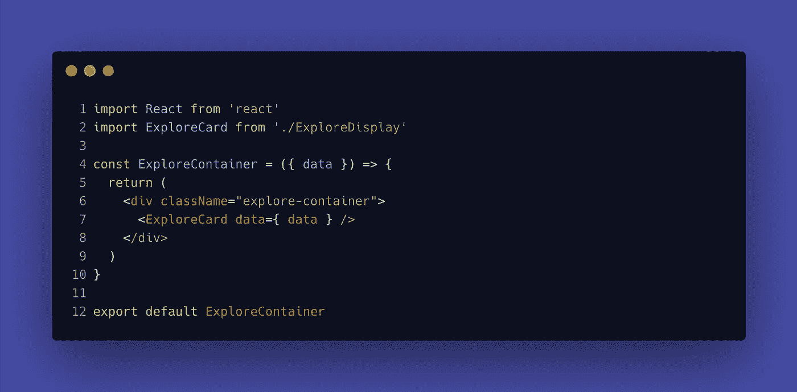

# 如何使用 React 路由器:useParams

> 原文：<https://medium.com/geekculture/how-to-use-react-router-useparams-436851fd5ef6?source=collection_archive---------0----------------------->

## 使用参数说明和演示


人们总是说参加黑客马拉松会迅速提高你的技能。我目前正在参加为期一周的黑客马拉松，我完全同意这种说法。在这次黑客马拉松中，我强迫自己学习一些新的东西，其中之一就是`useParams`。

# 介绍

`useParams`是[反应路由器](https://reactrouter.com/)附带的[挂钩](https://reactjs.org/docs/hooks-intro.html)方法之一。我假设你在这里的原因是你想学习当你在 React 中创建导航组件时如何使用`useParams`(我不得不说 React Router 是我见过的最好的文档之一。).

在我们开始讨论`useParams`之前，请确保您已经在 React 应用程序中安装了 React 路由器:

```
npm install react-router-dom
```

在我们学习的过程中，有几个标签你可能认识，也可能不认识:`<BrowserRouter>`、`<Router>`、`<Switch>`、`<Link>`、`<Route>`。

还有几个 React 路由器钩子方法我还在学习:`useHistory`、`useLocation`、`useRouteMatch`，我就不在这篇文章里介绍了。

根据 React 路由器 doc 中的定义，`useParams`返回:

> URL 参数的键/值对的对象。用它来访问当前`<Route>`的`match.params`。

用简单的英语来说是什么意思？

这意味着无论你在 useParams(例如:`title`)中设置了什么，你的参数都必须与`<Route path='/path/:title'>`相匹配。

## 为什么要用`useParams`？

当我第一次学习与我的编码 Bootcamp 反应时，我的 Bootcamp 教我们创建多个组件，并使用`handleClick`来点击项目的细节，并使用三元条件来替换页面。不是说这是个坏主意，但我注意到一个问题:



Screenshot from my capstone project

不知道大家有没有注意到，当我点开“香港迪士尼”的时候，探索页面的**位置**被香港迪士尼的详细信息取代，要向上滚动才能看到页面的顶部。代码如下:

正如你所看到的，这更像是一种替换，而不是将应用程序导向一个新的页面/标签。因此，`useParams`在这里会很有用，它会把我从当前 URL 引导到一个新的路径。

我知道如果没有实际的例子，这仍然是很模糊的。让我在下面演示一下。

## 游戏攻略

让我们继续使用我的 Explore 页面示例作为演示，这样我们就可以看到变化。(免责声明:您看到的数据是用于演示目的。在我的实际项目中，数据来自我创建的 Rails API。)

**第一步:设置** `**<Router>**` **和** `**<Route>**`

在我们的`App.js`(母公司)中，确保我们必须从`react-router-dom`进口我们需要的东西。

解释:

您可能知道`BrowseRouter`是存储 URL 并与 web 服务器通信；`Switch`和`Route`的目的是当`Switch`被渲染时，它搜索它的子`Route`元素来匹配当前的 URL。当找到匹配时，`Switch`将指向`Route`中的路径。

从上一部`Route`可以看到，它看起来和其他的很不一样，因为`/explore/:name`。这个`/:name`可以是任何东西，只要它与您的数据的参数/键匹配。这也是我们以后需要使用`useParams`时的关键。

我还创建了三个组件:

*   `ExploreContainer` —浏览页面的容器；
*   `ExploreCard` —显示来自`data`(我们的对象数组)的所有内容
*   `ExploreDetail` —显示数据的详细信息。

第二步:把孩子传下去

在`ExploreContainer.js`中，

我只需要这个来包含数据



ExploreContainer.js

**第三步:** `**<Link>**` **到下面的卡片**

在`ExploreCard.js`中，我会使用`map`来映射出数据表中的所有数据:

ExploreCard.js

正如你在第 9 行看到的，我们使用`<Link>`来连接我们从 App.js 中的`<Route>`得到的内容，并让我们的应用程序知道我们正从当前 URL 把它带到另一个位置。`{list.name}`是必不可少的，因为我们将在以后使用`useParams`时使用它进行条件检查，并确保它与我们的`Data`列表中的参数相匹配。

**第四步:过滤** `**/:name**` **，用** `**useParams**`匹配出我们想要看到的正确数据

现在我们正处于最后一步，我们将使用`useParams`，不要忘记导入`useParams`！

```
import { useParams } from 'react-router-dom'
```

首先，我们需要确保`{ name }`与我们的`/explore/:name`参数匹配。基本上，您可以将参数命名为您想要的任何名称，但是您可能希望与列表中的`key`匹配，这样就不会混淆。

我们就是这么做的！

这是我目前正在做的一个项目的快速演示(这个项目还没有造型)


Demo

正如你看到的，当我点击名字时，地址栏会添加这个人的名字。这就是`<Router>`->-`<Route>`->-`<Link>`的神奇之处。

# 结论

我只有这些了！如果你正在纠结如何使用`useParams`，希望这能对你当前的项目有所帮助。我提前道歉，这篇文章没有最技术性的解释，因为我还在学习过程中。

如果你正在寻找更多的资源，这个人在如何使用`useParams`方面做得非常出色。

查看一下他是如何实时实现这些方法的，别忘了查看 React-Router 文档，看看其他有趣的方法，您可以在未来实现它们！

编码快乐！

