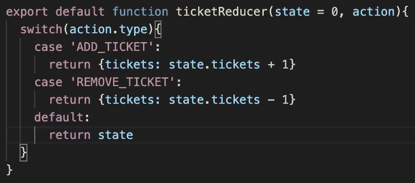

# 作为初学者如何使用 Redux

> 原文：<https://medium.com/geekculture/how-to-use-redux-as-a-beginner-6aecc1e2a154?source=collection_archive---------19----------------------->

Redux 是一个用于应用程序状态管理的 JavaScript 库。它可以用于任何 UI 库，但是这篇文章将讨论它在 React 中的用法。简而言之，库在单个对象中维护应用程序的不可变状态。不可变仅仅意味着它不能被直接改变。相反，它通过“redux 流”,最终返回一个新的状态对象并替换旧的状态。在开始使用 Redux 之前，你必须先了解 React。如果你不知道 React 是如何工作的，这里有一个[视频](https://www.youtube.com/watch?v=DLX62G4lc44)很好地解释了这个框架。说完了，让我们学习一些 Redux！

# 设置它

如果您还没有在您的应用程序中安装 redux，您可以通过运行`npm install redux react-redux`来安装。这将提供在你的应用中实现 redux 所需的一系列模块。

## 还原剂

您可以将 reducers 看作 React 中的 setState 函数。它们只是简单的函数，接受以前的状态和一个动作对象作为参数，然后返回新的状态。



example of simple reducer

我们将更深入地了解未来的行动，但现在只是把它们当作指令。减速器接受动作，并将类型与其中一种情况相匹配。然后返回一个新状态，该状态被分配给 redux 的全局状态。如果我们的状态中有另一个键，我们将不得不把我们的返回改为类似于:

```
{...state, tickets: state.tickets + 1}
```

否则，当更新 tickets 值时，我们将丢失 state 中的其他数据。

## 行动

这是您传递更新状态所需信息的地方。动作是一个普通的旧对象，带有类型的键和有效负载。类型告诉 reducer 它应该采取什么动作，有效负载是您的 reducer 将用来更新状态的数据。每次您想要更改状态时，可以手动编写操作。然而，最好有一个返回这些动作的单独的函数文件夹，称为 action creator。它保持了关注点的分离，节省了调试拼写错误的动作类型的时间。

## 将组件连接到 Redux 存储

一旦你有了行动和减少，我们就可以开始建立我们的商店。

```
//index.jsimport { Provider } from "react-redux";import { createStore } from "redux";import myReducer from "./reducers/myReducer";
```

首先，我们想创建我们的商店。每当在 Redux 中创建存储时，都需要指定 reducer。这是我们存储状态的地方。

```
const store = createStore(myReducer)
```

其次，我们希望将我们的顶级组件 App 封装在 Provider 组件中，并将我们刚刚在上面创建的 store 传递给它。这将为应用程序中嵌套的所有组件提供 store 访问权限。给予它们读取和更新状态的能力，而不管它们的层级位置。

```
ReactDOM.render( <Provider store={store}> <App /> </Provider>, document.getElementById('root'));
```

## mapStateToProps & mapdispatchtopros

虽然提供者允许所有组件访问 store，但是我们还必须采取一个步骤。connect 函数来自 react-redux 模块，接受两个参数。第一个参数是两个回调函数，第二个是您希望连接的组件。

**mapStateToProps** 用于从存储中读取数据。首先，您必须定义函数。现在这个函数将接收状态作为参数，并且必须返回一个对象。在返回值中，您可以指定要将存储中的哪些数据传递给组件。

```
const mapStateToProps = state => {
  return {
    data1: state.first,
    data2: state.second
  }
} 
```

然后，这个对象将扩展到组件的道具上，可以像访问任何其他道具一样访问它。如果您想要访问整个状态，只需返回 state。

**mapDispatchToProps** 是用来通过调度动作来改变状态的。就像第一个论点一样，这也必须被定义。然而，它将被调度，而不是作为一个参数被陈述。Dispatch 是存储中的一个函数，它接受一个动作作为参数。这是在 Redux 中触发状态改变的唯一方法。与 mapStateToProps 类似，该函数必须返回一个对象，该对象将作为 Props 向下传递给所需的组件，但其值将是回调函数。

```
const mapDispatchToProps = (dispatch) => {
  return {
    // dispatching plain actions
    increment: () => dispatch({ type: 'INCREMENT' }),
    decrement: () => dispatch({ type: 'DECREMENT' }),
    reset: () => dispatch({ type: 'RESET' }),
  }
}
```

## 结论

如果您正在构建简单的应用程序，您可能不会马上看到使用 Redux 的好处，但是您可以想象您的组件会变得多么混乱。不得不传递回调属性来改变状态。不是每个人都是 Redux 的粉丝，因为它没有添加任何已经不能用 React 完成的东西。我个人发现它对我的项目非常有帮助，帮助我更好地组织代码。你对 Redux 有什么感觉？