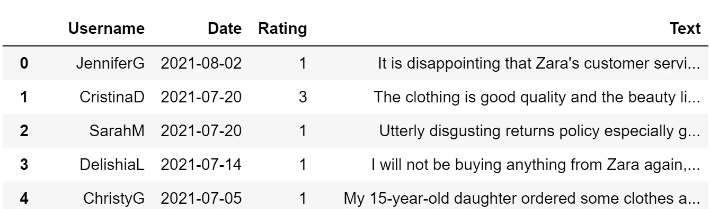
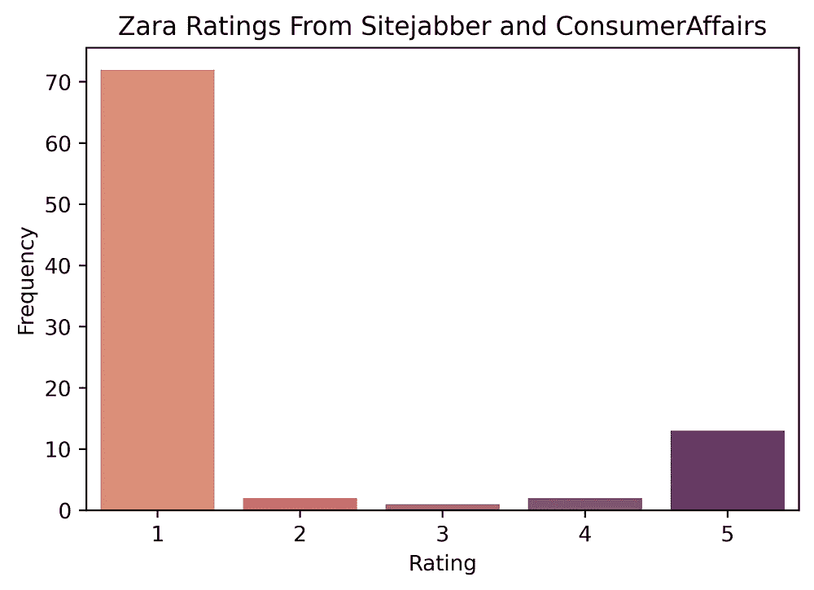
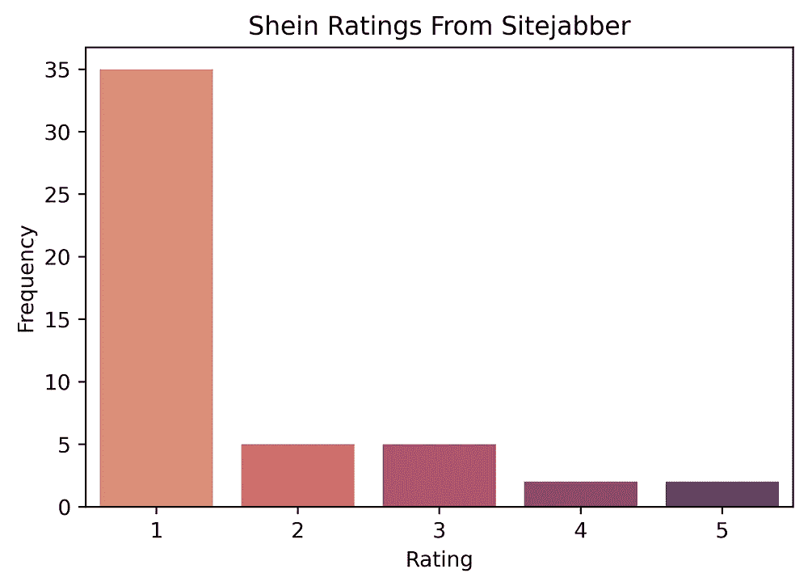
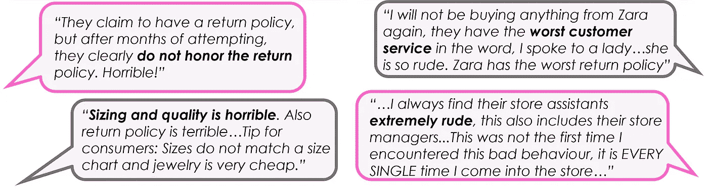

# 如何使用审核 API

> 原文：<https://medium.com/geekculture/how-to-use-review-api-abc3cb0ccd67?source=collection_archive---------17----------------------->

## 在没有网络抓取的情况下提取关于 Zara 和 Shein 的评论


Photo by [Priscilla Du Preez](https://unsplash.com/@priscilladupreez?utm_source=medium&utm_medium=referral) on [Unsplash](https://unsplash.com?utm_source=medium&utm_medium=referral)

我想学的一件事是如何进行网络搜集。当我试图弄清楚这一点时，我发现了一个可以做我想做的事情的工具: [Review API](https://app.reviewapi.io/documentation) 。在我看来，如果你还在学习 web 抓取和 regex，知道如何从 Review API 中提取数据是一个很好的敲门砖。免费版只能让你提取 30 篇评论，但它仍然是一个很好的学习工具。

对于这个项目，我想比较关于两个流行时尚公司的评论:Zara 和 Shein。它们在定价、产品质量、营销和客户细分方面有所不同。这个项目的目标是了解他们的客户如何评价他们的差异。

Review API 提供的文档非常有用；它向您展示了如何通过浏览器、CURL、Python、Node.js 和 PHP 请求评论。我将回顾一下我是如何使用 Python 做到这一点的。

Review API 支持几个平台，您可以从中提取数据，但是由于我只对关于公司的评论感兴趣，我将展示我是如何从 sitejabber 和 Consumer Affairs 中提取数据的。

[这个](https://www.sitejabber.com/reviews/zara.com)是 Zara 的 sitejabber 页面，我就是这样提取了 30 条评论的:

```
import requests
import re
import pandas as pdheaders = { 
  "apikey": "ENTER_YOUR_API_KEY_HERE"}params = (
   ("url","[https://www.sitejabber.com/reviews/zara.com](https://www.sitejabber.com/reviews/zara.com)"),
   ("amount","30"),
);response = requests.get('[https://app.reviewapi.io/api/v1/reviews'](https://app.reviewapi.io/api/v1/reviews'), headers=headers, params=params);#view response
print(response.text)
```

响应给你一个很大的字符串文本，但我想创建一个数据表，其中包含:用户名，日期，评级和审查。现在我们必须使用一些正则表达式来提取我们想要的东西。

下面是输出的一个片段:

```
{"query":{"url":"https:\/\/www.sitejabber.com\/reviews\/zara.com","amount":"30"},"reviews":[{"platform":"sitejabber.com","rating":1,"user_name":"JenniferG.","text":"It is disappointing that Zara's customer service policies are so poor. 30 minutes to wait in line to make a purchase or return is unreasonable. And, now that we're transitioning from the pandemic, the dressing rooms are still not open. And, if you buy something online, you cannot return it to a store. Terrible!ServiceValueShippingReturnsQuality","title":"TERRIBLE CUSTOMER SERVICE","timestamp":"2021-08-02","platform_specific":{"user_review_count":"1","user_image_url":"https:\/\/static.sitejabber.com\/img\/stock_photos\/200\/thumbnail_small.1476463632.jpg","user_helpful_vote":"1"}}
```

经过一些反复试验，我终于能够弄清楚如何获得我感兴趣的变量:

```
#make empty dataframe
zara_rev = pd.DataFrame(columns=['Username', 'Date', 'Rating', 'Text'])#extract data for each column
zara_rev['Username'] = re.findall(r'(?<=\"user_name\"\:.)(\w*)', response.text)
zara_rev['Date'] = re.findall(r'(?<=\"timestamp\"\:.).[0-9]*\-[0-9]*\-[0-9]*(?=\"\,\"platform_specific\")', response.text)
zara_rev['Rating'] = re.findall(r'(?<=\"rating\"\:)(\d)*', response.text)
zara_rev['Text'] = re.findall(r'(?<=\"text\"\:.).*?(?=\"\,\"title\")',response.text)
```

当涉及到 regex 时，我学会了非常具体地指定我想要提取的位置(否则我最终会得到一个数据点)。根据你的反应，你可能需要做一些改变。

现在，您的数据集应该如下所示:



就是这样！超级简单对吧？为 Shein 做同样的事。(注:Shein 没有消费者事务页面，所以我只有这家公司的 sitejabber 数据。)

这是我制作的一张展示 Zara 和 Shein 评分分布的图表:



So many 1-star ratings from both of them! Why is that?

许多消费者使用 sitejabber 和 Consumer Affairs 等网站来分享对公司产品或客户服务的糟糕体验。以下是一些一星评价:



Some reviews about Shein (left) and Zara (right)

这很有趣，因为我会从在这些商店购物的朋友那里听到这些观点。许多顾客抱怨 Shein 的尺码问题，并且没有得到退款。许多 Zara 评论者抱怨糟糕的客户服务体验。

公司评论是了解客户对你的产品和客户服务评价的好方法。客户评论可以帮助公司找到他们可以改进的地方！

如果你想更深入地分析你的文本，可以参考我的另一篇文章:[关于迪斯尼乐园评论的 NLP](https://towardsdatascience.com/analyzing-disneyland-reviews-b916b6dcccf4)。

如果你刚刚开始学习如何使用正则表达式或者正在学习如何抓取网页，我希望这篇文章能帮助你。

来源:

[](https://www.sitejabber.com/reviews/zara.com) [## Zara 评论- 2.3 星

### Zara 的 1070 条评论，2.3 星:“我不明白为什么有这么多差评。我绝对喜欢 Zara 的…

www.sitejabber.com](https://www.sitejabber.com/reviews/zara.com) [](https://www.sitejabber.com/reviews/shein.com) [## SHEIN 评论- 2.9 星

### SHEIN 的 3547 条评论，2.9 颗星:“迄今为止史上最差网站”。2020 年 4 月 23 日下单。据称已装运…

www.sitejabber.com](https://www.sitejabber.com/reviews/shein.com)  [## 西班牙一品牌

### ConsumerAffairs 不是政府机构。显示的公司可能会向我们支付授权费，或者当您点击链接时…

www.consumeraffairs.com](https://www.consumeraffairs.com/online/zara.html?#reviews) [](https://regex101.com/) [## regex101:构建、测试和调试 regex

### 正则表达式测试器，语法高亮，解释，PHP/PCRE，Python，GO，JavaScript 的备忘单…

regex101.com](https://regex101.com/)