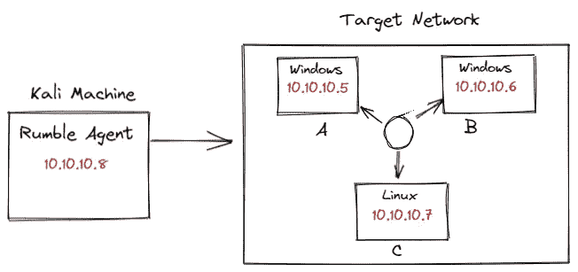

# 如何使用 Rumble 进行资产发现

> 原文：<https://medium.com/geekculture/how-to-use-rumble-for-asset-discovery-d2cf8f1724c3?source=collection_archive---------12----------------------->

## 轻松实现全面的资产发现

你好，世界！发现网络中的资产是保护和攻击网络的第一个关键步骤；你不能保护或利用你不知道存在的资产。如果有一种工具可以帮助确保我们不会错过网络中的这些项目就好了。嗯，你很幸运，因为隆隆声是一个资产清单…