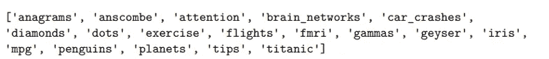
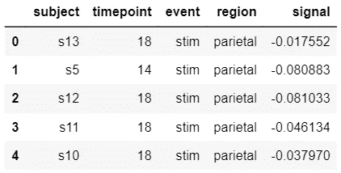
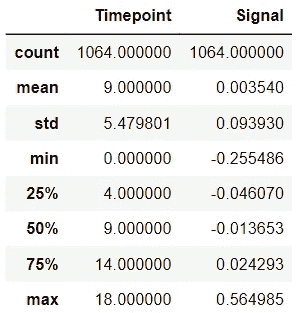
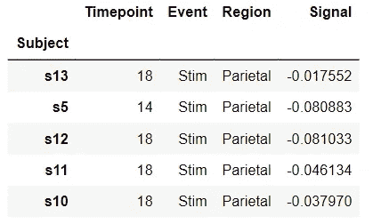
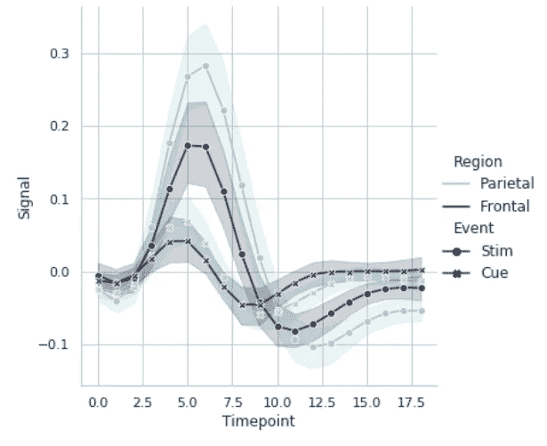
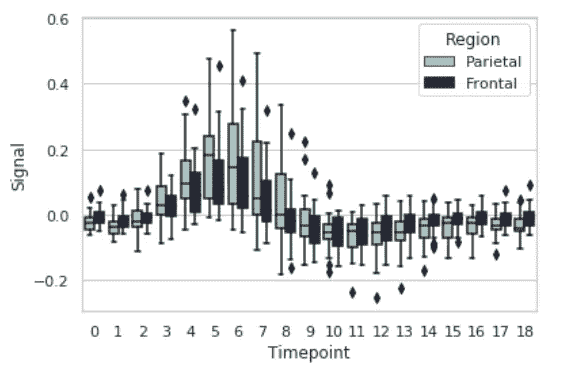
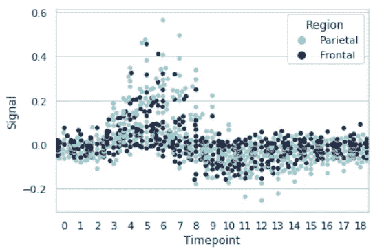
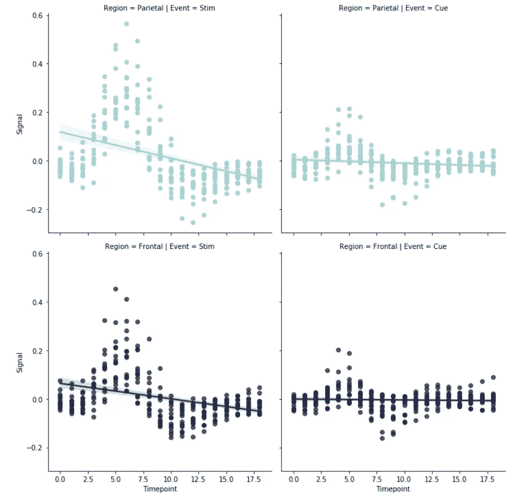

# 如何在 Python 中使用 Seaborn 来可视化 fMRI 数据集

> 原文：<https://medium.com/geekculture/how-to-use-seaborn-in-python-to-visualize-the-fmri-dataset-ae89381157ea?source=collection_archive---------9----------------------->


# 可视化技术

作为神经科学领域的一名新兴数据科学家，我将在这次演示中使用 Seaborn 样本数据集库中包含的 fMRI 数据集。功能性磁共振成像(fMRI)使用强大的静态磁场来检测与血流相关的变化，从而测量大脑活动。当大脑的某个区域被使用时，流向该区域的血液也会增加。血流量的增加由较高幅度的信号表示，该信号被视为强神经活动。

这个特殊的库对于可视化 fMRI 数据非常有用，因为它使用数据帧和数组与 pandas 数据结构紧密集成。我计划使用多个图来展示显示相同数据的不同可视化技术，例如:

1.  线形图
2.  箱形图
3.  群集图
4.  线性回归模型

Seaborn 库侧重于图的平均值的不同元素，并执行统计汇总以产生信息显示。它们最适合用来显示两个变量之间的关系。在这种情况下，我们将关注与**事件**和**区域**变量相关的变量**时间点**和**信号**。

[资源](https://en.wikipedia.org/wiki/Functional_magnetic_resonance_imaging#:~:text=Functional%20magnetic%20resonance%20imaging%20or,to%20that%20region%20also%20increases)

# 可视化库

> 如果 Matplotlib“试图让简单的事情变得简单，让困难的事情变得可能”，Seaborn 也试图让一组定义明确的困难事情变得简单迈克尔·瓦斯科姆

我要用的图书馆是迈克尔·瓦斯科姆的 Seaborn。它是一个建立在 Matplotlib 之上的声明式开源 Python 库。建议使用 Matplotlib 中的 Jupyter/IPython 接口集成 Seaborn 库。

与 Matplotlib 相比，Seaborn 的功能使用更少的语法，除了基本的绘图之外，还擅长统计可视化。Pandas 库很容易集成到 Seaborn 中，使它能够更直观地处理数据框和数组。它还提供了可视化的默认主题，有些人认为这是定制的一个限制。

我决定使用这个库，因为它是内置统计任务的好选择。它专门支持可视化分类变量和数值变量之间的关系，对于我正在使用的数据集，这将有助于叙述分析的结果。

[资源](https://seaborn.pydata.org/index.html)

# Seaborn 装置

*   最新的稳定版本可以从 PyPI: `pip install seaborn`安装
*   要包含可选的依赖项:`pip install seaborn[all]`
*   来自 Github 的开发版`pip install git+https://github.com/mwaskom/seaborn.git`
*   使用 conda 从 Anaconda 安装:`conda install seaborn`

安装 seaborn 时需要下载的依赖项:NumPy、scipy、pandas、matplotlib。

[资源](https://seaborn.pydata.org/installing.html)

# 示范

**导入 Seaborn 库**

```
import numpy as np
import pandas as pd
import matplotlib.pyplot as plt# Importing searborn
import seaborn as sns# Looking at the available sample datasets in the seaborn library
print(sns.get_dataset_names())
```



**加载 fMRI 数据集**

要加载数据，只需使用 load_dataset()函数来快速访问示例数据集。的。head()函数返回该数据框的前 n 行，如下所示:

```
# Loading the dataframe
fmri = sns.load_dataset('fmri')# Returning the first n rows
fmri.head()
```



我们可以用。describe()函数自动计算所有连续变量的基本统计数据。在这些统计中，任何 NaN 值都会被自动跳过。

这将显示:该变量的计数、平均值、标准偏差(std)、最小值、IQR(四分位范围:25%、50%和 75%)和最大值。

```
# Describing the data
fmri.describe()
```



**预处理和清洗**

这个样本数据集不需要大量的处理。相反，我将出于美观的目的清理数据。首先，我将重命名列，以便每个变量都大写。然后，我将设置索引，以主题变量开始数据帧。最后，我将重命名所有的字符串值，从一个大写字母开始。

为了查看所做的更改，我将使用。head()函数返回更新后的数据帧。这些变化将会反映在我的想象中。

```
# Renaming the columns
fmri.columns = ['Subject','Timepoint','Event','Region','Signal']# Setting the index to begin with the variable Subject
fmri=fmri.set_index('Subject')# Capitalizing string values in the dataframe
fmri.replace({'frontal': 'Frontal', 'parietal': 'Parietal', 'cue': 'Cue', 'stim': 'Stim'}, inplace=True)# Returning the first n rows of the updated dataframe
fmri.head()
```



**绘制数据**

*折线图* `relplot`函数能够创建时间序列分析中常用的折线图。在这个例子中，我们通过比较同一个图中的**区域**和**事件**来分析和比较两组观察值，**时间点**和**信号**。

使用`kind="line"`通过在绘图前转换数据提供了灵活性。观察值按其 x 值排序，重复观察值汇总。默认情况下，结果图显示每个单位的平均值和 95%置信区间(CI)。

```
sns.relplot(x="Timepoint", y="Signal", hue="Region", style="Event",
            palette="ch:rot=-.25,hue=1,light=.75",
            dashes=False, markers=True, kind="line", data=fmri);
```



*箱线图* 箱线图基于百分位数，提供了一种直观显示数据分布的快速方法。下面的`box plot`以二维显示，增加了第三维，即色调参数。通过根据第三个变量给点着色，可以将色调参数结合到绘图中。在这个例子中，我们使用**区域**变量作为色调参数。

方框的顶部和底部分别是第 75 和第 25 个百分点。中间值由方框中的水平线表示。称为胡须的线条从顶部和底部延伸，指示大部分数据的范围。

```
sns.boxplot(x="Timepoint", y="Signal", hue="Region",
            data=fmri,palette="ch:rot=-.25,hue=1,light=.75")
```



*蜂群图* 蜂群图可以单独绘制，有时被称为“蜂群”。图上的点已根据类别分组，以代表**区域**变量的值分布。绘图点显示了大脑顶叶和额叶区域与**信号**随时间变化的关系。

```
sns.set(style='whitegrid')
sns.swarmplot(x="Timepoint",y="Signal",hue="Region", 
                  data=fmri,palette="ch:rot=-.25,hue=1,light=.75")
```



*线性回归模型* Seaborn 有两个主要函数`regplot()`和`lmplot()`，用于可视化通过回归确定的线性关系，通常用于预测分析。虽然`regplot()`总是显示单个关系，但`lmplot()`将`regplot()`与 FacetGrid(一种用于绘制条件关系的多点网格)相结合，提供了一个简单的界面来显示“多面”图上的线性回归，允许您探索与多达三个附加分类变量的交互。对于这个例子，我们将使用`lmplot()`函数来绘制**时间点**和**信号**与**区域**和**事件**之间的关系。

[资源](https://seaborn.pydata.org/tutorial/regression.html)

```
sns.lmplot(x="Timepoint", y="Signal", hue="Region",
           col="Event", row="Region", data=fmri,
```



我们可以看到，在神经刺激事件的顶叶和额叶区域中，信号**与时间点**之间存在负相关，但在线索事件中不存在负相关。****

# 结论

既然我们已经从 Seaborn library 的 *fMRI* 样本数据框中探索了多个图，我们可以理解什么样的可视化最适合这种类型的数据。我的结论是，`line plot`是最有效的，因为它包含了**区域**和**事件**变量，没有太多的混淆。`linear regression model`让我们对 Seaborn 的分析能力有了更深的理解，也是可视化的首选图。`swarm plot`和`box plot`与`line plot`的模式非常相似，但并不真正描述数据中发生的事情，因为我们在图中只代表具有相似值的两个类别。我们从图中提取的相同信息可以用`.describe()`函数轻松表示。

希望这个演示能够帮助您更好地理解 fMRI，以及 Seaborn 库可以做些什么来可视化这种独特类型的数据。