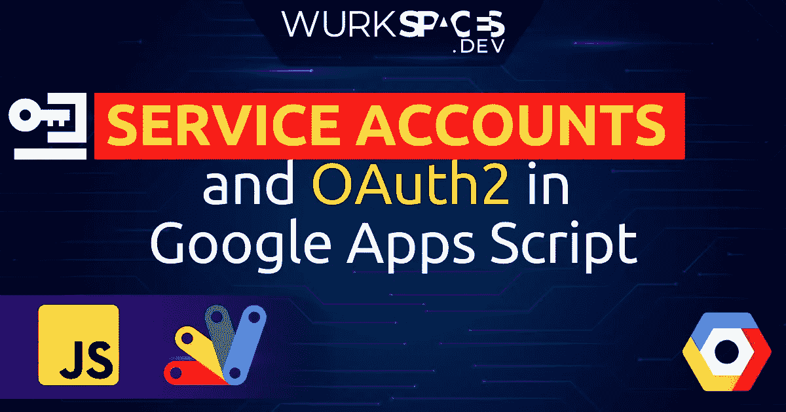

# 如何在 Google Apps 脚本中使用服务帐户和 OAuth2

> 原文：<https://medium.com/geekculture/how-to-use-service-accounts-and-oauth2-in-google-apps-script-99c4bc91dc31?source=collection_archive---------4----------------------->

## 给你的脚本用户没有的特权。

# Google 企业应用套件脚本中的授权

在 99%的情况下，Google Apps 脚本中的授权非常简单。当用户执行他们的脚本时，他们以自己的身份用各自的…