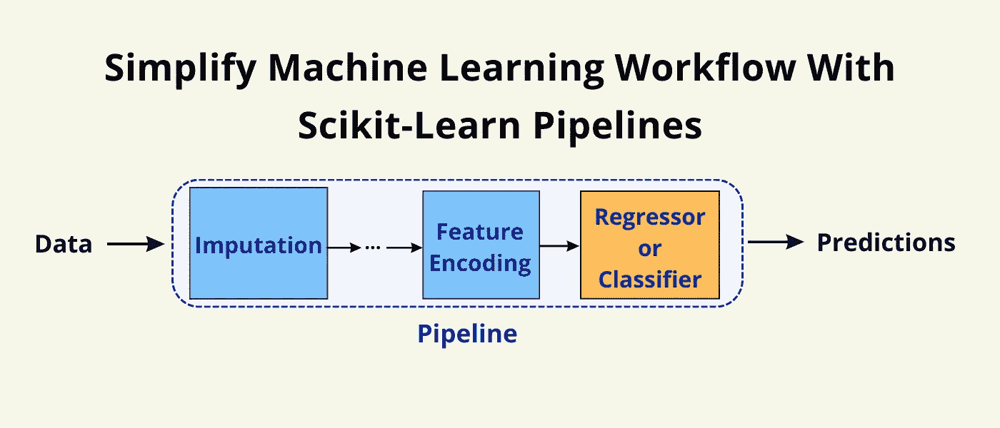

# 如何使用 Scikit-Learn 管道简化机器学习工作流程

> 原文：<https://medium.com/geekculture/how-to-use-sklearn-pipelines-to-simplify-machine-learning-workflow-bde1cebb9fa2?source=collection_archive---------2----------------------->

## Scikit-Learn 的瑰宝——管道

Image by the author

# 介绍

当我们开始一个机器学习(ML)项目时，我们通常执行以下步骤，

*   输入缺失值
*   编码分类特征
*   其他转换