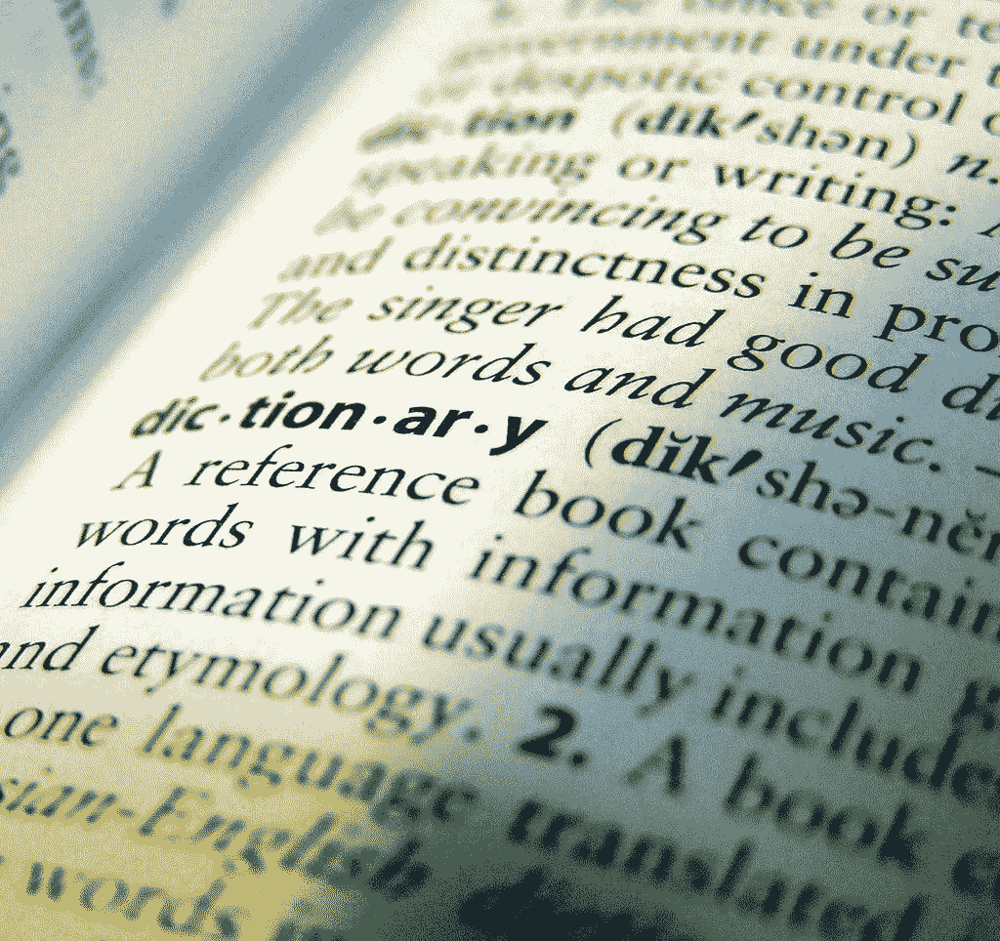

# 如何使用 sklearn 的字典矢量器功能

> 原文：<https://medium.com/geekculture/how-to-use-sklearns-dictvectorizer-function-5294645dd72c?source=collection_archive---------7----------------------->

在过去的几周里，我一直在学习自然语言处理(NLP ),结果，我重新熟悉了 sklearn 库中一些真正伟大的功能。虽然我在以前的文章中已经介绍了矢量器和转换器，但是我还没有介绍 DictVectorizer。

简而言之，dict vector 将一系列特征值映射转换成向量。它将一系列…