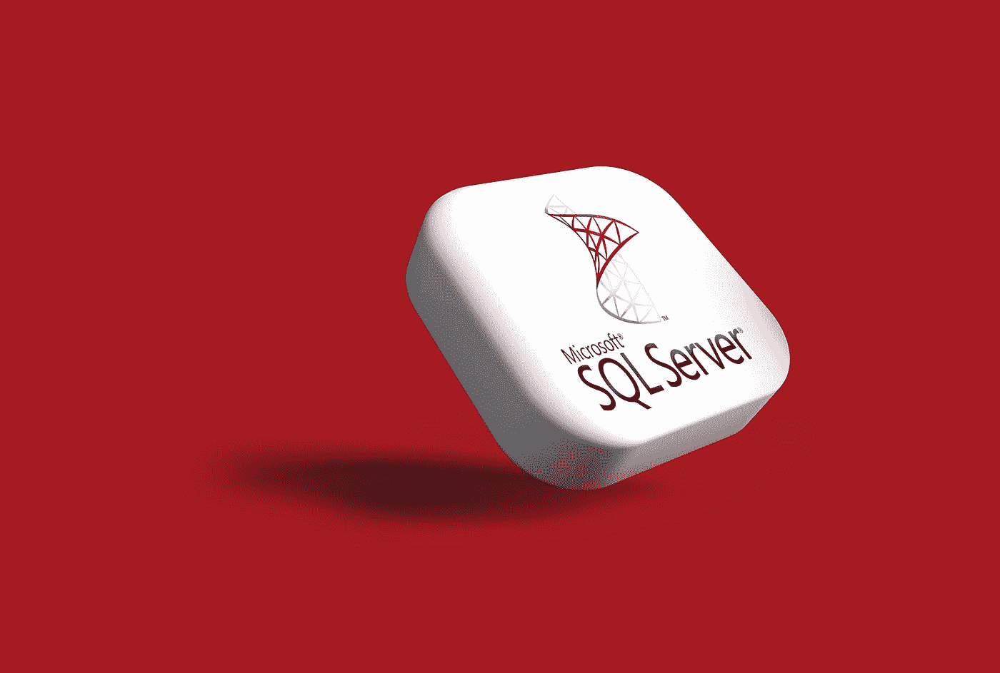

# 如何使用 SQL:创建和查询数据库的初学者指南

> 原文：<https://medium.com/geekculture/how-to-use-sql-a-beginners-guide-to-creating-and-querying-databases-644ffb0dc040?source=collection_archive---------1----------------------->

## 开始使用 SQL 所需的一切

Photo by [Rubaitul Azad](https://unsplash.com/@rubaitulazad?utm_source=medium&utm_medium=referral) on [Unsplash](https://unsplash.com?utm_source=medium&utm_medium=referral)

这篇文章最初发表于[CareerFoundry.com](https://careerfoundry.com/en/blog/data-analytics/how-to-use-sql/)。

# 想学 SQL？

当您开始您的数据分析之旅时，您需要了解如何访问和操作存储在…