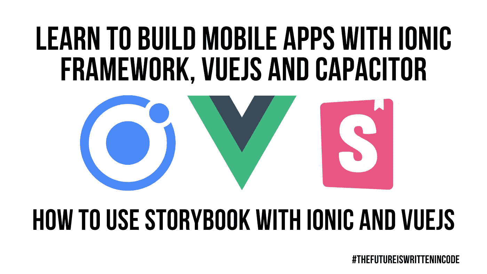

# 如何在 Ionic 和 VueJS 上使用故事书

> 原文：<https://medium.com/geekculture/how-to-use-storybook-with-ionic-and-vuejs-a3e6bfddbc48?source=collection_archive---------19----------------------->

# 概观

这是一个快速概述，作为视频教程的配套文档，链接如下。

我们将为 LoginForm 组件创建一个故事，该组件具有两个输入字段，用于发出登录和创建帐户的事件。

要让你的 [Ionic Vue](https://ionicframework.com/docs/vue/overview) 项目与 Storybook 一起工作，你需要遵循一些额外的步骤，幸运的是…