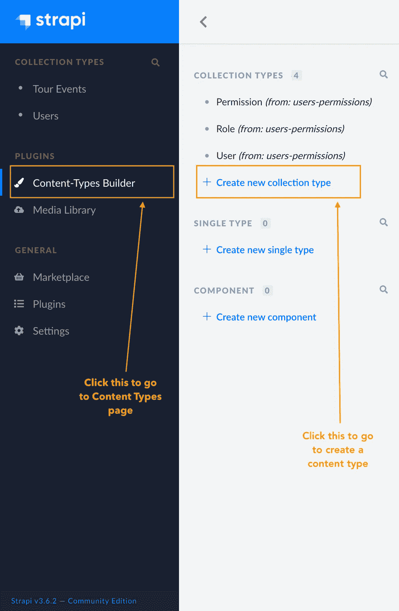
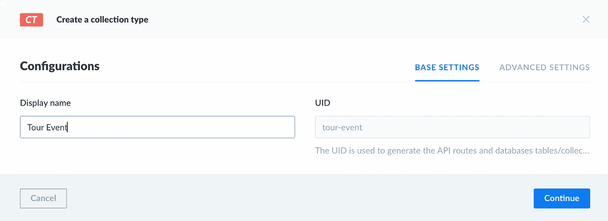
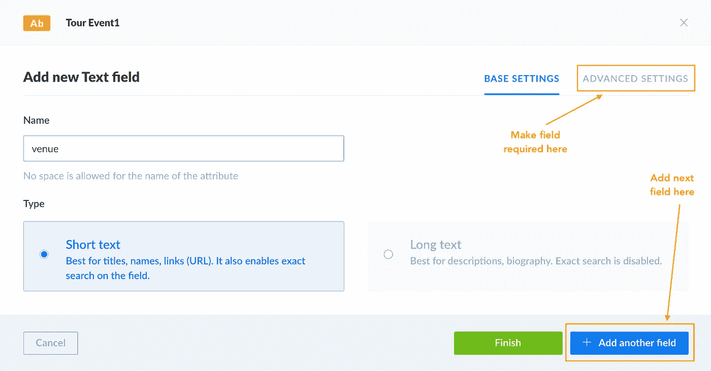
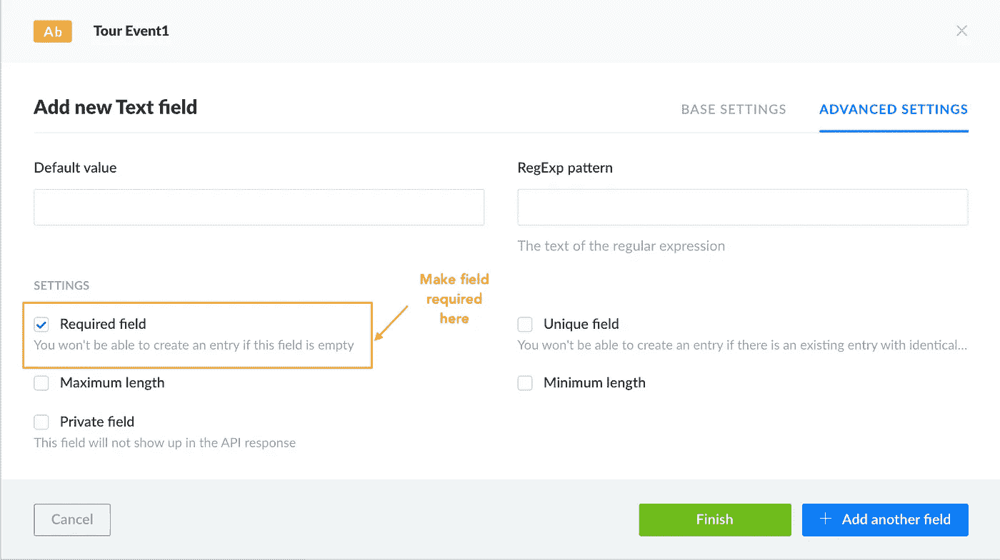
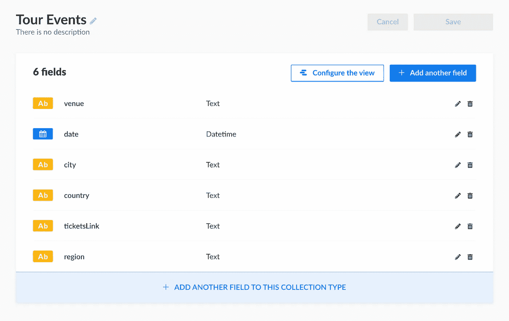
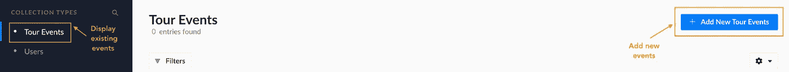
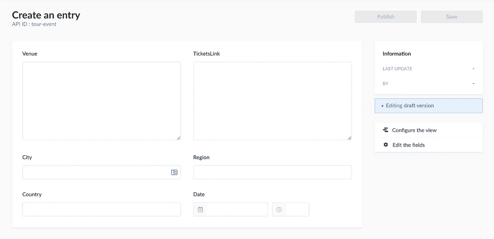
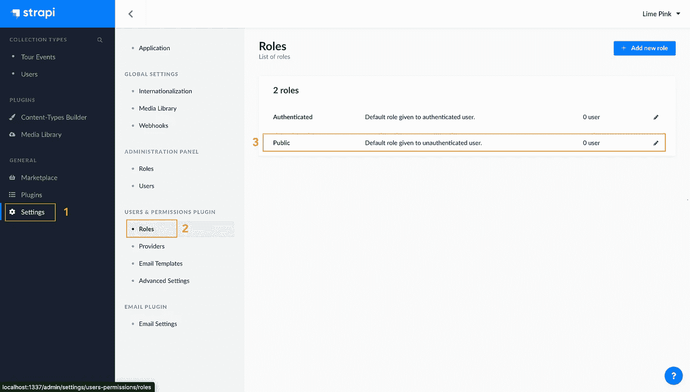
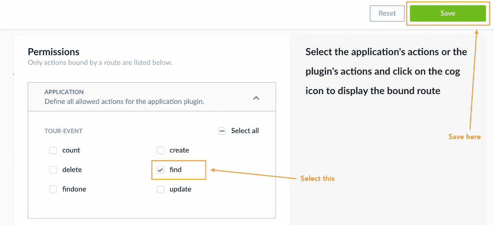

# 如何将 Strapi 与 Angular Universal 应用程序配合使用

> 原文：<https://medium.com/geekculture/how-to-use-strapi-with-angular-universal-apps-e8ff3bdca205?source=collection_archive---------38----------------------->


Angular 是一个强大的功能丰富的平台，可以用来创建各种单页应用程序，从简单的网站到更复杂的网站。有了它，您可以使用它集成的各种工具和库来构建高效的本机、web 和移动应用程序。然而，用它构建的应用程序仍有改进的余地。例如，使用 Angular Universal，您可以在服务器端呈现您的应用程序，以加快页面加载速度，提高 SEO 和性能。

服务器端渲染包括在服务器上将应用程序转换为 HTML。当您向服务器发送特定路径的请求时，它会返回一个完全静态的 HTML 页面作为响应。不需要发出额外的请求来用数据和资源填充页面，因为它们都包含在响应中。页面看起来几乎和客户端在 DOM 中呈现的一样，但有时功能有限。

Angular Universal 是一套在服务器端渲染 Angular apps 的工具。在服务器上，通用模板引擎采用 Angular 应用程序，并在发出请求时创建静态页面。然后将页面转发给客户端。它很可能被称为通用的，因为它可以在浏览器之外的其他平台上运行。

服务器端渲染的应用加载速度更快。向用户显示一个静态页面，以便在应用程序的其余部分加载时吸引他们。Angular Universal 提供的静态页面在搜索引擎网络爬虫访问时很容易索引。这种服务器端呈现提高了站点的 SEO 分数。此外，SSR 页面提供了更好的用户体验，尤其是在功能较弱的设备上，这些设备可能无法运行完整的 Angular 应用程序。

Strapi 是一个开源的内容 api。可以使用 REST 或 GraphQL 来消费其中的数据。有了它，您可以相对快速地设置 API。它还提供了一个管理面板，您可以在其中管理 API 和内容。你可以使用它与几个不同的数据库，如 SQLite，MySQL，PostgresSQL，MongoDB 等。此外，它是高度可定制的，并提供了许多插件来补充 API。

本文将介绍如何在 Angular Universal 应用程序中使用 Strapi。首先，您将设置一个 Strapi 服务器。然后，您将创建一个 Angular Universal 应用程序，它将使用来自 Strapi 的数据。

# 先决条件

在开始之前，您需要安装节点。你可以在这里找到如何得到它[。节点的版本需要至少为 12，最多为 14。您还必须安装 Angular CLI。](https://nodejs.org/en/download/)[本指南](https://angular.io/cli)将带你了解如何做到这一点。

# 项目示例

为了说明如何在 Angular Universal 应用程序中使用 Strapi，您将构建一个名为 Tour Events 的应用程序。它会列出巡回演出的日期和地点。Strapi 将为事件提供数据，Angular Universal 应用程序将使用并显示这些数据。

# 设置 Strapi

首先，您将安装 Strapi 并创建一个新项目。该项目将被称为`tour-server`。

```
npx create-strapi-app tour-server --quickstart
```

一旦服务器启动，前往[http://localhost:1337/admin](http://localhost:1337/admin)的管理面板。系统将提示您创建新的管理员。一旦您创建了一个，您将被路由到仪表板。

接下来，您将创建一个`Tour Event`内容类型。此内容类型将作为您将添加的事件数据的结构。单击侧面导航中的“内容类型生成器”链接。



在“内容类型”菜单中，单击“新建集合类型”链接。您应该会看到下面的弹出窗口。将类型 Tour Event 命名为**s**，然后单击继续按钮。



在下一个对话框中，将提示您添加一个字段并选择一种类型。例如，旅游事件**s 类型将有六个字段:地点、日期、城市、地区、国家和门票链接。因此，您将首先创建一个类型为 text**的场所字段。


在对话框中，输入场地名称，然后进入高级设置。



在高级设置中，通过单击复选框使字段成为必填字段。



之后，单击 Add another field 按钮创建其余的五个字段。完成后，游览事件类型应该类似于下图。添加完所有字段后，单击 Finish 按钮。



巡回赛类型现在将出现在侧面导航中。要添加新活动，请单击导航中的游览活动链接。它会告诉你所有可以参加的旅游活动。然后，单击 Add New Tour Events 按钮显示添加新事件的视图。



单击该按钮后，将显示一个弹出表单，您可以在其中添加新事件。添加一对作为虚拟数据。



您需要做的最后一件事是让 API 使用事件数据。您可以通过单击侧面导航栏中的“设置”链接来完成此操作。然后，在用户和权限插件下的设置页面中，单击角色链接。接下来，您应该会看到这个页面。



在“权限”下，将有一个游览活动的复选框列表。单击查找复选框，然后单击保存。此选项将使您能够为游览事件发出 GET 请求。



如果你去[http://localhost:1337/tour-events](http://localhost:1337/tour-events)，它会显示你创建的游览活动列表。

# 初始化和设置您的角度应用程序

在本节中，您将创建显示游览事件的 Angular 应用程序。它将被称为`tour-app`。要创建它，请运行:

```
ng new tour-app
```

当提示添加路由时，选择 yes 并选择 CSS 进行样式设置。该应用程序将只包含一个组件，但你将它的结构，以允许未来更多的组件。

该应用程序将有两个额外的模块:一个功能模块和一个核心模块。核心模块将包含应用程序的所有核心内容，如服务和模型。最后，功能模块将托管应用程序的功能。

您可以通过运行以下命令来生成这些模块:

```
ng g m core
ng g m features
```

接下来，在`environments/environment.ts`文件中，您将向`environment`常量添加一个`apiUrl`。这个 URL 将指向 Strapi 服务器。

```
// src/environments/environment.ts
export const environment = {
  production: false,
  apiUrl: 'http://localhost:1337/'
};
```

# 添加与 Strapi 一起使用的服务

设置好 app 后，你会在核心模块的模型的文件夹中添加一个`TourEvent`界面。您将通过运行以下命令来生成它:

```
ng g interface core/models/tour-event
```

用您在 Strapi 管理仪表板中创建的字段填充文件。当在应用程序的不同部分为函数指定返回类型时，这个接口会很有帮助。

```
// src/app/core/models/tour-event.ts
export interface TourEvent {
    id: string;
    city: string;
    country: string;
    date: Date;
    region: string;
    ticketsLink: string;
    venue: string;
}
```

要使用 Strapi API，您需要将`HttpClientModule`作为导入添加到`AppModule`。

```
// src/app/app.module.ts
import { HttpClientModule } from '@angular/common/http';
...@NgModule({
  ...
  imports: [
    ...
    HttpClientModule
  ]
})
export class AppModule { }
```

接下来，您将为旅游事件创建服务。您将按如下方式生成它:

```
ng g s core/services/tour-events
```

在服务文件中，您将创建一个`getEvents`方法，该方法将点击[http://localhost:1337/tour-events](http://localhost:1337/tour-events)路由并返回所有事件。该服务将如下所示:

```
// src/app/core/services/tour-events.service.ts
import { HttpClient } from '@angular/common/http';
import { Injectable } from '@angular/core';
import { environment } from 'src/environments/environment';
import { TourEvent } from '../models/tour-event';@Injectable({
  providedIn: 'root'
})
export class TourEventsService {
  private eventsPath = 'tour-events'; constructor(private http: HttpClient) { } getEvents(){
    return this.http.get<TourEvent[]>(environment.apiUrl+this.eventsPath);
  }
}
```

# 创建查看事件的页面

最后，您将创建`TourEventsComponent`。该组件将作为显示服务中所有旅游活动的页面。您将通过运行以下命令来生成它:

```
ng g c features/tour-events
```

然后，您将在构造函数中注入`TourEventsService`并调用其`getEvents`方法，并将结果分配给`events$`属性，您将在模板中使用该属性。

```
// src/app/features/tour-events/tour-events.component.ts
import { Component } from '@angular/core';
import { TourEventsService } from 'src/app/core/services/tour-events.service';
@Component({
  selector: 'app-tour-events',
  templateUrl: './tour-events.component.html',
  styleUrls: ['./tour-events.component.css']
})
export class TourEventsComponent {
  events$ = this.eventService.getEvents();
  constructor(private eventService: TourEventsService) { }
}
```

在模板中，创建一个包含五列的表，对应于一个事件的字段。对于表数据，您应该通过事件进行循环。

```
<!-- src/app/features/tour-events/tour-events.component.html -->
<h1>Tour Events</h1>
<table *ngIf="events$ | async as events">
    <tr>
        <th>Date</th>
        <th>Venue</th>
        <th>City</th>
        <th>Time</th>
        <th>Tickets</th>
    </tr>
    <tr *ngFor="let event of events">
        <td>{{event.date | date: 'fullDate'}}</td>
        <td>{{event.venue | titlecase}}</td>
        <td>
            <span *ngIf="event.region">{{event.city | titlecase}}, {{event.region | uppercase}} ({{event.country |
                uppercase}})</span>
            <span *ngIf="!event.region">{{event.city | titlecase}} ({{event.country | uppercase}})</span>
        </td>
        <td>{{event.date | date: 'shortTime'}}</td>
        <td><a href="{{event.ticketsLink}}">Tickets</a></td>
    </tr>
</table>
```

这就是你如何设计组件的样式。

```
/* src/app/features/tour-events/tour-events.component.css */
* {
    font-family: arial, sans-serif;
}h1 {
  text-align: center;
}table {
    border-collapse: collapse;
    width: 100%;
}

td, th {
  border-bottom: 1px solid lightgray;
  text-align: left;
  padding: 8px;
}tr:nth-child(even) {
  background-color: #f5f5f5;
}
```

在 app routing 模块中，为`TourEventsComponent`添加一条路线，以便预览。

```
// src/app/app-routing.module.ts
...
import { TourEventsComponent } from './tour-events/tour-events.component';
import { Routes, RouterModule } from '@angular/router';const routes: Routes = [
  { path: '', component: TourEventsComponent}
];@NgModule({
  declarations: [
    TourEventsComponent
  ],
  imports: [
    ...
    RouterModule.forChild(routes)
  ]
})
export class FeaturesModule { }
```

在运行应用程序之前，请确保将`app.component.html`的内容替换为:

```
<!-- src/app/app.component.html -->
<router-outlet></router-outlet>
```

现在运行应用程序:

```
ng serve
```

转到 [http://localhost:4200](http://localhost:4200/) ，您应该会看到类似这样的内容:


# 添加角度通用

在设置服务器端渲染时，Angular CLI 非常方便。Angular Universal 使用 Node.js Express 服务器创建静态 HTML 页面并响应请求。然后，使用通用模板引擎呈现页面。

它采用请求的路径、包含组件的模块和模板页面。它使用路径来决定使用什么组件，在模板中呈现视图，并生成一个 HTML 页面。然后将页面提供给客户端。

要创建服务器端应用程序模块，请运行:

```
ng add @nguniversal/express-engine
```

运行上述命令将添加所需的依赖项、web 服务器、服务器模块以及服务器端呈现所需的其他设置。要预览 SSR 站点，请运行:

```
npm run dev:ssr
```

该应用将像以前一样在 [http://localhost:4200](http://localhost:4200/) 上提供。该网站应该看起来和上面的截图一样。唯一的区别是视图将是一个完整的 HTML 页面。

# 结论

Angular Universal 站点对于 SEO 来说是非常棒的，有着快速的加载时间和更好的性能。然而，仅仅因为它们呈现在服务器端，并不意味着使用外部 API 变得更加复杂。使用 Strapi，您可以构建 Angular Universal 应用程序可以轻松使用的 api。

要了解更多关于 Angular Universal 的信息，请点击[链接](https://angular.io/guide/universal)。更多关于你可以用 Strapi 做什么的信息，请查看他们的[资源中心](https://strapi.io/resource-center)。你可以在这里找到这个项目[的代码。](https://github.com/zaracooper/tour-app)