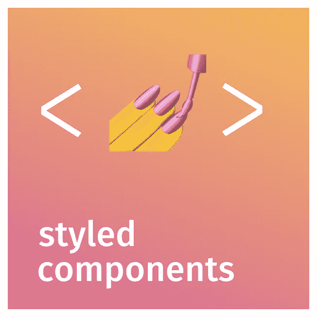

# 如何在 React 中使用样式化组件

> 原文：<https://medium.com/geekculture/how-to-use-styled-components-in-react-72d767a542e?source=collection_archive---------22----------------------->

## 创建简单的元素来学习如何使用样式化组件

在本文中，我们将使用[样式化组件](https://styled-components.com/)来样式化组件。我们将通过创建简单的元素来学习它，添加初始状态来改变颜色，如 Bootstrap，从 Material UI 扩展样式，还可以通过使用 ThemeProvider 来改变主题。

styled components