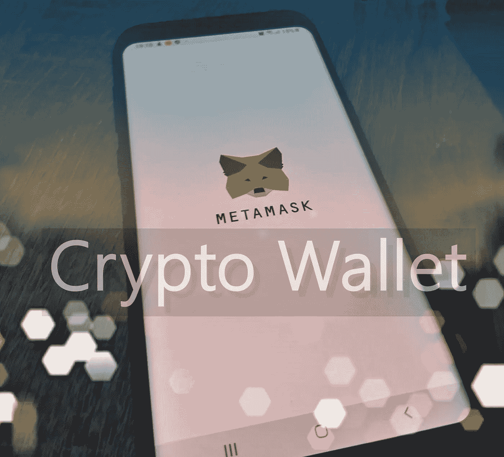
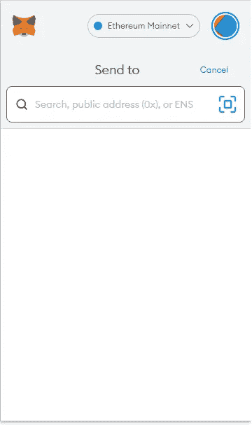

# 如何使用 MetaMask 钱包

> 原文：<https://medium.com/geekculture/how-to-use-the-metamask-wallet-b9c35ad42fec?source=collection_archive---------9----------------------->

## 用于发送和购买密码

The image is created and edited by the author

etaMask 是一个分散的加密钱包，可以在 [metamask.io](https://metamask.io/) 上找到并下载。它是一个 web 浏览器扩展，服务于加密钱包的目的。您也可以通过从 Google Play 和 App Store 下载应用程序在移动设备上使用它。

# 元掩码安装

如果你的电脑上有谷歌 Chrome，你就必须像搜索任何其他扩展一样搜索 MetaMask:你进入设置，然后进入扩展。安装并激活扩展，然后从浏览器右上角附近的扩展栏访问它。MetaMask 也适用于 Firefox、Edge 和 Brave 浏览器。

安装完成后，打开扩展，系统会询问您是要导入现有的钱包还是创建一个新的钱包。如果您已经在其他地方创建了钱包，您只需使用您的密码，您的钱包将被导入 MetaMask。如果没有，只需创建一个新的钱包。

你需要设置一个密码来帮助你登录钱包，就像你用传统方式登录一个账户一样。这与恢复密钥或密码不同。设置好之后，选择语言和货币等常规选项，就可以登录钱包了。

# 选择正确的区块链网络

在 MetaMask 中，您可以选择不同的区块链网络，如以太坊主网络、币安智能链网络、和谐网络等。尝试发送加密时，请确保您使用的是正确的网络。

# 添加新令牌

您可以添加其他令牌，方法是在区块链上查找其智能合同地址，并将其粘贴到添加令牌区域。在 [coinmarketcap](https://coinmarketcap.com/) 上，对于某些代币，您可能会在合同地址附近看到可点击的元掩码图标，并带有“添加到元掩码”功能。这样，您只需将新代币添加到钱包中。

# 发送、交换和接收密码

发送加密很简单。你只需使用发送选项，并输入你想发送到的地址。您将看到交易费用，但您也可以切换到更低的费用。在这种情况下，交易持续时间会长很多。

The image is a screenshot from MetaMask made by the author

也可以在不同的加密货币之间互换。为了接收以太坊和其他基于以太坊的加密货币，你可以在扩展的顶部找到钱包的地址，如果你去账户，你也会找到二维码。

# 使用 Fiat 加载钱包

当你向钱包里装钱时，以太坊令牌有一个购买按钮，你可以从中选择不同的支付服务提供商，如 Wyre 或 Transak，你可以使用信用卡添加菲亚特。根据你想购买的代币和你想购买的网络，允许有一些最低金额。

你会看到网络费和交易费，然后是购买一定数量的密码必须支付的法定货币总额。

# 结论

MetaMask 是一个易于使用的钱包，只要你知道基本知识。汇款时，你可以通过选择交易处理的速度来选择费用。很容易与任何允许你这样做的网站和游戏连接，请相信我，我已经看到他们中的许多人这样做了。