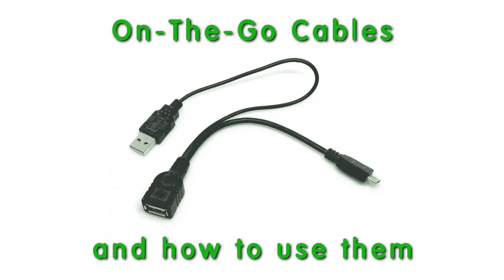

# 如何在 Android 智能手机和平板电脑上使用 USB 设备:移动电缆

> 原文：<https://medium.com/geekculture/how-to-use-usb-devices-with-smartphones-tablets-on-the-go-cables-9eb3c2f4db7b?source=collection_archive---------15----------------------->

智能手机和平板电脑非常适合上网、听音乐、看电视或 YouTube，以及使用现有的众多 Android 和 iOS 应用程序做各种其他事情。然而，与标准台式机或笔记本电脑相比，它们有一个主要缺点，即缺少全尺寸 USB 型连接器插座。