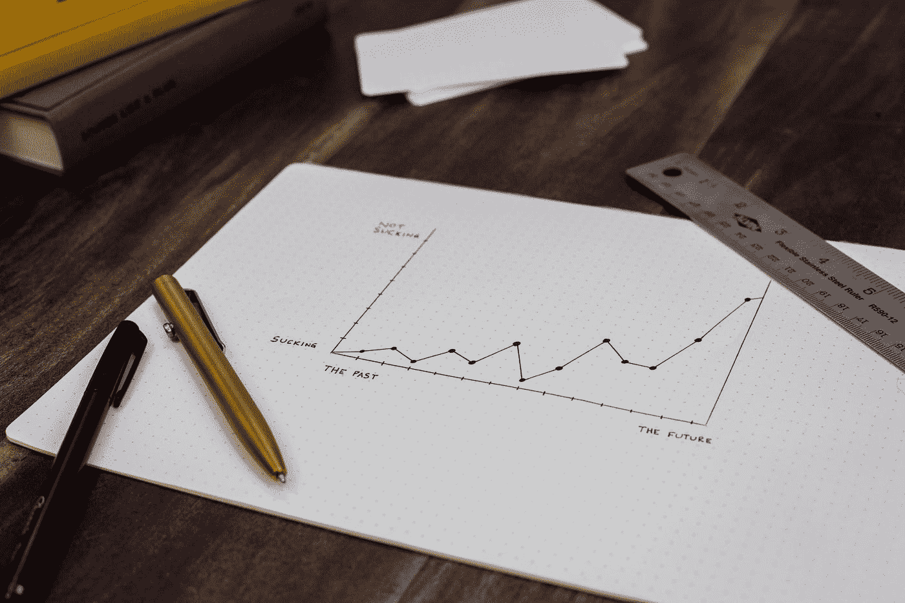

# 如何使用 UX 设计技术获得更好的效果

> 原文：<https://medium.com/geekculture/how-to-use-ux-design-techniques-for-better-results-d31edb94600c?source=collection_archive---------13----------------------->

## 使用这些技术，充分利用您的 UX 设计！

Photo by [Isaac Smith](https://unsplash.com/@isaacmsmith?utm_source=medium&utm_medium=referral) on [Unsplash](https://unsplash.com?utm_source=medium&utm_medium=referral)

用户体验设计，或 UX 设计，是一个相对较新的领域越来越受欢迎。它是以用户为中心设计产品和服务的过程。UX 设计的主要目标是确保用户有良好的体验，产品或服务满足…