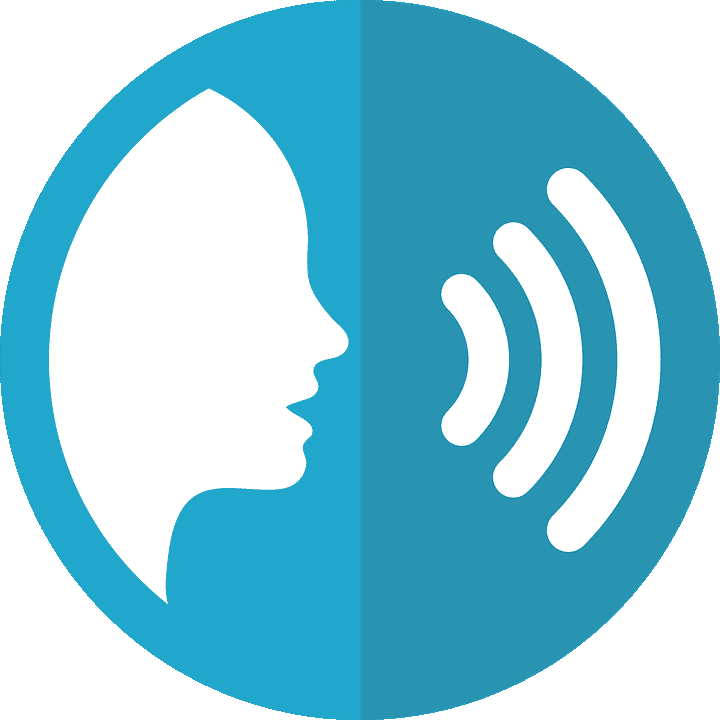

# 如何在 Windows10 中使用声音转录

> 原文：<https://medium.com/geekculture/how-to-use-voice-transcription-in-windows10-f538d67df58e?source=collection_archive---------41----------------------->

在我最近的帖子中，我讨论了 Google Docs 是一个免费的文字处理器，可以用来执行语音到文本的听写。这是一个很棒的应用，只要打开语音识别软件就可以免费访问。

我之前在 Google docs 上使用语音打字的博文链接是免费的，可以在这里找到:- [我是如何从手写到](https://tracyrenee61.medium.com/how-i-went-from-handwriting-my-work-to-dictating-it-in-five-short-decades-8b745afdd294) …