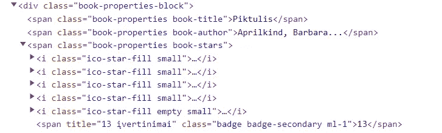
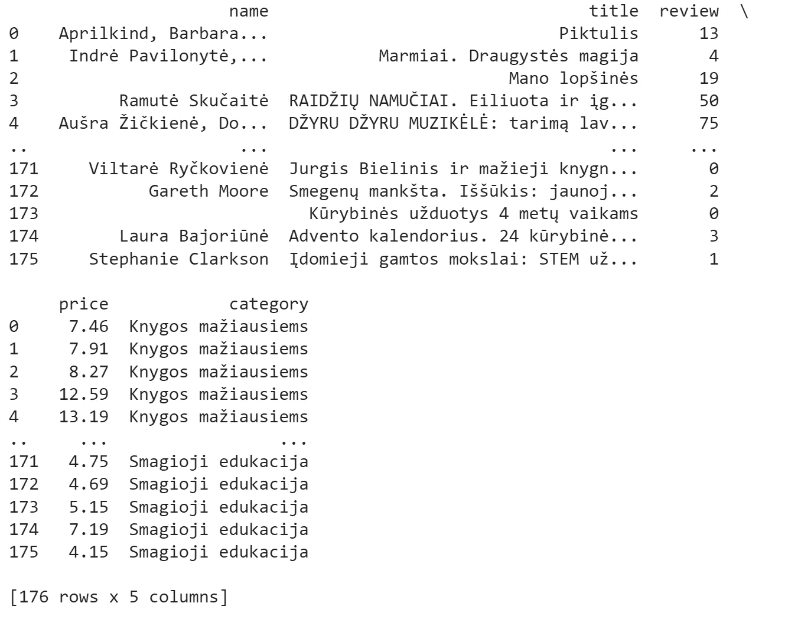
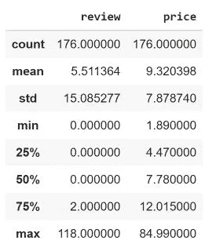
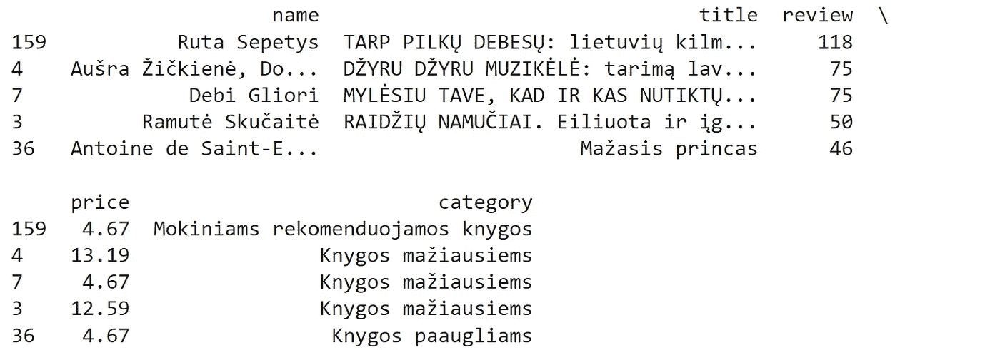
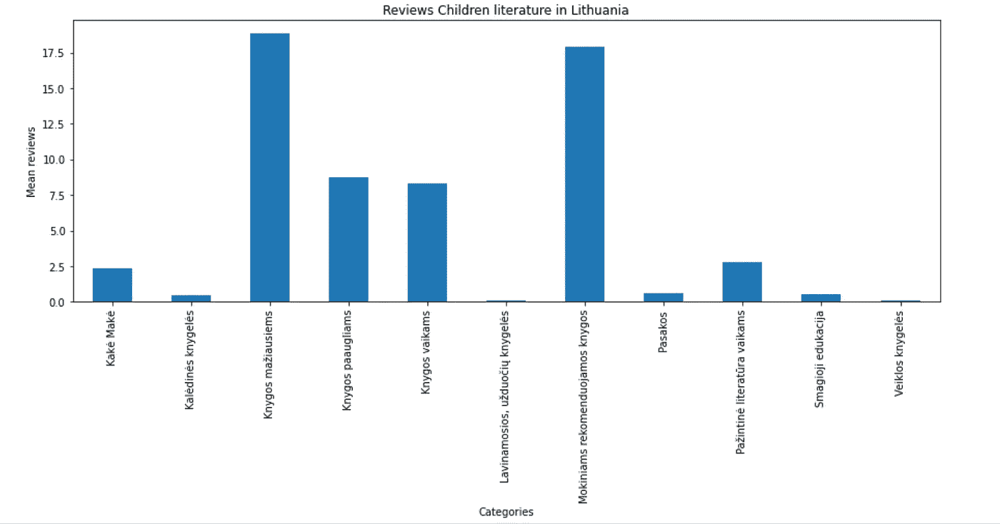
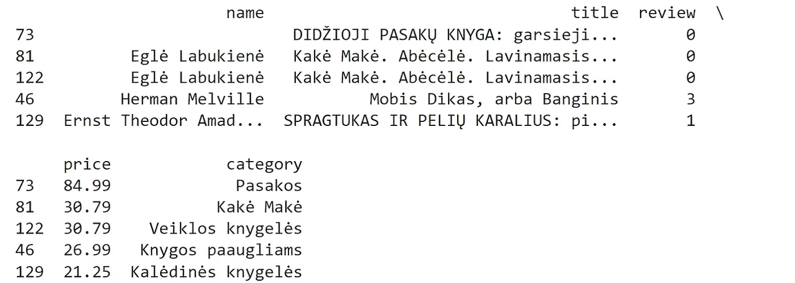
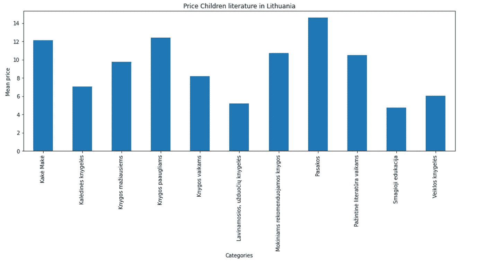
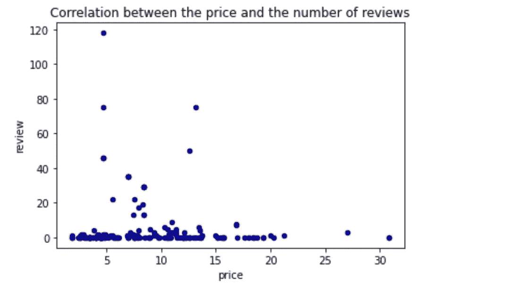

# 如何利用网络抓取工具洞察某个特定的板块？

> 原文：<https://medium.com/geekculture/how-to-use-web-scraping-tools-to-gain-insight-into-a-specific-sector-68f3f4bfb1f9?source=collection_archive---------8----------------------->

## 立陶宛儿童文学部门分析

为了我的工作，我需要立陶宛儿童文学领域的具体数据。然而，尽管在网上做了一些研究，除了一些文章(可以在本文的来源中找到)，我找不到任何精确的数字。

我还在接受 Python 数据分析的培训，特别想学习更多关于 web 抓取的知识。因此，我可以在发展我对 **beautiful soup** (一个用于解析 HTML 的 Python 库)和 **selenium** (一个用于控制 web 浏览器的工具)的理解的同时，避开这种资源的缺乏。

在写这篇文章时，我想展示一个 web 抓取的具体案例，以及它如何帮助我们获得难以获得的数据。这些数据是进行相关分析的基础。显然，我的主题非常具体，我不能局限于该领域的一般概念。

Photo by [Stephen Andrews](https://unsplash.com/@porkbellysteve?utm_source=medium&utm_medium=referral) on [Unsplash](https://unsplash.com?utm_source=medium&utm_medium=referral)

我想回答一些具体的问题:一本儿童书籍的平均价格是多少，有多少种类，哪些书最受欢迎，立陶宛作者在所选书籍中的比例是多少？此外，我想知道在 Covid 危机期间，人们是否倾向于购买更多的儿童书籍。由于父母在隔离期间不得不呆在家里陪孩子，他们很可能会购买更多的书籍来寻找与孩子一起做的活动。

为了获得这些信息，我决定检索网站 **knygos.lt** (一个立陶宛版的亚马逊)上的数据。事实上，在一个页面上，我们可以找到近 200 本儿童和青少年书籍，分为 11 个类别，以及大量其他相关信息供我们分析。

## 1.抓取数据

第一步是通过检查 **robots.txt 文件**来检查站点是否确实可以被抓取。一旦这一点得到确认，我就可以开始实际刮。我将从导入所需的库和创建 soup 对象开始。

查看网站上的 HTML 文件，您可以看到书籍属性的类名为“book-properties ”,分为。图书作者“，”。书名“和”。图书价格”。要将选择限制在包含青年文学的网格中，我需要选择班级”。col-12”(否则我们会包括与我们的主题无关的促销)。

The Information Available Thanks to the Inspect Element Tool

每本书都有一个星级系统(从 0 到 5)。然而，这些评价并不十分多样(绝大多数在 4 到 5 星之间)。为了分析一本书的受欢迎程度，给出的评论数量似乎更相关。这可在“课程”下找到。徽章-二级”。

对于数据存储，我使用了一个字典，它的键是索引，值是包含作者姓名、标题、评论数量和价格的列表。

这些书籍也分为 11 类:knygos maiausiems(幼儿书籍)、Knygos vaikams(儿童书籍)、Knygos paaugliams(青少年书籍)、paintin literati ra vai kams(儿童教育文学)、Pasakos(童话)、kakė makė(立陶宛流行的以" Nelly Jelly "为主角的儿童系列)、Lavinamosios、užduočiųknygels(教育和活动书籍)、vei

在这个网页上，每个类别有 16 本书，所以我们可以很容易地将这些类别添加到我们之前创建的字典中。

太好了，我们现在拥有了创建数据框架的一切！然而，我们首先需要清理一下数据(用“0”填充缺失的评论，并将数据类型改为 float)。

我们现在只剩下这个包含 176 行和 5 列的数据帧。

## 2.分析数据

使用 **describe()** 函数将帮助我们获得一些关于定量数据的可靠信息(评论和价格)。

**2.1。分析评论**

让我们来看看在我们的选择中哪些书和哪些类别是最受欢迎的。

我们可以看到评论最多的书是美国-立陶宛作家芸香属·塞佩蒂斯的《灰色阴影中的*。收到最多评论的类别是给幼儿的和推荐给学校的。*

**

***2.2。分析价格***

*我们分析的下一部分将根据一本书的类别来看它的平均价格，以及哪些书是最贵的。*

****

*最贵的一类是童话(帕萨科斯)，逻辑上最贵的书也在这一类。然而，需要注意的是，这本书实际上是一个分册的集合，因此价格很高。*

***2.3。价格和评论之间的相关性***

*我注意到更贵的书似乎得不到很多评价。所以我想看看这两者与`df_lithuania_no_outliers.plot.scatter(x=”price”, y=”review”, c=”DarkBlue”)`是否有关联。在此之前，我删除了带有`df_lithuania_no_outliers = df_lithuania.drop([73])`的明显异常的卷集合。*

**

*我们可以看到评论最多的书籍是**在 5 到 15 欧元**之间**价格区间**。然而，正如我们注意到的 describe()函数，几乎 50%的书都在这个范围内。然而，有趣的是，不属于这个区间的书几乎没有得到任何评论。*

## *3.作者的国籍*

*在分析开始时，我感兴趣的一个问题是了解立陶宛作者在这个语料库中的**比例。这个好像有点复杂，不用一一追踪立陶宛作者。然而，我们可以通过使用立陶宛语的一个“怪癖”来解决这个问题，这个怪癖就是它非常独特的发音符号(“ąčęėįšųūž").这些可能确实有助于我注意到哪些作者可能是立陶宛人(或立陶宛后裔)。我使用正则表达式模块(`import re`)将作者分为两组。***

*我注意到，虽然至少有两个非立陶宛国籍的人被包括在选择范围内(pav la Hanáková和 Ester Dobiáová，两人均为捷克裔),但搜索似乎确实主要接纳了立陶宛人。然而，我保留了这种方法，因为它给了我一个很好的近似值。我把 Hanáková夫人和 Dobiáová带走了。remove()函数。*

*列表的最后一个变化是增加了一些立陶宛特有的常见名字(Vytautas，Linas)，最后增加了芸香属·塞佩蒂斯(《T4》的作者)，他的双重国籍可能是没有“ū”的原因。*

*尽管她生活在美国，但她这本书的总主题与立陶宛直接相关。因此，在我看来，将她列入立陶宛作家之列是合乎逻辑的。以下是完整的代码:*

*多亏了这个列表，我们现在知道立陶宛作者在我们的语料库中的百分比是 19.32%。下一步是在我们的数据框架中添加一个新的列，如果作者是立陶宛人，它将有一个“Y ”,否则有“N”。这个新的专栏让我们看到立陶宛作者是否比非立陶宛作者得到更多的评论。*

*通过这种计算，我们看到立陶宛人写的书平均得到 9.56 条评论，而非立陶宛人只得到 4.39 条评论。然而，我们知道有一个异常值:灰色阴影之间的书*有 118 个评论。如果我们把它从语料库中取出来，让我们看看它是如何变化的。**

**如果没有 Sepetys 的书，平均评论下降到 6.27 篇，仍然高于外国作家的平均水平。**

## **4.**对比 2019 年和 2021 年的畅销书****

**在 knygos.lt 上，你可以看到相当多的儿童文学书籍都在今年的畅销书之列。我想知道这些年来这一比例是否有所变化，更具体地说，covid 危机是否有任何影响。然而，我们的网站没有给出前几年的前 100 名。所以我们不得不求助于另一个网站 [www.knyguklubas.lt](http://www.knyguklubas.lt) 。这个站点需要启用 JavaScript，而美汤不允许。所以我们不得不求助于另一个 python 库: **Selenium** 。**

**为了比较 2019 年和 2021 年，我决定从这个网站获得儿童作者的列表，然后分析 2019 年和 2021 年销量最高的作者的百分比。**

**于是我去了儿童文学专用页面(设置为 96 本按人气排序的书)。然后我把前两页的作者都刮了下来，这就给了我一个儿童文学领域 192 位热门作者的名单。我用列表理解去掉了“Nė ra Autoriaus”(无作者)，这给了我 172 个作者的最终列表。**

**然后我去了 2019 年最受欢迎书籍的页面，并将所有作者添加到一个列表中，并对 2021 年做了同样的事情。**

**最后，我正在查看是否有 2019 年或 2021 年的儿童作者。**

**所以，击鼓:在 2019 年的总共 95 本书中，没有儿童作者在场，而在 97 本书中，有 **18 本儿童作者写的书在 2021 年的畅销书名单中**。**

**老实说，关于硒的这一部分相当费时，而且，坦率地说，从网站上的两个列表看，结果很明显。然而，这个过程让我发现并掌握了硒，这仍然是一个积极的方面。**

**这就把我们带到了分析的结尾。我对结果很满意。多亏了这些网络抓取工具，我获得了原本无法获得的数据。**

# **来源**

** [## 文学

### pasaulį.国家公园特古尔·帕萨科斯、恩奇克洛佩迪霍斯、nuotykių·伊斯特里霍斯、穆齐金什……

www.knygos.lt](https://www.knygos.lt/lt/knygos/zanras/literatura-vaikams-ir-jaunimui/)  [## 奥古·knygų·帕达维马斯·因特网，道吉亚- vaikų文学

### 潘德米霍斯·梅图·迪迪奥吉·达利斯·普雷基博斯·佩尔西克尔·įinternetą、伊帕廷盖·伊索戈·knygų·帕达维马斯。„knygų·克鲁博”…

www.15min.lt](https://www.15min.lt/kultura/naujiena/literatura/isaugo-knygu-pardavimas-internetu-daugiausia-vaiku-literaturos-286-1304822) 

[https://www.knyguklubas.lt/literatura-vaikams](https://www.knyguklubas.lt/literatura-vaikams)

下面是 Github 上的代码:

 [## GitHub-STM acre/web _ 报废 _ 青年 _ 文学 _ 立陶宛

### 为了我的工作，我必须分析立陶宛儿童文学的趋势。因为我也对学习感兴趣…

github.com](https://github.com/StMaCre/web_scrapping_youth_literature_lithuania)**