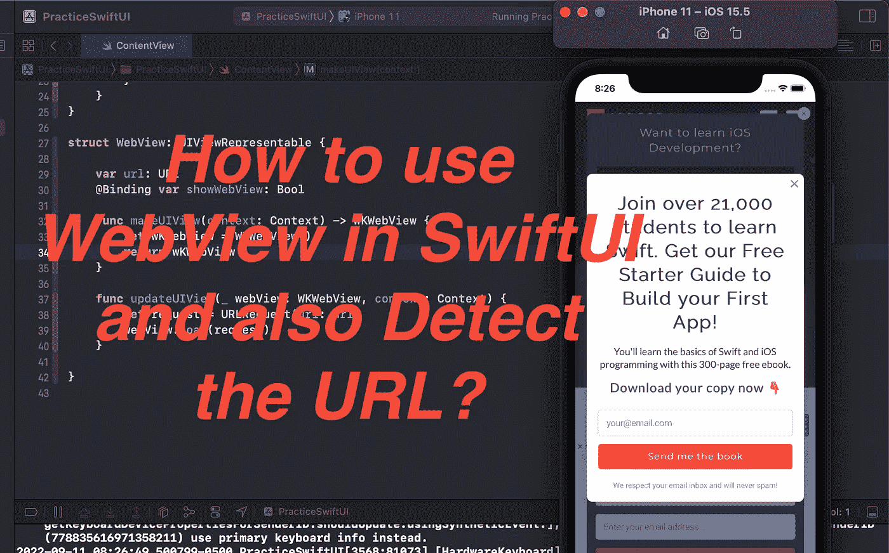
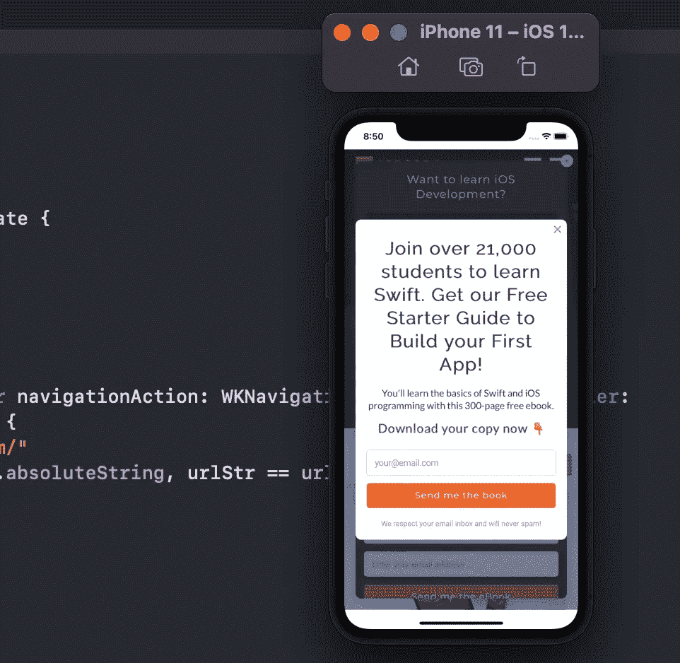

# 如何在 SwiftUI 中使用 WebView 并检测网址？

> 原文：<https://medium.com/geekculture/how-to-use-webview-in-swiftui-and-also-detect-the-url-21d4fab2a9c1?source=collection_archive---------4----------------------->

在这篇博客中，你将学习如何通过使用 **UIViewRepresentable** 来使用 **WebView** 进入 **SwiftUI** ，你还将学习如何检测哪个 url 被打开进入 WebView。

创建全新的 SwiftUI 项目，然后跟随博客。

## 第一步

在 **ContentView** 中创建**show webview****@ State**属性，用于呈现 **fullScreenCover** 。还要创建一个示例按钮，该按钮将切换 **showWebView** 属性。然后使用**全屏**打开应用内的 **WebView** 。

## 第二步

现在，首先导入 **WebKit** 。

然后创建一个新的结构，用 UIViewRepresentable 协议继承这个结构，并实现两个必要的方法

> make uiview(Context:Context)-> wk webview 和
> 
> update uiview(_ webView:wk webView，context: Context)

**makeUIView** 方法用于创建视图，而 **updateUIView** 方法用于更新视图。

还要在这个**结构**中创建两个属性。url 用于从父视图获取 URL，而 **showWebView** 用于将 **fullScreenCover** 值绑定到那个 **WebView** 以消除 **fullScreenCover** 。

## 第三步

之后使用 **fullScreenCover** 中的 **WebView** 并传递 URL，绑定 **showWebView** 。

之后运行代码，点击“**打开 WebView** ”按钮，你会看到网站将在你的应用程序中打开。

## 第四步

为了检测在 WebView 中打开了哪个 url，我们需要实现 WebKit**WKNavigationDelegate**。

为此，我们需要在 **WebView** 结构中创建一个类。

创建一个 WebViewCoordinator 类，并用 **NSObject** 和 **WKNavigationDelegate 继承它。**创建我们之前创建的 WebView 属性。使用 **init** 在类内初始化。

现在实现下面的 WKNavigationDelegate 方法来检测 WebView 中当前打开了哪个 URL。

> **func**webView(_ webView:WKWebView，decidePolicyFor navigation action:WKNavigationAction，decision handler:**@ escaping**(WKNavigationActionPolicy)->Void

通过编写**navigation action . request . URL？。absoluteString，**我们可以检查 WebView 内部打开了哪个 URL。

## 重要事项:

> **每当 WebView 中的 URL 发生变化时，就会调用该方法。**

在该方法中，获取在 WebView 中打开的 URL，然后将其与 urlToMatch 进行比较，如果两个 URL 匹配，则关闭 WebView。

## 第五步

通过实现另一个函数 makeCoordinator()来使用 WebViewCoordinator 类。

## 第六步

最后，将该协调器的上下文提供给 WKWebView 并运行代码。当您打开 WebView 方法中的另一个链接时，WebViewCoordinator 将运行并检测 URL。

# 完整代码:

希望你喜欢这个博客。感谢你阅读这篇文章。

## 订阅模式

 [## 米（meter 的缩写））阿巴斯正在创建 IOS 开发者| Patreon

### 立即成为 M.Abbas 的赞助人:获得世界上最大会员的独家内容和体验…

www.patreon.com](https://www.patreon.com/abbasgujjar)