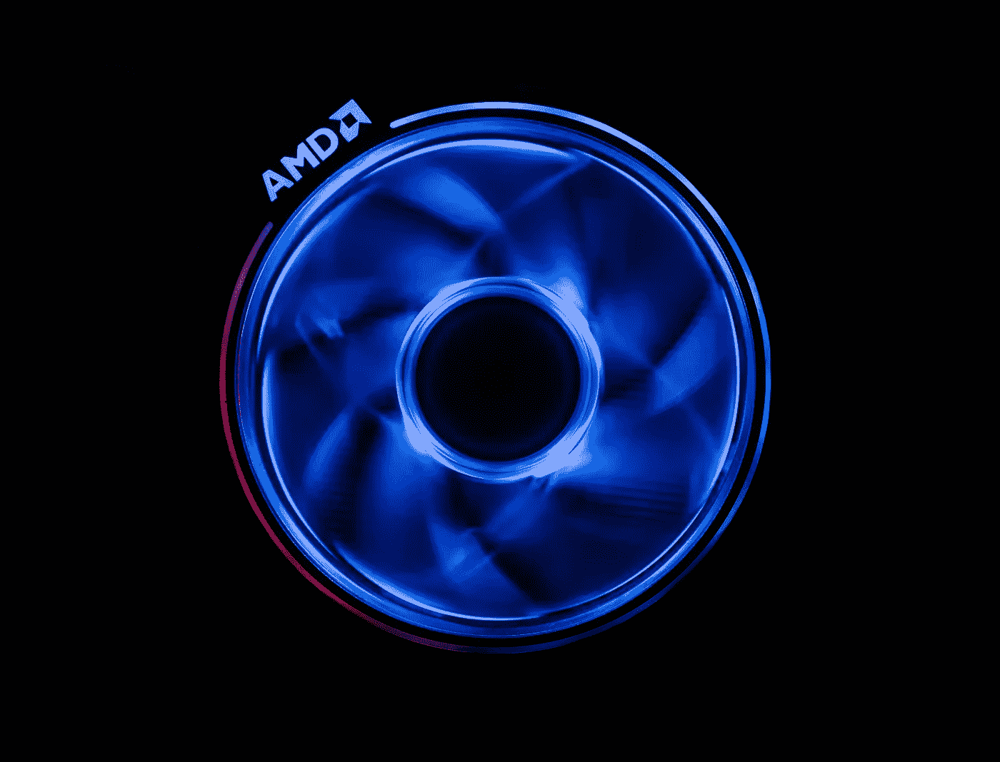

# 如何使用你的 Macbook GPU 进行 Tensorflow？

> 原文：<https://medium.com/geekculture/how-to-use-your-macbook-gpu-for-tensorflow-5741472a3048?source=collection_archive---------2----------------------->

## 让我们在 Tensorflow/Keras 中释放你 Macbook 内部 GPU 的力量进行深度学习吧！

Credit: Maxence Pira from [Unsplash](https://unsplash.com/photos/pNpqq8Cwjxw)

# 为什么是这篇文章？

许多 Macbook 笔记本电脑都配有 AMD GPUs。不幸的是，众所周知，AMD GPUs 几乎与大多数主要的深度学习框架不兼容，因为 Nvidia 和 CUDA…