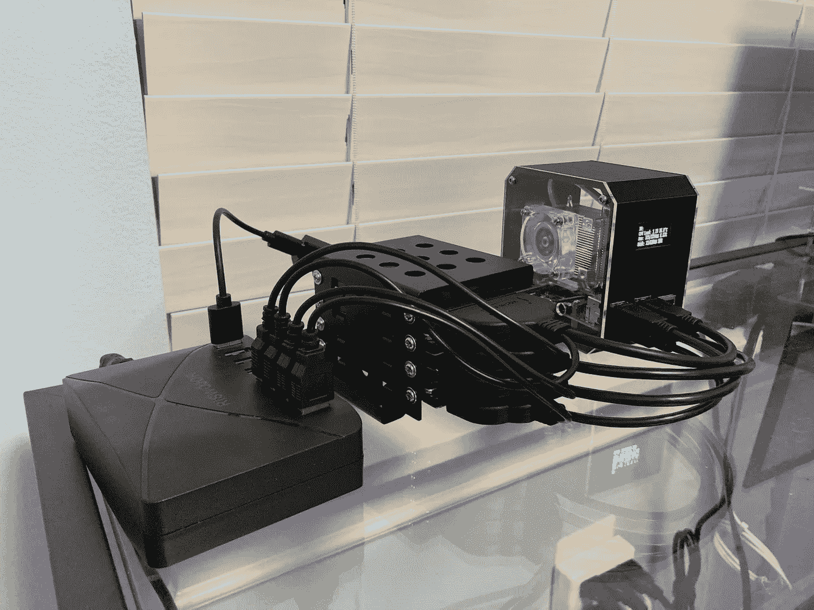
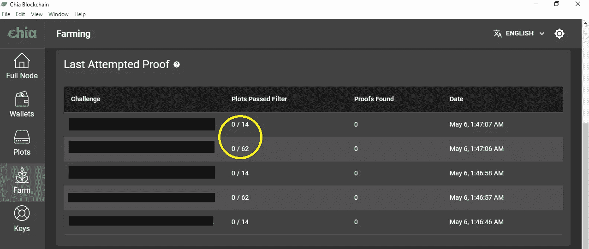

# 如何使用您的树莓 Pi 作为 Chia 收割机

> 原文：<https://medium.com/geekculture/how-to-use-your-raspberry-pi-as-a-chia-harvester-66440c17d318?source=collection_archive---------0----------------------->

## 从一个 Chia 新手到其他 Chia 新手使用 Raspberry Pi 4 作为辅助收割机的完整分步指南。



如果你和我一样，你可能在过去的几周里用奇亚图填满了你能找到的所有未使用的硬盘。现在，您可能正在寻找一种简单的方法来整理已满的硬盘。当我开始考虑将我的树莓 Pi 4 用作收割机时，这正是我发现自己所处的位置。

尽管在官方的 Chia GitHub wiki 上有关于[在许多机器上设置树莓派](https://github.com/Chia-Network/chia-blockchain/wiki/Raspberry-Pi)和[农场的信息，但是我发现许多指令对于命令行经验有限的人来说解释得很糟糕。经过几个小时的思考，我决定把这个教学指南放在一起，作为一个单一的参考点，以帮助其他 Chia 新手。我不认为我的方法是最好的方法。然而，我的方法对我来说是令人满意的，我希望其他人也能从我的努力中受益。](https://github.com/Chia-Network/chia-blockchain/wiki/Farming-on-many-machines)

## 一.总体设置

农家乐是一个两部分的过程。第一步是创建 Chia“图”,这些图是在临时驱动器上创建的，然后保存到最终目标驱动器。第二步是“耕种”土地。绘图和耕作步骤可以在不同的计算机上完成，多台计算机可以在耕作步骤中用作“收割机”。

值得注意的是，如果在同一网络上使用多台计算机，只有*的一台*应该运行完整节点，并且只有*那台*应该启用[通用即插即用(UPnP)](https://en.wikipedia.org/wiki/Universal_Plug_and_Play) 。此设置是在您的路由器上配置的。如果您没有启用 UPnP，或者如果您在同一个网络上的多台机器上启用了 UPnP，这将在以后给您带来问题。

本指南假设您使用 Windows 机器作为主节点，并且使用 Raspberry Pi 4 作为收割机。这种设置是最佳的，因为 Pi 可能需要几天时间来完全同步节点，之后我发现它运行起来相当缓慢。然而，Pi 可以很好地作为一个收割机，它的好处是便宜，并且在墙上消耗的能量相对较少。

确保连接到 Pi 的驱动器有电源。Pi 本身可以为一个或两个 SDD 供电，但它将很难为更多的 SDD 供电。我已经使用 Sata 转 USB 线将我的驱动器连接到通电的 USB 条，该线具有额外的仅供电 USB 连接(见上图)。如果您做了类似的事情，您还应该意识到 Pi 可能会由于反向电源而无法正常重启。也就是说，来自电源板的一些电力可能会从连接的驱动器流回 Pi。我知道这通常不是一个问题，只要你的电源板也有某种电涌保护。在任何情况下，我发现在引导 Pi 之前简单地从电源板断开任何额外的驱动器可以避免打开 Pi 时的任何问题。Pi 运行后，您可以将驱动器插回。

## 二。设置 Pi

Chia 软件只能在 64 位操作系统上运行。因此，第一步是下载 64 位版本的 Raspbian，并将其闪存到 micro SD 卡中。64 位版本目前处于测试阶段，在 Raspberry Pi Imager 上不可用。

你可以直接从 Raspberry Pi foundation 获取最新的图片[(截止到本文发布之日，日期为 04/09/21)。只需下载。zip 文件，并将其保存到您的计算机上。然后，使用](https://downloads.raspberrypi.org/raspios_arm64/images/) [Raspberry Pi Imager](https://www.raspberrypi.org/software/) 或 [BalenaEtcher](https://www.balena.io/etcher/) 将下载的图像刷新到微型 SD 卡。请注意，将图像闪存到 SD 卡也会擦除卡上保存的任何内容，因此请确保使用新卡或备份任何需要保留的文件。

一旦您启动了 Pi，请完成基本设置。设置完成后，您可以选择添加以下配置:

*   **设置 Pi 从 SSD 启动:**我发现 Pi 使用 SSD 比使用 micro SD 卡运行得更好。为此，打开一个新的终端并使用`sudo raspi-config`启动配置工具。选择*高级选项*，然后选择*引导程序版本*。选择*最新*，然后选择*正常*，然后选择*否*。然后返回主菜单。从那里，再次选择*高级选项*，然后选择*引导顺序*。然后选择 *SD 卡启动*，然后选择 *Ok* 。Pi 将询问您是否要重新启动—选择*号*最后，选择*完成*并关闭配置工具。之后，使用 SD 卡复制器工具(可在应用程序菜单中的*附件*下找到)将您的 micro SD 卡克隆到您连接的 SSD(这将擦除 SSD)。然后，您可以使用`sudo shutdown now`从终端关闭您的 Pi，移除 micro SD 卡，并重新启动 Pi。它现在将从您的固态硬盘启动。
*   **启用 VNC** : VNC 允许您从桌面计算机远程访问 Pi，而无需将 Pi 连接到它自己的显示器、键盘和鼠标(所谓的“无头”配置)。详细说明[可以在这里](https://www.raspberrypi.org/documentation/remote-access/vnc/)找到。
*   **安装 Samba** : Samba 允许您轻松地在桌面和 Pi 之间移动文件，就像它是一台服务器一样。设置 Samba [的详细说明可以在这里](https://pimylifeup.com/raspberry-pi-samba/)找到。

您还需要完成以下工作:

*   **增加交换空间**:根据您的 Pi 上有多少 RAM，Chia 创建者建议您将交换空间增加 1024 MiB。本文中提供了关于如何执行此操作[的详细说明。](https://pimylifeup.com/raspberry-pi-swap-file/)

## 三。安装 Chia

对于我们这些不太习惯命令行的人来说，这是事情开始变得有趣的地方。Chia 确实有一个图形用户界面，但是它在 Pi 上运行非常慢，并且不提供与命令行相同级别的控制。至少目前，最好使用命令行在 Pi 上安装、配置和运行 Chia。

打开命令终端，使用以下命令安装 Chia:

```
git clone https://github.com/Chia-Network/chia-blockchain.git -b latest
cd chia-blockchainsh install.sh
. ./activate
chia init
```

然后，使用`chia keys add`从您的 24 个单词中导入您的密钥。Chia 现在安装在 Pi 上。让终端保持打开状态，以便您可以在下一步中继续使用它。

## 四。配置 Chia

您现在需要配置 Chia，以便它将作为一个收割机运行。这个过程将涉及到运行主节点的 Windows 计算机(以下我称之为“主计算机”)和 Pi。完成以下步骤:

1.  完全退出 GUI，关闭主计算机**上的 Chia。**
2.  在您的**主计算机**上，导航至 CA 文件夹。该文件夹可能位于 C:\ Users \[您的用户名]\。chia\mainnet\config\ssl\ca。制作 CA 文件夹的副本，并使用闪存驱动器或 Samba 将该文件夹的副本保存到 Pi 的桌面上。
3.  在您的 **Pi** 上打开终端窗口，使用`chia init -c [directory]`，其中【目录】是 CA 文件夹副本的文件路径。如果你把它保存到你的桌面上，那么这个命令应该看起来像`chia init -c /home/pi/Desktop/ca`。
4.  现在在你的**主计算机**上，定位你的主计算机的 IP 地址。您可以在命令提示符下使用`ipconfig`来完成此操作。在*无线局域网适配器 Wi-Fi* 部分，您的主计算机的 IP 地址将出现在 *IPv4 地址*行。
5.  返回到 **Pi** 打开的终端窗口，使用`chia configure --set-farmer-peer [Main Computer IP Address]:8447`，其中【主计算机 IP 地址】是上一步的 IP 地址。
6.  接下来，使用`chia configure -upnp false`禁用 **Pi** 上的 UPnP。
7.  此时，您需要将带有地块的驱动器连接到 Pi，并将地块添加到收割机。对于每个驱动器，可使用命令`chia plots add -d [File Path to Plots]`将图添加到 **Pi** ，其中【图的文件路径】是包含图的驱动器的文件路径。
8.  回到你的**主电脑**，你现在可以重启 Chia 了。
9.  最后，在你的 **Pi** 上打开终端，使用`chia start harvester`将 Pi 连接到你的主计算机。

如果您现在在 GUI 上的 *Farm* 选项卡的 *Last Attempted Proof* 部分看到连接到 Pi 的图，您就可以知道这个过程已经成功。您应该会看到您的主计算机上的图和您的 Pi 上的图在此部分中循环的两个不同的总数。



In the above example, the main computer has 62 plots and the Pi has 14.

请注意，截至本文发布之日的最新 Chia 版本(1.1.4)， *Your Farm Overview* 部分中的信息仅显示主计算机的信息。因此，您的地块计数、地块总大小和预计获胜时间将不会更新以反映 Pi 中的地块。希望这将在未来的 Chia 版本中得到更新。

## 动词 （verb 的缩写）结论

一旦你的采集器设置好了，你就可以让它在后台运行，只需要很少的额外维护。您将希望确保您的 Pi 总是运行最新版本的 Chia，可以在干净的终端中使用以下命令序列来更新它:

```
cd chia-blockchain
git fetch
git checkout latest
git reset --hard FETCH_HEADgit statussh install.sh
. ./activate
chia init
```

这是一个令人兴奋的时间进入中国农业。我希望这份指南能帮助你扩大和管理你的 Chia 农场。收获快乐。