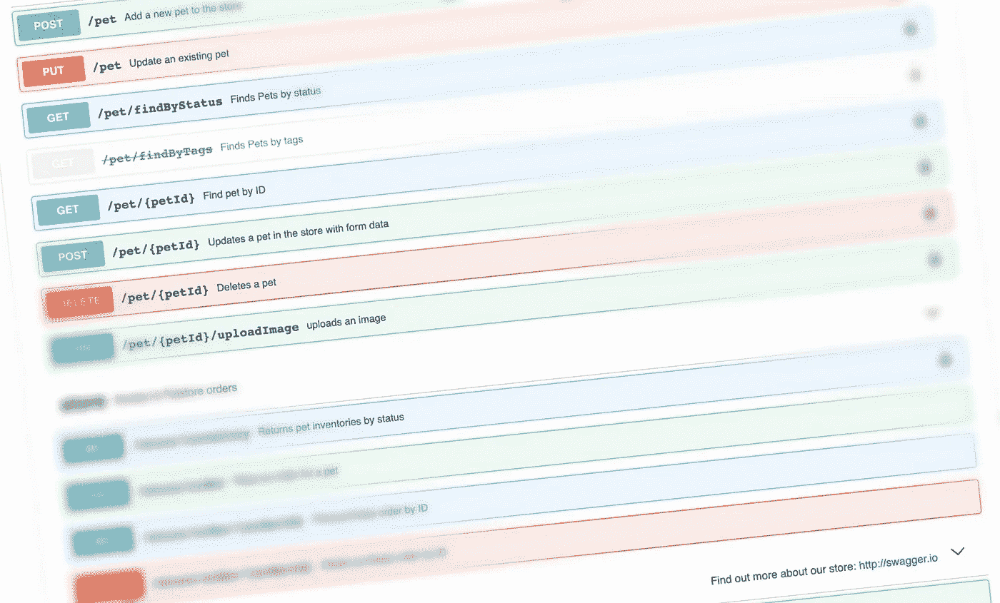

# 如何在 CI 运行程序中验证 OpenAPI 规范

> 原文：<https://medium.com/geekculture/how-to-validate-the-openapi-spec-in-ci-runners-4fcd6b92e711?source=collection_archive---------0----------------------->

## 制作完美规格的简单方法

Image: Sample Swagger API

# TL；速度三角形定位法(dead reckoning)

看看 Docker Hub 吧。