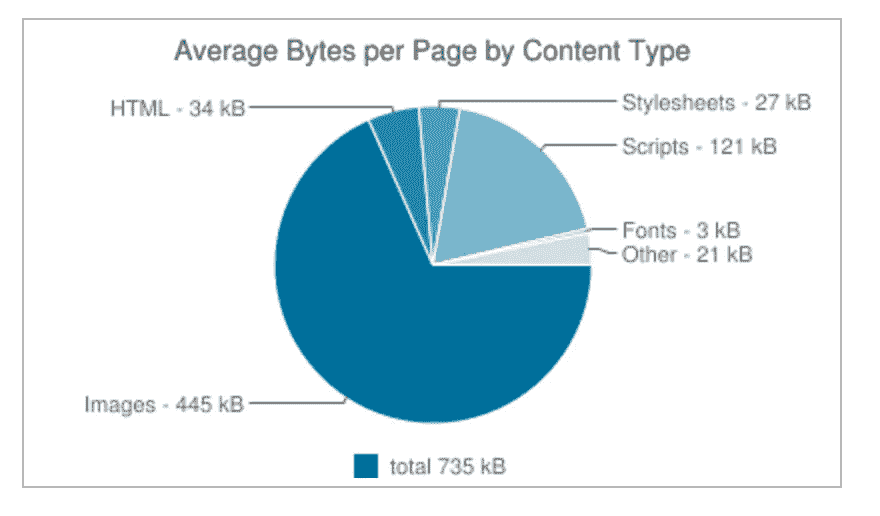
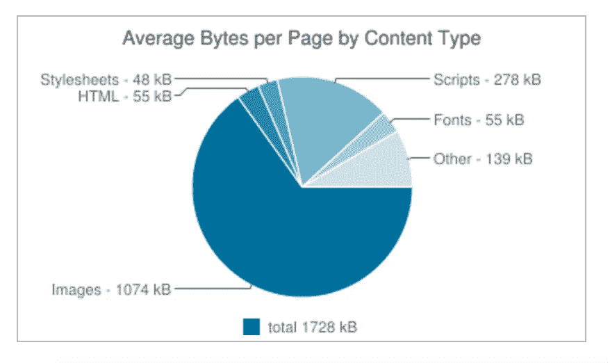
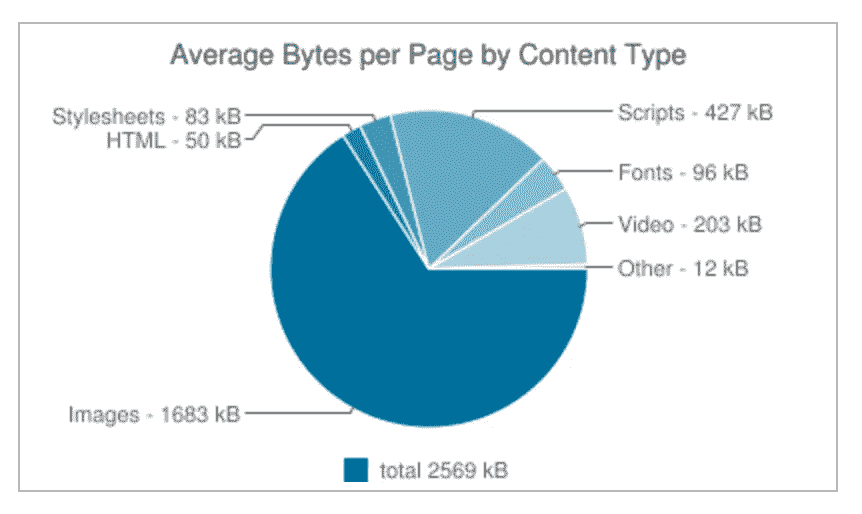
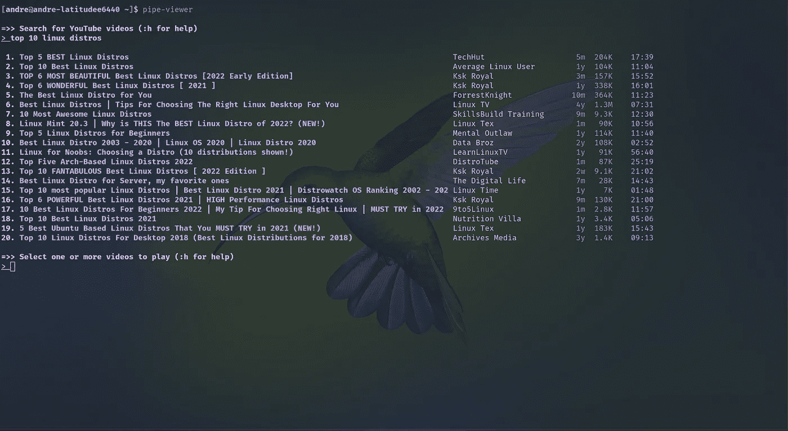
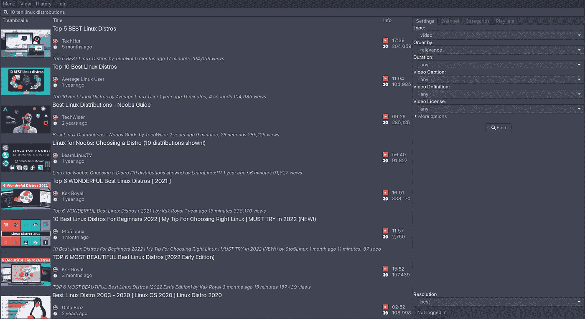
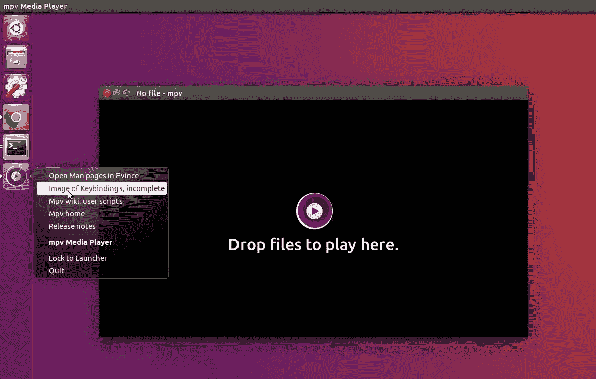

# 没有 YouTube 怎么看 YouTube？

> 原文：<https://medium.com/geekculture/how-to-watch-youtube-without-youtube-b015da2790eb?source=collection_archive---------3----------------------->

## 观看没有广告和间谍软件的 YouTube


Photo by [Christian Wiediger](https://unsplash.com/@christianw?utm_source=medium&utm_medium=referral) on [Unsplash](https://unsplash.com?utm_source=medium&utm_medium=referral)

或许你已经厌倦了观看 YouTube 视频，并在视频开头看到两个广告卷。平台被允许做所有这些事情，因为他们的服务基本上没有竞争。[与 YouTube 相比，Vimeo 和 Odyssey 等所有其他平台都微不足道。](/@hujustin/r-i-p-vidme-why-youtube-is-a-monopoly-f733da4756e4)他们基本上是 YouTube 的炮灰。然而，仍然有一种方法可以在不使用 YouTube 前端服务的情况下欣赏 YouTube 上的所有内容。

以下是如何在没有广告和间谍软件的情况下观看 YouTube 的方法。

## 互联网广告如何运作，如何屏蔽？

以下是传统广告拦截技术的工作原理。您有一个正在分发内容的 URL。假设为了谷歌，网址是开着的

```
ads.google.com
```

广告内容将从此 URL 显示。[广告拦截器只需要拦截那个域名。](https://blog.hubspot.com/marketing/how-ad-blocking-works)然后广告将不再显示。

## 为什么你不想在浏览器或应用程序中使用 YouTube？

你不想使用像 YouTube 这样的网站的主要原因是软件膨胀和安全性。JavaScript 是最臃肿、最不安全的编程语言之一。

【2011 年 3 月—平均大小为 735kB



Figure 1 from [https://mgearon.com/](https://mgearon.com/)

**2014 年 3 月—平均大小 1728kB**



**2017 年 3 月—平均大小 2569kB**



正如你所看到的，随着时间的推移，互联网变得越来越臃肿。尽管如此，大多数网页的功能并没有实质性的增加。这让您想知道这些脚本中添加了什么特性来保证大小的增加？


Photo 1 from tenor.com

[恶意行为者可以创建一个看起来与原始网站一模一样的网站。让用户给假网站提供信息。然后带着这些信息登录到实际的站点，提取有用的信息。](https://us.norton.com/internetsecurity-online-scams-what-is-phishing.html)随着公司希望迁移到云上。

[](https://knowledge.wharton.upenn.edu/article/adobes-shift-to-the-cloud-is-this-the-start-of-a-trend/) [## Adobe 向云的转变:这是一种趋势的开始吗？-沃顿知识

### 面向创意专业人士的领先软件公司 Adobe 正在退出收缩包装软件业务…

knowledge.wharton.upenn.edu](https://knowledge.wharton.upenn.edu/article/adobes-shift-to-the-cloud-is-this-the-start-of-a-trend/) 

事实上，网络钓鱼显示了现代软件开发已经变得多么落后。不仅如此，所有不需要连接到云的东西都要连接到云。

[](https://www.theregister.com/2020/06/08/smart_fridges_support_periods/) [## 智能冰箱很酷，但短短几年后，你可能会被一块结霜的大砖头卡住…

### 更新了消费者权益组织的一份报告。强调“智能”设备的寿命短得惊人，而且…

www.theregister.com](https://www.theregister.com/2020/06/08/smart_fridges_support_periods/) [](https://forum.lowyat.net/topic/5254917) [## 软件更新后微波砖

### 德国产品 AEG 的某款组合式微波炉的拥有者已经有了一个超过…

forum.lowyat.net](https://forum.lowyat.net/topic/5254917) 

但是标准就像“这只是技术发展的方向”。


Photo 2 from mobilesyrup.com

## **台式机和笔记本电脑**

幸运的是，您不必处理现代 web 应用程序带来的不安全性和膨胀。[遵循使用软件功能模块化的 UNIX 哲学，你就不会受限于这些应用程序创建者的暴政。](https://en.wikipedia.org/wiki/Unix_philosophy)

**烟斗浏览器**

不像 YouTube，你唯一的选择是通过网站获取内容。管道查看器出现在许多不同的客户端应用程序中。

在这个应用程序中，您有一个 CLI 选项。



Photo 3 from Dre Chang

和 GUI 选项。



Photo 4 from Dre Chang

您可以在此下载 PipeViewer 应用程序。

[](https://github.com/trizen/pipe-viewer) [## GitHub - trizen/pipe-viewer:一个轻量级的 YouTube 客户端

### 一个轻量级的应用程序，用于搜索和播放 YouTube 上的视频。这个分支解析…

github.com](https://github.com/trizen/pipe-viewer) 

您将使用 YouTube 的代理后端，而不是使用 YouTube 作为后端。一旦你安装了它，你将需要一个 API 主机在下面的文件中。

```
~/.config/pipe-viewer/pipe-viewer.conf
```

更改文件中的以下内容。

```
prefer_invidious => 1,
api_host => "[API_HOST] | auto",
```

**MPV**



Photo 5 from [https://ubuntuhandbook.org/](https://ubuntuhandbook.org/)

这是一个按键驱动的应用程序，允许您观看从您的计算机或远程位置(如 YouTube)下载的视频。

[](https://mpv.io/) [## mpv.io

### 脚本强大的脚本功能可以让玩家做几乎任何事情。有大量的用户选择…

mpv.io](https://mpv.io/) 

**赞助方阻塞**

[当然，42.7%的网民使用广告拦截器。现在都在互联网上运行某种广告拦截器。](https://backlinko.com/ad-blockers-users)广告网络每天的浏览量越来越少，随着争夺关键词的人数增加，每次点击的竞争也越来越激烈。不仅如此，如果观众最喜欢的创作者认可产品，他们更有可能购买。所以这些公司不是一个智囊团。


Photo 6 from reddit.com

与其通过广告网络，为什么不直接联系创作者自己，让他们推广产品。这就是为什么你会不断看到像《暗影传奇》这样的游戏广告。

当然，人们会厌倦看到这样的广告。于是赞助商屏蔽就产生了。这是一个由用户维护的 YouTube 视频赞助时间范围的数据库。用户可以创建和投赞成票/反对票不同的赞助部分。

[](https://github.com/po5/mpv_sponsorblock) [## GitHub - po5/mpv_sponsorblock:跳过 YouTube 视频的赞助片段的 mpv 脚本

### mpv 的全功能 SponsorBlock 端口。将此回购的内容移动到您的 mpv 脚本文件夹中。播放一个 YouTube…

github.com](https://github.com/po5/mpv_sponsorblock) 

**浏览器扩展**

当然，你可能还是想继续使用 YouTube 界面。我不知道你为什么想要，但是不同的人有不同的方法。

随着 YouTube 开始试验“广告拦截器”拦截技术，使用广告拦截器只拦截主机名的日子即将结束。

> 2021 年 12 月更新:
> 
> YouTube 正在使用一种技术来阻止移动设备上的视频广告。目前无法屏蔽这些广告。这只影响 YouTube，你不应该在其他网站上看到 T2 的广告。

这意味着你应该继续使用 MPV，因为 YouTube 前端客户端将禁用仍在使用主机拦截的广告拦截器。

[](https://addons.mozilla.org/en-US/firefox/addon/iina-open-in-mpv/) [## 在 mpv 中打开—获取以下扩展🦊火狐浏览器(美国)

### 这是一个简单的网络扩展(适用于 Chrome 和 Firefox ),可以帮助打开 mpv 中当前打开的标签中的任何视频…

addons.mozilla.org](https://addons.mozilla.org/en-US/firefox/addon/iina-open-in-mpv/) [](https://chrome.google.com/webstore/detail/open-in-mpv/epaldpobheocfkfioepkcalnlhlgpcag) [## 在 MPV 中打开

### 在 MPV 中打开视频和音频。

chrome.google.com](https://chrome.google.com/webstore/detail/open-in-mpv/epaldpobheocfkfioepkcalnlhlgpcag) 

## 移动的

在 iOS 上，你必须越狱你的设备才能在没有广告的情况下访问 YouTube 视频。否则，您将不得不面对定期的请求，以修复被撤销的认证。

 [## 为 iPhone、iPod 和 iPad 下载 YouTube ++ IPA | IPA 库

### YouTube++是一个调整，增加了新的功能，如:阻止广告下载视频到您的设备播放…

ihax.io](https://ihax.io/youtube/) 

Android 用户使用替代软件要容易得多。你有 NewPipe，它给你一个免费和开源的 YouTube 替代品。

[](https://newpipe.net/) [## 免费的 YouTube 客户端

### 版本亮点修复了快进/快退弧线不在系统界面下面的问题，修复了加载问题和随机…

newpipe.net](https://newpipe.net/) 

有一个叫做 YouTube Vanced 的程序是 NewPipe，但是使用了赞助商屏蔽技术。但这目前正被谷歌起诉。

[](https://www.theverge.com/2022/3/13/22975890/youtube-vanced-app-discontinued-shutting-down-legal-reasons) [## “由于法律原因”, YouTube Vanced 正在关闭

### 在受到谷歌的法律威胁后，广受欢迎的 Vanced YouTube 应用程序将被停止使用。Vanced 的创造者有…

www.theverge.com](https://www.theverge.com/2022/3/13/22975890/youtube-vanced-app-discontinued-shutting-down-legal-reasons) 

当然，推广自由开源软件的公司并不了解自由开源软件。社区最终会创建一个分叉。这就像是一场永无止境的猫捉老鼠的游戏。

[](https://techlog360.com/youtube-dl-removed-from-github/) [## 由于 RIAA 发布了撤下通知，YouTube-dl 从 GitHub 中移除

### GitHub 已经将广泛使用的开源项目 Youtube-dl 的代码下线。这源于 DMCA 的一项请求…

techlog360.com](https://techlog360.com/youtube-dl-removed-from-github/) [](https://www.theverge.com/2020/11/17/21571473/github-youtube-dl-downloader-riaa-copyright-1201-takedown-reinstated) [## GitHub 恢复了一个 YouTube 视频下载器，RIAA 声称这是一个盗版工具

### GitHub 恢复了一个下载 YouTube 视频的开源工具，并改变了政策，使类似的…

www.theverge.com](https://www.theverge.com/2020/11/17/21571473/github-youtube-dl-downloader-riaa-copyright-1201-takedown-reinstated) 

当然，这是允许发生的，因为大多数人都是网络农民。订阅电子邮件列表，找回您的互联网形象[。](/subscribe/@dretechtips)

**相关内容:**

*   [去谷歌化的完全指南](/@drechang/how-to-dismantle-the-google-empire-e652bff6d2)
*   [停止为网飞和 Spotify 付费](/@drechang/how-to-build-your-own-illegal-streaming-service-ff353ef70cd0)
*   [你的密码没用](/geekculture/your-passwords-are-useless-5087cdcb1433)